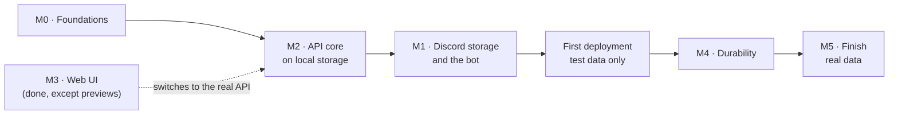
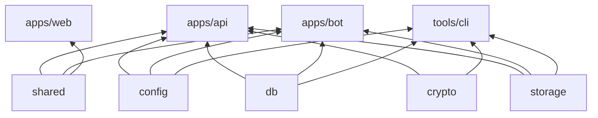

# DFS — Backend Build Plan

### Draft · 2026-10-04

| | |
|---|---|
| **What this is** | The plan for building the API, the bot and the database: order of work, code layout, tasks, and how each milestone is checked. |
| **What it is not** | The spec. Behavior, data model, security and formats are defined in [DESIGN.md](DESIGN.md); this plan links to it instead of restating it. When the two disagree, DESIGN.md wins and this plan is fixed. |
| **Starting point** | The web UI is done against an in-browser mock API (D14). The mock serves the whole §9 contract, so the API's job is to serve the same contract for real. |
| **Lifetime** | Tasks get checked off as they land; once the backend exists, this file is retired and anything lasting moves into DESIGN.md. |

---

## 1. Decisions

Settled for this plan and recorded in [DESIGN.md §19](DESIGN.md#19-decisions-log):

| # | Decision | Effect on the plan |
|---|---|---|
| D19 | **API first, Discord later.** | After M0 comes M2 on local storage, so the UI runs against a real server early. M1 (Discord storage and the bot) follows (§2). |
| D20 | **An upload onto an existing file's name creates a new version** of that file. | New rules in DESIGN §6.1, a small contract change (§4.2), and mock and UI updates (§7). |
| D21 | **Dev-only sign-in** without Discord. | `DEV_LOGIN=1` in development enables `POST /api/auth/dev-login`; the API refuses to start with it in production. |
| D22 | **Node runs the TypeScript sources directly** (type stripping). | No build step for api, bot and packages; rules and checks in §3.2. |
| D23 | **First deployment once Discord storage works**, test data only until M4. | A deployment step between M1 and M4 (§2). |
| D24 | **Old versions count toward the quota** until purged. | Quota reservation and pruning rules in DESIGN §5.1 and §6.1. |
| D25 | **One Discord server and bot for development and production.** Development uses its own `DFS Dev` channels and no gateway connection. | Config for the category and the gateway (§6); `dfs setup` in the CLI arrives with M1, since development can't use slash commands; load tests stay off Discord. |
| D26 | **Private GitHub repository, no CI.** | `pnpm check` in M0; the VPS pulls with a deploy key (§4.4). |
| D27 | **Access is a list kept in DFS:** an admin adds people by Discord user ID; the Discord server is private to the owner. | Sign-in checks the list, not guild or roles; an "Add user" admin action (§4.2, §7). |
| D28 | **Admins are set in DFS;** the owner (`OWNER_DISCORD_ID`) is always an admin. | Owner protections in the admin routes; no role sync in the bot (§4.3). |

The Discord server and application already exist and serve both environments; §6 lists what to configure. The VPS is available, with more than 150 GB of disk (§4.4).

---

## 2. Order of work

The design's milestone numbers stay; only their order changes (D19).



| Step | Ends with |
|---|---|
| **M0 · Foundations** | Workspace packages, config, Postgres in Docker, schema and migrations, health endpoints; TypeScript runs directly in Node. |
| **M2 · API core on local storage** | The UI works end to end against the real API (`VITE_API_MOCKS=off`): sign-in, browsing, uploads with versions, downloads, shares, admin, live events. Files are encrypted frames in a local blob store. |
| **M1 · Discord storage and the bot** | Blobs go to Discord, small files are packed, CDN URLs are refreshed, deletions in Discord are noticed. |
| **First deployment** | DFS runs on the Fedora VPS behind Caddy, privately, with test data. |
| **M4 · Durability** | GC, compaction, scrubber, metadata journal, nightly backups, and a recovery drill that passes. Real data is allowed from here. |
| **M5 · Finish** | Previews and version history in the UI (the rest of M3), admin search, slash commands, hardening. |

---

## 3. Code layout and conventions

### 3.1 Packages

The layout of [DESIGN §14](DESIGN.md#14-repository-layout), with responsibilities:

| Package | Holds | Used by |
|---|---|---|
| `packages/shared` | Wire schemas (Zod) and name rules. Exists. | web, api, bot |
| `packages/config` | Env parsing with Zod, derived sizes (`BLOB_MAX_BYTES`, `CHUNK_SIZE`), startup checks (DESIGN §15). | api, bot, cli |
| `packages/db` | Drizzle schema, SQL migrations, the connection pool, query helpers for recursive CTEs and keyset pages, the journal outbox writer. | api, bot, cli |
| `packages/crypto` | DFS1 frames, envelope encryption, DEK wrapping, AAD contexts (DESIGN §7.3). | api, cli |
| `packages/storage` | `BlobStore` interface, `LocalBlobStore`, `DiscordBlobStore`, `ChaosBlobStore`. | api (reads), bot (writes), cli |
| `apps/api` | Fastify app: routes of DESIGN §9, sessions, uploads, downloads, live events. | — |
| `apps/bot` | pg-boss workers, packer, Discord gateway, internal RPC. Runs without Discord when `BLOB_STORE=local`. | — |
| `tools/cli` | `dfs` admin CLI (setup, recover, rotate-key, verify). Later phases. | — |



`crypto` never reaches the bot: it only moves ciphertext (DESIGN §3.1).

### 3.2 Running TypeScript in Node (D22)

Node 24 strips types, so `node src/main.ts` runs the sources as they are. The base config already enforces the syntax this needs (`erasableSyntaxOnly`, `verbatimModuleSyntax`). The remaining rules:

- **Imports name their files:** `import { x } from './x.ts'`. Workspace packages export `.ts` entry points, as `@dfs/shared` does.
- **No path aliases at runtime.** Use relative imports, or package.json [subpath imports](https://nodejs.org/api/packages.html#subpath-imports) (`"imports": { "#*": "./src/*" }`), which Node resolves natively.
- **JSON imports** need `with { type: 'json' }`.
- **Typecheck with Node's rules:** packages that Node runs get a `tsconfig` with `module`/`moduleResolution: "NodeNext"`, since the base config's `Bundler` resolution accepts imports Node would reject.
- **Development** uses `node --watch src/main.ts`; production images copy the sources and run the same command (`pnpm deploy --prod` produces the runtime tree).

M0 proves this with a smoke test before anything else is built on it (§4.1), because Node refuses to strip types under `node_modules` and workspace packages are reached through pnpm's symlinks.

### 3.3 API conventions

- **Fastify 5 plugins, in order:** request ID and pino logger; config; database; trusted-proxy client IP; session (cookie → user); CSRF check on state-changing routes, except the public share routes (DESIGN §7.5); rate limits; error handler.
- **One error shape:** `{ error: { code, message } }` (the shared `apiErrorSchema`), with the codes the mock already uses (`name_conflict`, `invalid_move`, `quota_exceeded`, `share_locked`, …). Unknown errors become `500 internal_error` with the request ID in the log, never a stack trace in the response.
- **Validation from the shared schemas:** routes declare their bodies, queries and replies with the Zod schemas of `@dfs/shared` through the Zod type provider, so the API and the UI can't drift.
- **Routes are thin:** a route parses, authorizes and calls a service function (`nodes`, `uploads`, `content`, `shares`, `admin`, `events`) that takes a transaction.
- **Changes that matter for recovery** write their journal records in the same transaction (DESIGN §8). The helper exists from M2, so the journal fills from the first real upload even though flushing it to Discord comes in M4.
- **Streaming:** content and archive routes stream; nothing reads a whole file into memory.

---

## 4. Milestones

Each step lists its tasks and how to check it is done. "Done" means the command or test named there passes.

### 4.1 M0 · Foundations

**Tasks**

- [ ] **Node runs TypeScript (do first):** `apps/api` with a `src/main.ts` that imports `@dfs/shared` and `@dfs/config` and serves `/api/health`. Check `node src/main.ts` and `node --watch`, and a NodeNext typecheck. If the pnpm symlinks break type stripping, decide between `--preserve-symlinks` and a different workspace link mode before going on.
- [ ] `packages/config`: Zod env schema for DESIGN §15, derived sizes, startup checks, `DEV_LOGIN` refused when `NODE_ENV=production`, `DISCORD_*` optional when `BLOB_STORE=local`.
- [ ] `docker/docker-compose.dev.yml`: Postgres 18, port 5432 on localhost only, a named volume.
- [ ] `packages/db`: Drizzle schema for every table of DESIGN §5 (users, sessions, nodes, file_versions, chunks, blobs, storage_channels, folder_stats, share_links, upload_sessions, audit_log, journal), the indexes of §5.1 (partial and trigram indexes as SQL in the migration), `drizzle-kit` migrations committed as SQL, and a `migrate` script.
- [ ] `apps/api` skeleton: the plugins of §3.3, `/api/health` (liveness plus a DB query), graceful shutdown.
- [ ] `apps/bot` skeleton: pg-boss started, the advisory-lock leader election (DESIGN §11), `/internal/health`.
- [ ] Turborepo tasks for the new packages (`dev`, `typecheck`, `lint`, `test`), `.env.example`, and a README section on running the backend.
- [ ] `pnpm check` at the root: format check, typecheck, lint and tests in one command, to run before every push (D26).
- [ ] The private GitHub repository, with this repo pushed to it (you create it; the push needs your go-ahead).
- [ ] Integration test harness: Vitest with Testcontainers Postgres, migrations applied once per run, a transaction or schema per test.

**Done when**

- `pnpm dev` starts web, api and bot; `curl localhost:3000/api/health` answers `ok` with the DB reachable.
- `pnpm typecheck`, `pnpm lint` and `pnpm test` pass, with at least one integration test against a real Postgres.
- Migrations apply to an empty database and again as a no-op.

### 4.2 M2 · API core on local storage

Files are encrypted from the start: the API writes DFS1 frames to staging (DESIGN §6.1, §7.3), and the bot, running without Discord, moves them into `LocalBlobStore`. Every frame becomes its own local blob for now; packing arrives with M1. Data written in M2 stays valid afterwards, because the frame format is final.

**Contract change for versions (D20)**

- `uploadSessionSchema` gains `versionId`.
- `GET /uploads/:id` keeps answering until the session expires, also after completion: `uploadStatusSchema` gains `state: 'receiving' | 'completed'`.
- The upload engine's retry check uses that state instead of the node's sync state. With versions, the node already exists and its current version is `stored`, so the old check would report a lost upload as done.

**Tasks**

- [ ] **Auth:** Discord OAuth with `identify` (DESIGN §7.1); sign-in only for Discord accounts an admin added (D27), with a "no access" answer otherwise; the owner from `OWNER_DISCORD_ID` created on startup if missing (D28); sessions in Postgres, CSRF tokens, `GET /auth/me`, logout; the dev-only sign-in (D21).
- [ ] **Browse and change the tree:** children with keyset pagination, path, node, folders, `folders/ensure`, rename, move with the cycle check, trash and restore, search with `pg_trgm`, folder stats.
- [ ] **Uploads:** sessions with quota reservation, batches with per-upload results, part PUTs with SHA-256 checks and encryption, auto-complete for single parts, completion, cancel, resume status, `503` with `Retry-After` when staging is full, the 24 h janitor. Same-name uploads become versions; pruning past `VERSION_RETENTION` (D20, D24).
- [ ] **Bot in local mode:** the `blob.upload` worker writes staged frames to `LocalBlobStore`, marks blobs and versions `stored`, and sends `nodes.synced` through `pg_notify`.
- [ ] **Content:** streamed downloads with `Range` (from staging while syncing, from the blob store once stored), ZIP archives for folders and selections, archive tickets.
- [ ] **Shares:** create, list, edit, revoke; the public routes with argon2id passwords, unlock cookies, subtree checks and download counting (DESIGN §7.5, D18).
- [ ] **Admin:** adding users by Discord user ID (with their root folder), quotas, roles and disabling, never for the owner; usage, the read-only metadata browser, moderation, health, channels, audit log (DESIGN §9, D4). Every admin view and action is audited.
- [ ] **Live events:** one `LISTEN` connection per API instance, SSE with typed payloads and pings (DESIGN §6.1).
- [ ] **Web and mock (D20):** the mock turns same-name uploads into versions; the engine uses the new session state; a row that gets a new version doesn't replay its "new" animation.
- [ ] **Switch-over:** the Vite proxy to the API, real downloads by navigation, the OAuth redirect flow.

**Done when**

- The contract suite (§5) passes against both the MSW handlers and the real API.
- With `VITE_API_MOCKS=off`, the UI signs in (dev sign-in and Discord), uploads a folder of 1,000 small files and a 1 GB file, shows them syncing then stored, downloads them back byte for byte, and shares a folder that opens in a private window.
- The upload engine's retry and resume paths pass against the real API with the `ChaosBlobStore` and an injected network failure.

### 4.3 M1 · Discord storage and the bot

**Tasks**

- [ ] `DiscordBlobStore`: post attachments with `nonce`/`enforce_nonce`, verify size, Range reads from the CDN, URL refresh in batches (`POST /internal/urls/refresh`).
- [ ] Workers of DESIGN §11: `blob.upload` per channel concurrency, `pack.seal` with the packer of §6.6, `blob.delete`, `reconcile.orphans`; `blob.compact` and `blob.verify` can wait for M4.
- [ ] Gateway: `messageDelete` and `messageDeleteBulk` mark blobs `lost` (intents `Guilds` and `GuildMessages` only; users aren't server members, D27).
- [ ] `dfs setup` in the CLI, and `/dfs setup` in production: create the category named by `DISCORD_CATEGORY_NAME` with the channels of DESIGN §4, and register them in `storage_channels`.
- [ ] Environment separation (D25): `DISCORD_GATEWAY=off` skips the gateway (slash commands, tamper watch); the reconciler, scrubber and GC only touch registered channels.
- [ ] Frame cache on the API (DESIGN §6.2).
- [ ] Opt-in Discord contract tests against a test channel (DESIGN §17).

**Done when**

- With `BLOB_STORE=discord`, the M2 checks pass again, and 10,000 small files of 100 KB land in about 100 pack messages, not 10,000.
- Deleting a storage message by hand marks its blob `lost`, and the admin overview shows it (production gateway).
- A development instance and a production instance run side by side against the same server, and neither reads, deletes or adopts the other's messages (a test that plants a foreign `dfs1` message in an unregistered channel).
- A 2 GB file streams with seeking from Discord, with the frame cache warm and cold.

### 4.4 First deployment (from M5, D23)

**Tasks**

- [ ] Dockerfiles for api, bot and the web build; `docker-compose.yml` with caddy, api, bot, postgres and the one-shot `migrate`; the Caddyfile with the route allowlist and streaming settings (DESIGN §3.2, §13.2).
- [ ] Secrets in `/etc/dfs/secrets`, the master key generated and backed up outside the VPS, `PUBLIC_BASE_URL` and the production OAuth redirect.
- [ ] Getting the code: a read-only deploy key for the GitHub repository; updates stay `git pull && docker compose up -d --build` (DESIGN §13.2).
- [ ] Sizes for this VPS (more than 150 GB of disk): `STAGING_MAX_BYTES=50GiB` and `CACHE_MAX_BYTES=20GiB`, leaving room for Postgres, images and the OS. Check them against the real disk size and the DB estimate of DESIGN §12.2 before going live.
- [ ] Host setup: Docker, firewalld, SSH keys only, automatic security updates.

**Done when**

- The site answers over HTTPS on the VPS domain, `/internal/*` answers 404 from outside, and only Caddy publishes ports.
- Sign-in with Discord works, and the M2 checks pass against the deployed instance, with test data only.

### 4.5 M4 · Durability

**Tasks**

- [ ] GC (`blob.delete`), compaction (`blob.compact`), scrubber (`blob.verify`), tamper alerts in `#dfs-log`.
- [ ] Journal flush to Discord, nightly snapshots with manifests and backup pointers (DESIGN §8).
- [ ] `dfs recover` and the recovery drill of DESIGN §17.

**Done when**

- The recovery drill rebuilds an empty database from Discord and the key file alone, and the rebuilt metadata matches the original.
- After that drill passes on the deployed instance, real data is allowed.

### 4.6 M5 · Finish

Previews and version history (the rest of M3), admin search, slash commands, the remaining items of [DESIGN §18.1](DESIGN.md#181-status-and-future-work), and hardening from running it.

---

## 5. Testing

| Level | What | Where |
|---|---|---|
| **Contract** | One HTTP-level suite, grown from today's mock spec (`apps/web/src/mocks/db.test.ts`): every rule of DESIGN §5–§7 the UI relies on (names, cycles, trash, pagination, quotas, uploads, versions, shares, admin). It runs against the MSW handlers in Node (`setupServer`) and against the real API, so the mock and the API can't drift. | A shared test package, run by web and api |
| **Unit** | Crypto round trips and tamper detection, frame parsing, pack math, range → chunk math (DESIGN §17). | `packages/*` |
| **Integration** | API + Testcontainers Postgres + `LocalBlobStore`: full flows, concurrency (renames, moves, quota), SSE across two API instances. | `apps/api` |
| **Fault injection** | `ChaosBlobStore` (429s, 5xx, timeouts, lost responses) under the upload and download paths. | `apps/api`, `apps/bot` |
| **Discord contract** | Opt-in, real token, test channel. | `packages/storage` |
| **E2E** | Playwright against the real API, from M2 on: the checks of §4.2, plus drag-to-move and the motion flows that unit tests can't see. | `apps/web` |

---

## 6. Local development and Discord setup

**Running it**

```bash
docker compose -f docker/docker-compose.dev.yml up -d   # Postgres 18
pnpm --filter @dfs/db migrate
pnpm dev                                                # web :5173, api :3000, bot :3001
```

- `.env` from `.env.example`; with `DEV_LOGIN=1` and `BLOB_STORE=local`, nothing needs Discord.
- `VITE_API_MOCKS=off` points the UI at the API; without it, the UI keeps using the mock.

**Discord: what to configure** (the server and application exist)

- **Application → OAuth2:** both redirect URIs on the one application, `http://localhost:5173/api/auth/discord/callback` and, at deployment, `https://<domain>/api/auth/discord/callback`; scope `identify` only.
- **Application → Bot:** no privileged intents are needed (D27). The bot is already in the server; it needs *View Channels*, *Send Messages*, *Attach Files*, *Read Message History* and *Manage Messages*, plus *Manage Channels* and *Manage Roles* for `dfs setup` (they can be removed once both categories exist; DESIGN §4).
- **Server:** private to you; users never join it, and no roles are needed (D27). Your existing text channel becomes production's first storage channel: keep it visible only to you and the bot, and register it on the Admin → Channels page at the first deployment. The private categories and their channels (`#storage-00` to `#storage-03`, `#dfs-journal`, `#dfs-backups`, `#dfs-log`) don't need creating by hand: `dfs setup` makes the `DFS Dev` set for development, and `/dfs setup` the `DFS` set in production (M1).
- **Into `.env`:** `DISCORD_CLIENT_ID`, `DISCORD_CLIENT_SECRET`, `DISCORD_BOT_TOKEN`, `DISCORD_GUILD_ID`, `OWNER_DISCORD_ID` (your own Discord user ID: Settings → Advanced → Developer Mode, then right-click your name → Copy User ID).
- **Development `.env`:** the same token and IDs as production, plus `DISCORD_CATEGORY_NAME=DFS Dev` and `DISCORD_GATEWAY=off`. Never point development at the `DFS` category.

---

## 7. Changes to the web app

| When | Change |
|---|---|
| M2 | Same-name uploads become versions in the mock; the contract suite covers it (D20). |
| M2 | The upload engine checks the session's `state` on a retry, and stops checking the node's sync state. |
| M2 | Rows that get a new version don't replay their "new" animation. |
| M2 | Sign-in goes through the Discord redirect, except with `DEV_LOGIN`. |
| M2 | The login page explains "not added to DFS" instead of the old Discord role (D27). |
| M2 | Users page: an "Add user" dialog (Discord user ID, quota, role); the owner is marked and can't be edited (D28). The mock follows. |
| M2 | Downloads use plain navigation with the real API (already built; first exercised here). |
| M2 | The mock's demo channels use the names of DESIGN §4 (`storage-00` …) instead of `dfs-data-N`. |
| M5 | Preview and version history screens; the share page shows previews. |

---

## 8. Risks to check early

| Risk | Check | When |
|---|---|---|
| Type stripping and pnpm's symlinked workspace packages | The M0 smoke test | First task of M0 |
| The Zod type provider supporting Zod 4 | A route with a shared schema, in the M0 skeleton | M0 |
| Drizzle with PG 18 features (`uuidv7()` defaults, partial and trigram indexes) | The first migration | M0 |
| argon2's native build on Windows and in the Alpine/Debian image | Install in dev and in the Dockerfile | M2, deployment |
| Discord rate limits with many small files | The 10,000-file check with packing | M1 |
| Development and production sharing one bot (D25) | The side-by-side check of M1; load tests stay on `LocalBlobStore` | M1 onwards |
| CDN URL expiry during long streams | A slow download across a refresh | M1 |

---

## 9. Open questions

1. **The domain.** There is none yet; it is decided before the first deployment, which needs it for TLS and the production OAuth redirect. Nothing before that depends on it.
