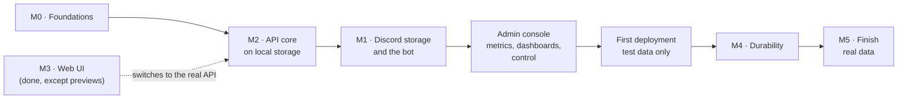
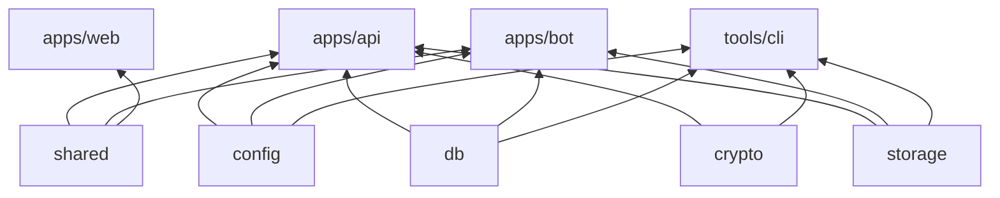

# DFS — Backend Build Plan

### Draft · 2026-10-04

| | |
|---|---|
| **What this is** | The plan for building the API, the bot and the database: order of work, code layout, tasks, and how each milestone is checked. |
| **What it is not** | The spec. Behavior, data model, security and formats are defined in [DESIGN.md](DESIGN.md); this plan links to it instead of restating it. When the two disagree, DESIGN.md wins and this plan is fixed. |
| **Starting point** | The web UI is done against an in-browser mock API (D14). The mock serves the whole §9 contract, so the API's job is to serve the same contract for real. |
| **Lifetime** | Tasks get checked off as they land; once the backend exists, this file is retired and anything lasting moves into DESIGN.md. |

---

## 1. Decisions

Settled for this plan and recorded in [DESIGN.md §19](DESIGN.md#19-decisions-log):

| # | Decision | Effect on the plan |
|---|---|---|
| D19 | **API first, Discord later.** | After M0 comes M2 on local storage, so the UI runs against a real server early. M1 (Discord storage and the bot) follows (§2). |
| D20 | **An upload onto an existing file's name creates a new version** of that file. | New rules in DESIGN §6.1, a small contract change (§4.2), and mock and UI updates (§7). |
| D21 | **Superseded by D27:** there is no dev-only sign-in. | Development signs in with a password like production; `dfs owner` makes the first account. |
| D22 | **Node runs the TypeScript sources directly** (type stripping). | No build step for api, bot and packages; rules and checks in §3.2. |
| D23 | **First deployment once Discord storage works**, test data only until M4. | A deployment step between M1 and M4 (§2). |
| D24 | **Old versions count toward the quota** until purged. | Quota reservation and pruning rules in DESIGN §5.1 and §6.1. |
| D25 | **One Discord server and bot for development and production.** Development uses its own `DFS Dev` channels and no gateway connection. | Config for the category and the gateway (§6); `dfs setup` in the CLI arrives with M1, since development can't use slash commands; load tests stay off Discord. |
| D26 | **Private GitHub repository, no CI.** | `pnpm check` in M0; the VPS pulls with a deploy key (§4.5). |
| D27 | **Username and password accounts, made by an admin** with a temporary password; no Discord accounts. Users choose their own password at first sign-in. | Password sign-in, the limited first session, and creating users and resetting passwords on the admin side (§4.2, §7). |
| D28 | **Admins are set in DFS;** the owner, made on the server with `dfs owner`, is always an admin. | The `dfs owner` command and the owner protections in the admin routes (§4.2). |

The Discord server and application already exist and serve both environments; §6 lists what to configure. The VPS is available: Fedora 43, 6 cores, 11 GB of memory and a 100 GB disk (§4.5).

---

## 2. Order of work

The design's milestone numbers stay; only their order changes (D19).



| Step | Ends with |
|---|---|
| **M0 · Foundations** | Workspace packages, config, Postgres in Docker, schema and migrations, health endpoints; TypeScript runs directly in Node. |
| **M2 · API core on local storage** | The UI works end to end against the real API (`VITE_API_MOCKS=off`): sign-in, browsing, uploads with versions, downloads, shares, admin, live events. Files are encrypted frames in a local blob store. |
| **M1 · Discord storage and the bot** | Blobs go to Discord, small files are packed, CDN URLs are refreshed, deletions in Discord are noticed. |
| **Admin console** | Everything about the running system can be seen and done from the admin pages: graphs of what it does, its health, and the actions that needed the command line. |
| **First deployment** | DFS runs on the Fedora VPS behind Caddy, privately, with test data. |
| **M4 · Durability** | GC, compaction, scrubber, metadata journal, nightly backups, and a recovery drill that passes. Real data is allowed from here. |
| **M5 · Finish** | Previews in the UI (the rest of M3; no version history, D33), admin search, slash commands, hardening. |

---

## 3. Code layout and conventions

### 3.1 Packages

The layout of [DESIGN §14](DESIGN.md#14-repository-layout), with responsibilities:

| Package | Holds | Used by |
|---|---|---|
| `packages/shared` | Wire schemas (Zod) and name rules. Exists. | web, api, bot |
| `packages/config` | Env parsing with Zod, derived sizes (`BLOB_MAX_BYTES`, `CHUNK_SIZE`), startup checks (DESIGN §15). | api, bot, cli |
| `packages/db` | Drizzle schema, SQL migrations, the connection pool, query helpers for recursive CTEs and keyset pages, the journal outbox writer. | api, bot, cli |
| `packages/crypto` | DFS1 frames, envelope encryption, DEK wrapping, AAD contexts (DESIGN §7.3). | api, cli |
| `packages/storage` | `BlobStore` interface, `LocalBlobStore`, `DiscordBlobStore`, `ChaosBlobStore`. | api (reads), bot (writes), cli |
| `apps/api` | Fastify app: routes of DESIGN §9, sessions, uploads, downloads, live events. | — |
| `apps/bot` | pg-boss workers, packer, Discord gateway, internal RPC. Runs without Discord when `BLOB_STORE=local`. | — |
| `tools/cli` | `dfs` admin CLI (setup, recover, rotate-key, verify). Later phases. | — |



`crypto` never reaches the bot: it only moves ciphertext (DESIGN §3.1).

### 3.2 Running TypeScript in Node (D22)

Node 24 strips types, so `node src/main.ts` runs the sources as they are. The base config already enforces the syntax this needs (`erasableSyntaxOnly`, `verbatimModuleSyntax`). The remaining rules:

- **Imports name their files:** `import { x } from './x.ts'`. Workspace packages export `.ts` entry points, as `@dfs/shared` does.
- **No path aliases at runtime.** Use relative imports, or package.json [subpath imports](https://nodejs.org/api/packages.html#subpath-imports) (`"imports": { "#*": "./src/*" }`), which Node resolves natively.
- **JSON imports** need `with { type: 'json' }`.
- **Typecheck with Node's rules:** packages that Node runs get a `tsconfig` with `module`/`moduleResolution: "NodeNext"`, since the base config's `Bundler` resolution accepts imports Node would reject.
- **Development** uses `node --watch src/main.ts`; production images copy the sources and run the same command (`pnpm deploy --prod` produces the runtime tree).

M0 proves this with a smoke test before anything else is built on it (§4.1), because Node refuses to strip types under `node_modules` and workspace packages are reached through pnpm's symlinks.

### 3.3 API conventions

- **Fastify 5 plugins, in order:** request ID and pino logger; config; database; trusted-proxy client IP; session (cookie → user, and the limited session that can only choose a password, DESIGN §7.1); CSRF check on state-changing routes, except `POST /auth/login` and the public share routes, which check `Origin` instead (DESIGN §7.1, §7.5); rate limits; error handler.
- **One error shape:** `{ error: { code, message } }` (the shared `apiErrorSchema`), with the codes the mock already uses (`name_conflict`, `invalid_move`, `quota_exceeded`, `share_locked`, …). Unknown errors become `500 internal_error` with the request ID in the log, never a stack trace in the response.
- **Validation from the shared schemas:** routes declare their bodies, queries and replies with the Zod schemas of `@dfs/shared` through the Zod type provider, so the API and the UI can't drift.
- **Routes are thin:** a route parses, authorizes and calls a service function (`nodes`, `uploads`, `content`, `shares`, `admin`, `events`) that takes a transaction.
- **Changes that matter for recovery** write their journal records in the same transaction (DESIGN §8). The helper exists from M2, so the journal fills from the first real upload even though flushing it to Discord comes in M4.
- **Streaming:** content and archive routes stream; nothing reads a whole file into memory.

---

## 4. Milestones

Each step lists its tasks and how to check it is done. "Done" means the command or test named there passes.

### 4.1 M0 · Foundations

Done on 2026-10-04.

**Tasks**

- [x] **Node runs TypeScript (do first):** `node src/main.ts` and `node --watch` run the sources through pnpm's workspace links, which resolve to real paths outside `node_modules`, so no flag or link-mode change is needed. Node-run packages extend `tsconfig.node.json` (NodeNext), and `@dfs/shared` does too.
- [x] `packages/config`: Zod env schema for DESIGN §15, derived sizes, startup checks, `DISCORD_*` optional when `BLOB_STORE=local`. Development and tests get defaults that match the dev compose file (DESIGN §15); production has none for the database and the secrets. Each service is checked only for what it already uses; the Discord settings become required in M1.
- [x] `docker/docker-compose.dev.yml`: Postgres 18, port 5432 on localhost only, a named volume at `/var/lib/postgresql` (where the PostgreSQL 18 image keeps its versioned data directory).
- [x] `packages/db`: Drizzle schema for every table of DESIGN §5, with the indexes of §5.1 (partial and trigram ones generated by drizzle-kit), `pg_trgm` in a first custom migration, migrations committed as SQL, and `pnpm db:migrate`, which holds an advisory lock while it runs. `backups` and the journal's batch bookkeeping come with M4.
- [x] `apps/api` skeleton: logger with request IDs, config, database, trusted proxies, the Zod type provider, one error shape (`invalid_request`, `not_found`, `internal_error` without a stack trace), `/api/health` (503 while Postgres is unreachable), graceful shutdown. Sessions, CSRF and rate limits arrive with sign-in in M2.
- [x] `apps/bot` skeleton: the advisory-lock leader election on a dedicated connection (DESIGN §11), pg-boss started by the leader, `/internal/health` behind `INTERNAL_RPC_SECRET`. It retries while Postgres is down, and exits if the connection holding the lock fails, so two leaders never overlap.
- [x] Turborepo tasks for the new packages (`dev`, `typecheck`, `lint`, `test`), with transit nodes so a change in a dependency invalidates cached results; `.env.example`; a README section on running the backend.
- [x] `pnpm check` at the root: format check, typecheck, lint and tests in one command, to run before every push (D26).
- [x] The private GitHub repository, with this repo pushed to it.
- [x] Integration test harness: Vitest global setup starts PostgreSQL 18 with Testcontainers (or uses `TEST_DATABASE_URL`), migrates a template database once, and each test file copies it.

**Done when**

- [x] `pnpm dev` starts web, api and bot; `curl localhost:3000/api/health` answers `ok` with the DB reachable.
- [x] `pnpm typecheck`, `pnpm lint` and `pnpm test` pass, with integration tests against a real Postgres (schema rules, health, leader hand-over).
- [x] Migrations apply to an empty database and again as a no-op.

### 4.2 M2 · API core on local storage

Files are encrypted from the start: the API writes DFS1 frames to staging (DESIGN §6.1, §7.3), and the bot, running without Discord, moves them into `LocalBlobStore`. Every frame becomes its own local blob for now; packing arrives with M1. Data written in M2 stays valid afterwards, because the frame format is final.

**Contract change for versions (D20)**

- [x] `uploadSessionSchema` gains `versionId` and `isNewVersion`.
- [x] `GET /uploads/:id` keeps answering until the session expires, also after completion: `uploadStatusSchema` gains `state: 'receiving' | 'completed'`.
- [x] Retried parts and completions are accepted (DESIGN §6.1), so the upload engine no longer guesses from the node's sync state whether a lost upload landed; a `404` means the session expired. The mock does the same, and new versions don't replay the "new" animation.

**Tasks**

- [x] **Auth** (DESIGN §7.1, D27): `POST /auth/login` with argon2id, the dummy-hash check for unknown usernames, per-IP and per-account rate limits, and the `Origin` check; temporary passwords that expire; the limited session that can only choose a password (`403 password_change_required` everywhere else, enforced in the session plugin, not per route); activation on the first own password; `POST /auth/password`, which needs the current password otherwise and ends the other sessions; the common-password list; sessions in Postgres with a new ID on sign-in and password change, CSRF tokens, `GET /auth/me`, logout. Sign-ins, failures, changes and resets are audited.
- [x] **`dfs owner`** (D28): a command in `apps/api` that creates the owner with a temporary password, or gives the existing owner a new one and ends their sessions. Development uses it for its first account too.
- [x] **Browse and change the tree:** children with keyset pagination, path, node, folders, `folders/ensure`, rename, move with the cycle check, trash and restore, search with `pg_trgm`, folder stats.
- [x] **Uploads:** sessions with quota reservation, batches with per-upload results, part PUTs with SHA-256 checks and encryption, auto-complete for single parts, completion, cancel, resume status, `503` with `Retry-After` when staging is full, the 24 h janitor. Same-name uploads become versions; pruning past `VERSION_RETENTION` (D20, D24).
- [x] **Bot in local mode:** the `blob.upload` worker writes staged frames to `LocalBlobStore`, marks blobs and versions `stored`, and sends `nodes.synced` through `pg_notify`.
- [x] **Content:** streamed downloads with `Range` (from staging while syncing, from the blob store once stored), ZIP archives for folders and selections, archive tickets.
- [x] **Shares:** create, list, edit, revoke; the public routes with argon2id passwords, unlock cookies, subtree checks and download counting (DESIGN §7.5, D18).
- [x] **Admin:** creating users (username, display name, temporary password, quota, role, with their root folder), resetting passwords, display names, quotas, roles and disabling, never for the owner or for yourself; usage, the read-only metadata browser, moderation, health, channels, audit log (DESIGN §9, D4). Every admin view and action is audited.
- [x] **Live events:** one `LISTEN` connection per API instance, SSE with typed payloads and pings (DESIGN §6.1).
- [x] **Web and mock (D20):** the mock turns same-name uploads into versions; the engine uses the new session state; a row that gets a new version doesn't replay its "new" animation.
- [x] **Switch-over:** the Vite proxy to the API, real downloads by navigation.

**Done when**

- The contract suite (§5) passes against both the MSW handlers and the real API.
- With `VITE_API_MOCKS=off`, the UI signs in with a password (a first sign-in with a temporary password, too), uploads a folder of 1,000 small files and a 1 GB file, shows them syncing then stored, downloads them back byte for byte, and shares a folder that opens in a private window.
- The upload engine's retry and resume paths pass against the real API with the `ChaosBlobStore` and an injected network failure.

**How it was checked**

- The contract suite runs in `pnpm check` against both targets (42 tests).
- In the browser, against the real API: the first sign-in with a temporary password, choosing a password, uploads that sync to stored live, byte-identical downloads (also ranges across a chunk boundary and ZIPs), a share opened signed out and a password share unlocked, and every page of the drive, shares, trash, settings and admin.
- The 1,000 files and the 1 GB file go through `pnpm --filter @dfs/api check:end-to-end` instead, which makes the web app's requests against the running stack (picking 1,000 files in a browser can't be scripted): 1,000 files in about 12 s from first request to all stored and read back, 1 GB in about 14 s. It also has 12 clients upload versions of the same names at once, which found two bugs: deadlocks between starting and completing uploads, and pruning that failed on finished upload sessions.
- `pnpm --filter @dfs/web check:engine` runs the real upload engine against the stack with `BLOB_STORE=chaos` in the root `.env` (the bot logged its chaos warning): upload requests fail, answers are lost, and an outage fails a file part-way, which gives up its session and is then retried from its start; everything comes back byte for byte and the quota counts each file once.
- The common-password list (2026-10-05) is SecLists' million most common passwords, keeping the ~30,000 of 12 characters or more; the top 10,000 alone would have added only 10 passwords the length rule doesn't already refuse.

### 4.3 M1 · Discord storage and the bot

**Tasks**

- [x] `DiscordBlobStore`: post attachments with `nonce`/`enforce_nonce`, verify size, Range reads from the CDN, URL refresh in batches (`POST /internal/urls/refresh`). Each post keeps a random nonce and its channel for retries, since blob IDs repeat across databases sharing the bot; the API signs a lookup batch's URLs in one call to the bot.
- [x] Workers of DESIGN §11: `blob.upload` per channel concurrency, `pack.seal` with the packer of §6.6, `blob.delete`, `reconcile.orphans`; `blob.compact` and `blob.verify` can wait for M4. Messages carry their database's `i` (DESIGN §4), so the reconciler only ever deletes its own.
- [x] Gateway: `messageDelete` and `messageDeleteBulk` mark blobs `lost` (intents `Guilds` and `GuildMessages` only; users aren't server members, D27). Removed with D31 (2026-10-07): the gateway now only answers `/dfs`, with the `Guilds` intent.
- [x] `dfs setup` in the CLI: create the category named by `DISCORD_CATEGORY_NAME` with the channels of DESIGN §4, hidden from everyone but the bot, and register them in `storage_channels`. Running it again changes nothing.
- [x] `/dfs setup` in production, with the gateway: the same, as a slash command.
- [x] Environment separation (D25): `DISCORD_GATEWAY=off` skips the gateway (slash commands; its tamper watch went with D31); the reconciler, scrubber and GC only touch registered channels; Admin → Channels accepts only channels in this environment's category, so development can't register production's channel by its ID.
- [x] Frame cache on the API (DESIGN §6.2), with read-ahead that grows as the reader keeps up, one memory budget for all downloads, and whole packs for ZIPs. Measured against Discord with a 256 MB file. Proposed: run the 2 GB check below at the first deployment, from the VPS, rather than through a home link (about 205 messages and 10 minutes of upload from here).
- [x] Opt-in Discord contract tests against a test channel (DESIGN §17): `pnpm --filter @dfs/storage check:discord`.

**Done when**

- With `BLOB_STORE=discord`, the M2 checks pass again, and 10,000 small files of 100 KB land in about 100 pack messages, not 10,000.
- Deleting a storage message by hand marks its blob `lost`, and the admin overview shows it (production gateway). Withdrawn with D31: only the bot reaches the channels.
- A development instance and a production instance run side by side against the same server, and neither reads, deletes or adopts the other's messages (a test that plants a foreign `dfs1` message in an unregistered channel).
- A 2 GB file streams with seeking from Discord, with the frame cache warm and cold.

### 4.4 Admin console

The admin pages grow from a status page into the place to watch and run DFS, before the first deployment, so that deployment is watched from them. Five steps, each committed on its own.

**Tasks**

- [x] **1 · Metrics** (DESIGN §16, D29): the API and the bot record what they do and add it to the `metrics` table every 5 s (every 10 s at first), in half-minute, minute and hour buckets; the leading bot samples the system's figures every half minute and drops old rows; `GET /admin/metrics` reads series over a range. The overview's cache card shows the real frame cache, and its figures no longer scan pg-boss's job table.
- [x] **2 · Dashboards:** graphs on the overview with a time range, alerts for what needs attention (worked out by the API, with the health), and a Monitoring tab for traffic, Discord, reading back, storage, the database, the processes and people. Graphs are the web app's own SVG, with a crosshair, keyboard reading and a table view. A Database tab watches PostgreSQL: its statistics sampled into the metrics, what runs now (with Cancel and End), the slowest statements (`pg_stat_statements`), tables, unused indexes and settings, and alerts for connections, long transactions, lock waits and deadlocks.
- [x] **3 · Storage control:** an Admin → Storage tab replaces Channels. Tasks go to the leading bot through the `admin.task` queue (one at a time, run once, refused while no bot leads, dropped after 10 minutes waiting): create a channel in the category, check the Discord layout, seal packs, clean up orphans, give uploads that gave up one more try, try failing deletions now, and recover a lost blob from the CDN's cache, which works only for blobs read lately (checked live: a deleted message's attachment is served only through a link that read it before; lost blobs now keep that link). The page lists failing uploads and deletions with their errors, and lost blobs with their files. A partial index on lost blobs (migration 0011) keeps the overview's 5 s refresh cheap. Lost blobs, their recovery and their index went with D31 (2026-10-07, migration 0020).
- [x] **4 · People and access:** an Admin → Access tab: everyone signed in (sessions now keep their address, browser and last use; migration 0012), each signed out at once; every share link, without its token, turned off by an admin; uploads under way, given up by an admin. A user's page has their sessions and Sign out everywhere. The audit log filters by kind of action and by words. Only the owner signs the owner out, and the asking session can't end itself.
- [x] **5 · System:** an Admin → System tab: the settings in effect from a fixed list in `packages/config`, each marked with the service that reads it; the bot's own (`/internal/settings`) for those only it reads, and compared for those both read; secrets as set or not in the service using them; the Discord layout with Check the layout; staging and the frame cache, which can be cleared. The Database tab vacuums a table on demand.
- [x] **Review of the admin console (2026-10-06):**
  - staging counts sealed packs waiting for Discord everywhere, as the upload limit does;
  - one admin task of a kind at a time, checked under a lock, and Create channel asks first;
  - System refreshes after a task, and compares only the settings both services read;
  - only the sessions an admin may end show Sign out, and Sign out everywhere asks first;
  - an upload given up, or a link turned off, is audited only when something changed;
  - lost blobs list each file once, and the alert counts only files whose current version is lost;
  - the overview's pass over `blobs` is shared for 30 s;
  - old metrics are dropped in a loop of their own.

**Done when**

- [ ] With a stack running, the graphs show its traffic, Discord's answers and the storage growing, and agree with the overview's figures. Traffic, storage and the overview's figures were seen on local storage; Discord's answers are recorded (checked in the database) but no graph of them has been looked at yet: on the first run with Discord storage, or at the deployment.
- [x] Every task that needed the command line after setup (except creating the owner) can be done from the admin pages, and each is in the audit log.
- [x] The mock API serves every new route, and the contract suite checks both.

### 4.5 First deployment (from M5, D23)

**Tasks**

- [x] Dockerfiles for api, bot and the web build; `docker-compose.yml` with caddy, api, bot, postgres and the one-shot `migrate`; the Caddyfile with the route allowlist and streaming settings (DESIGN §3.2, §13.2). Postgres starts with `shared_preload_libraries=pg_stat_statements`, as in development, for Admin → Database. Secrets come from files (`*_FILE`), and `dfs master-key` makes the master key. Checked on this PC with local storage (TESTING.md): only Caddy publishes ports, `/internal/*` is a 404, sign-in works over HTTPS, and the end-to-end check passes through Caddy.
- [x] Secrets in `/etc/dfs/secrets`, the master key generated on the development PC (its copy in `D:\Docs\DFS`) and copied to the VPS, `PUBLIC_BASE_URL` (`https://dfs.xlestudio.it`). Then `dfs owner` to make your account, run by the owner.
- [x] `NODE_ENV=production` in the images, so no development default applies (DESIGN §15); a fixed subnet for the internal Compose network, with `TRUSTED_PROXY_CIDRS` set to Caddy's address on it, so sign-in limits and the audit log see real client addresses. To check on the VPS: Docker Desktop shows its own gateway for every client, so only a real host proves it; no AAAA record until IPv6 keeps client addresses too.
- [x] Getting the code: sent from the development PC by `docker/deploy.sh` (the owner's choice, over a deploy key), which replaces `/opt/dfs` whole and starts the stack (DEPLOY.md).
- [x] Sizes for this VPS: its disk turned out to be 100 GB (91 GB free), not more than 150, so `STAGING_MAX_BYTES=30GiB` and `CACHE_MAX_BYTES=15GiB` (the defaults in `docker/.env.example`), leaving room for Postgres, images and the OS. Check them against the DB estimate of DESIGN §12.2 before going live.
- [x] Host setup: Docker Engine and its Compose plugin from Docker's repository. The hardening of DESIGN §13.2 (firewalld, SSH keys only, automatic updates) is left out by the owner's choice (2026-10-06): the VPS serves other uses too. Only Caddy's ports 80 and 443 are DFS's; nothing else of DFS listens.
- [x] Pages from before a deploy (2026-10-07; DESIGN §10.1): each deploy's version (its git revision) and time are built into the images by `docker/deploy.sh`; every API answer carries `X-DFS-Version`, and `GET /api/version` says it too, so an older page offers a reload at its next request. A screen's code that a deploy removed now answers 404 instead of the app's HTML marked immutable for a year (found on production: an older tab opening Trash or Admin for the first time showed "Failed to fetch dynamically imported module"), and the route's error page reloads into the new version instead. Settings shows the page's version; Admin → System the API's and the bot's, warning when they differ.
- [x] Forgot your password? (the user's request, 2026-10-07; DESIGN §7.1): the sign-in page asks the admins for a new password by username, since without email only an admin can tell it's really that person. `POST /auth/password-reset` answers `204` either way; `users.password_reset_requested_at` (migration 0022, left out of the journal like sign-in counters) marks the account on Admin → Users and raises an overview alert until an admin sets a temporary password or the person signs in. An email link will replace the admin's part.

**Done when**

- [x] The site answers over HTTPS on the VPS domain, `/internal/*` answers 404 from outside, and only Caddy publishes ports. On 2026-10-06: `https://dfs.xlestudio.it` with a Let's Encrypt certificate, `/internal/*` and `/metrics` 404 from outside, ports 80 and 443 only, from Caddy.
- [x] Sign-in works over HTTPS, and the M2 checks pass against the deployed instance, with test data only. The end-to-end check signs in with the owner's password, so the owner ran it on 2026-10-06 against `https://dfs.xlestudio.it`: all checks passed (300 small files, a 64 MB file, through Discord). Both sessions recorded the visitor's public IPv4 address, so the sign-in limits and the audit log see real clients, not Docker.

### 4.6 M4 · Durability

**Tasks**

- [x] GC (`blob.delete`, `apps/bot/src/collector.ts`).
- [x] No outside deletions (D31, the user's decision, 2026-10-07): only the bot reaches DFS's channels, so nothing deletes a storage message but DFS. Removed: the gateway's deletion watch and its alert in `#dfs-log` (the channel stays, with nothing posting yet), the `lost` states of blobs and versions with `lost_at` and their indexes (migration 0020, which also drops the lost-blob gauge's samples), `409 file_lost`, the drive's lost icon, Admin → Storage's lost blobs and their recovery task, the overview's lost blobs and alert. Recovery now drops a version whose blob the journal lacks, as if never journaled, and its file falls back to an earlier version or goes.
- [x] One lock order for packs (2026-10-07, `packages/db/src/locks.ts`): file versions, then blobs in ID order, then their frames. Storing a pack locked the pack and then its versions, while completing an upload that replaced a file locked the old version and then its pack, so replacing a file whose previous version's pack was being posted could deadlock; Postgres broke it and one side retried. A two-connection test reproduced it (`uploader.test.ts`, "lock order").
- [x] Deletions wait for the journal (2026-10-07): the GC deletes a released blob's message only once every journal record written by its release is posted (`blobs.released_at`, migration 0021, which a check keeps set on every `deleting` blob). Before, a message went within seconds and its journal record a minute later, so a VPS lost in between rebuilt a database pointing at a deleted message. `collector.test.ts` checks a release waits while its record is unsealed and while its batch isn't posted.
- [x] Reads follow a moved frame (2026-10-07): a frame read that fails is looked up again and read where it is now, as one moved out of staging already was (`readMoved` in `apps/api/src/content/reader.ts`). A download looks up 64 chunks ahead, so compacting a pack could otherwise cut it once the old message went. `discord-reads.test.ts` moves a file's packed end mid-download and deletes the old message; without the change the download was cut off.
- [x] **Compaction** (`blob.compact`, DESIGN §6.6, D32), designed with the user on 2026-10-07 and built in four commits on 2026-10-08, each passing `pnpm check`; deployed once the user says so. What it relies on is done above: one lock order, deletions waiting for the journal, reads following a moved frame.
  - [x] **1 · Recovery replays `blob.relocated`**, before anything writes one, so a drill never meets a record it can't replay. `foldJournal` moves each listed chunk of a version it has to `{id, offset}`, skips a version it doesn't have (not journaled yet, or purged), and refuses a chunk index the version lacks, which only a bug could write. `fold.test.ts`: a version stored, its pack compacted, rebuilt where it is now, its other chunk left; a pack merged twice; a relocation of a version journaled after it; one of a version purged before it. Done 2026-10-08.
  - [x] **2 · The compactor** (`apps/bot/src/compactor.ts`), shared by the leader's loop and the admin task like the packer, one run at a time. Done 2026-10-08, as below, with two additions: packs are read one at a time and only their live frames kept, so a group of many sparse packs never holds them all in memory; and the move also gives up on a reservation over half an hour old, well inside the hour after which the janitor drops it and the reconciler deletes its message, so neither can while the move commits. Then, on the user's request to make sure downloads stay as fast (2026-10-08): measured on a review stack against Discord, downloads before and after a merge took the same time, but packed files took up to half again as long while a run read packs over the same link; so a run also waits until no file was downloaded for a minute (`downloadsUnderWay`, from `downloads.bytes`) and stops before its next pack read when one starts. Compact packs now doesn't wait.
    - Candidates (one function, D32): `kind = 'pack'`, `state = 'stored'`, `live_bytes < COMPACT_THRESHOLD × PACK_TARGET_BYTES`, `stored_at` at least `COMPACT_MIN_AGE_DAYS` ago (new setting, read by the bot, in `describeSettings`; `COMPACT_THRESHOLD`'s description changes to "of a full pack"). Grouped in ID order, whole packs while they fit in `PACK_TARGET_BYTES`; a group of one is left.
    - A group: download each pack whole through the store, check its size and SHA-256 and each live frame's (`chunks` by `blob_id`, in ID order). A pack that fails goes into an in-memory `#broken` set with a warning and `compaction.failures`, never into `attempts` or `last_error`, which the GC and Admin → Storage read for deletions. Assemble in chunk ID order, insert the new row `building` (size, frame count, SHA-256), `store.put` from memory.
    - The transaction, in the order of `locks.ts`: the planned chunks' versions `FOR NO KEY UPDATE` by ID; the old packs and the new one `FOR UPDATE` by ID; stop if the new one isn't `building`; `UPDATE chunks … WHERE id = planned AND blob_id = from AND blob_offset = from_offset RETURNING`; `live_bytes` on every side from the rows moved, the new pack `stored` (location, signed URL, `stored_at`, `last_verified_at`), an old one left with nothing `deleting` with `released_at = now()`; journal `blob.stored` then `blob.relocated`, last.
    - Failure: the new row goes `deleted` at once when it can; the janitor (`cleanUp`) turns `building` rows older than an hour `deleted` and removes their local-store file; the reconciler deletes a posted message.
    - Leader loop every minute, one group per run, skipped while `uploadsWaiting`. Metrics: `packs.compacted` (old packs merged), `compaction.freed_bytes`, `compaction.failures`.
    - Tests on local storage and FakeDiscord (packs aged by moving `stored_at` back): two sparse packs merge and read back byte for byte; the rules (age, threshold of a full pack, whatever the size, two or more, what fits); a purge racing the relocation (its version locked as a purge does) leaves `liveBytesDrift` empty and the frame behind; a crash after posting, swept by the janitor, its message an orphan for the reconciler; a pack that fails its check is left out; old messages wait for the journal. The drill's drive (`recover.test.ts`) gets a compaction: rebuilt column for column and read byte for byte, on both stores.
  - [x] **3 · Admin:** the `packs.compact` task (Compact packs now, without the days' wait, as Seal packs now skips the pack wait), Admin → Storage's packs that qualify with their live bytes and the bytes merging would free, the metrics on the storage dashboard, the mock and the contract suite for the task and the figures. Done 2026-10-08: the rule moved to `@dfs/db` (`compaction.ts`), so the bot merges and `GET /admin/storage` counts by the same function; its `compaction` says, for packs a week old and for any age, how many packs merge into how many, their files' bytes, and the bytes freed. "Packs that hold little" on Admin → Storage shows both and runs the task; packs merged join Storage work on the Discord dashboard, and Storage gets Freed by compaction and Damaged packs.
  - [x] **4 · Docs and a review** of all three against DESIGN §6.6, then deploy on the user's word. Docs and review done 2026-10-08: DESIGN §6.6, §9 and §15 say what was built; the review found the API reading `PACK_TARGET_BYTES`, `COMPACT_THRESHOLD` and `COMPACT_MIN_AGE_DAYS` for its figures, so Admin → System lists them as read by both services. The deploy waits for the user's word. Production has no packs yet, so there it does nothing until packs are a week old; the first runs show in the bot's log and the metrics.
- [ ] Scrubber (`blob.verify`): with D31, all it could find is Discord itself losing or damaging an attachment. Whether to build it is the user's call.
- [x] Journal flush to Discord (DESIGN §8): the API seals batches into `journal_batches`, the leading bot posts them to `#dfs-journal`, an alert says when it falls behind, Admin → System shows it. Done 2026-10-07.
- [x] Keep each file's own modification date (DESIGN §5, §6.2). Done 2026-10-07: the upload sends `modifiedAt` (`File.lastModified`, left out when 0 or unknown), each version keeps it (`file_versions.modified_at`, migration 0017, journaled in `version.stored`), and completing an upload makes it the file's "Modified" (`nodes.updated_at`), which renames and moves of a file now leave. ZIPs write DOS times in the downloader's zone (`?tz=`, before this the server's UTC, so files unzipped in Italy showed times 2 hours early) and Info-ZIP's extended timestamp in UTC. Files uploaded before keep their upload date. A single downloaded file can't keep its date: browsers date it to the download.
- [x] A resumed download could mix two versions: `sendFile` answered a `Range` request without checking `If-Range`. Now `requestedRange` serves the whole file when `If-Range` names another version. Done 2026-10-07, with the next item.
- [x] Versions kept only for share links (the user's decision, 2026-10-07): a file link pins the version current when it was made (`share_links.version_id`, migration 0018, which pins existing file links); completing an upload purges earlier versions no working link serves (`unneededVersions`, locked against a link being made), and the leading bot's janitor purges the rest once their links stop working (`purgeUnneededVersions`). A link whose version went answers `410 share_version_deleted` and can't be changed. `VERSION_RETENTION` is gone.
- [x] Ask before overwriting (the user's decision, 2026-10-07): uploads from the web app send `ifExists: 'ask'`, and a name a file has answers `409 file_exists` with the file's version count and working links. The panel holds the upload (`conflict` status) and `UploadConflictDialog` asks: Replace, Keep both (named `name (N).ext` from the version count, editable) or Skip, optionally for the rest of the drop. Closing it skips.
- [x] Warn about share links (the user's decision, 2026-10-07): `POST /shares/count` counts outstanding links to items and their subtrees, or to anything in the trash. Moving to the trash asks first when the count isn't 0 (`TrashDialog`), the trash page's Delete forever and Empty trash say how many links go, and the replace dialog says the links keep the version replaced (`LinkWarning`).
- [x] Admin removal revokes share links (the user's decision, 2026-10-07): `moderate` revokes every unrevoked link to the item or below it in its transaction (journaled), returns `{revokedLinks}`, and adds the count to the audit entry; `GET /admin/nodes/:id/links` gives the count the moderation dialog warns with.
- [x] Admin → Access lists share links by owner, searchable (the user's request, 2026-10-07): `GET /admin/shares/owners` (owners with matching and working counts) and `GET /admin/shares` with `ownerId` and `q` (item name, folder path, owner name or username); each link carries its folder path, its owner's username and its version, and a link whose version was deleted shows as such.
- [x] Turning a link off deletes it (the user's decision, 2026-10-07): the owner's Delete, the admin's, and moderation delete the row and journal `share.deleted`; migration 0019 journaled and deleted the links revoked before, and dropped `revoked_at`. A deleted link answers `404 share_not_found`; the audit action stays `share.revoked`, labelled "Deleted a link".
- [x] Journal the version of an empty file. Done 2026-10-07: completion journals `version.stored` for a version with no chunks (`versionRecords`, moved from the bot to `@dfs/db`; `chunks` is `[]`, never `null`).
- [ ] Nightly snapshots with manifests and backup pointers (DESIGN §8).
- [x] `dfs recover` and `dfs drill` (DESIGN §8 step 5), with no snapshot: the whole journal replayed into an empty database. Built 2026-10-07; the drill test (`apps/api/src/recover/recover.test.ts`) rebuilds a drive used every way the journal records and matches it column for column and byte for byte, and covers a batch posted twice, a missing or changed batch, the journal on Discord among another database's, and a file whose version never reached Discord. Records now carry what recovery needs: `blob.stored` its `frameCount`, `version.stored` its `createdBy` and `createdAt`.
- [x] `dfs drill` against production's Discord, read only, into a scratch database on the VPS (the user's go, 2026-10-07): 32 batches, 1,461 records, rebuilt and matching the database in use with no difference; the scratch database was dropped. It runs in a one-off API container given the bot token too (docs/DEPLOY.md).

**Done when**

- The recovery drill rebuilds an empty database from Discord and the key file alone, and the rebuilt metadata matches the original.
- After that drill passes on the deployed instance, real data is allowed.

### 4.7 M5 · Finish

**Tasks**

- [x] **Previews, phase 1** (DESIGN §10.3, D33): images, PDFs, text and code, designed with the user on 2026-10-08 and built in five commits, each passing `pnpm check`. Their decisions: version history is out (earlier versions are internal, kept only for share links); audio and video come after, as their own plan; viewing a shared file never counts toward its download limit, only Download does; PDFs through pdf.js; Markdown formatted and JSON pretty-printed; office documents stay out.
  - [x] **1 · The API:** `304 Not Modified` for `If-None-Match` naming the version on both content routes (the ETag is the version's ID; a `304` is no download), and `?preview=1` on the share content route, which never counts. The contract suite, on the mock and the API: a revalidation answers `304` with no body and another version `200`; a link with one download left serves previews without using it, and Download still counts. The mock does the same.
  - [x] **2 · The viewer, with images:** `?preview=<id>` on the drive's and the search's URLs; double-click, Enter and the context menu open a previewable file (`previewKind(name, mimeType)` in `apps/web/src/lib`, unit-tested), others download as before; previous and next through the list's previewable files (a large folder's next page at its end), the keyboard and swipes; the header's Download, Share and Details; fit, 1:1, zoom around the pointer and pan; the next image loaded ahead; "no preview" with Download for an image the browser can't decode. The mock gets sample images (an SVG made per file). Checked in the browser on the mock, at a phone's width too.
  - [x] **3 · Text and code:** the first 5 MiB by Range; decoding and binary detection (`decodeText`, unit-tested: UTF-8, byte-order marks, UTF-16, NUL bytes, a character cut at the cap); a read-only CodeMirror 6 with each language loaded when first needed, line numbers, wrap, search; Markdown formatted (`react-markdown` with `remark-gfm`, no raw HTML, links in a new tab with `noopener`) with a switch to its source; JSON pretty-printed with a switch to the file as it is. The mock gets sample text, code, Markdown and JSON.
  - [x] **4 · PDF:** `pdfjs-dist` loaded with the first PDF, its worker, character maps and standard fonts as static files, its viewer with Range loading, zoom and the page count, `isEvalSupported: false`. The CSP checked in a production build behind Caddy, as for the deploy versioning, with `'wasm-unsafe-eval'` only if pdf.js needs it. The mock gets a small PDF. Checked on a review stack against Discord with a large PDF. Built 2026-10-08 with pdf.js 6, which has no `eval` (the option is gone): `useWasm: false` uses its JavaScript decoders, so the CSP is unchanged; a range transport replaces pdf.js's probe for the whole file. On Discord, a 58 MB PDF opened with 4 requests; one that spreads its page dictionaries read every chunk once (DESIGN §10.3). Its JavaScript decoders for JPEG 2000 and JBIG2 images went unexercised: no such PDF was at hand.
  - [x] **5 · The share page, then docs and a review:** a file link's preview on the page above Download, a folder link's files in the viewer, previews with `?preview=1`. A review of all five against DESIGN §10.3, then deploy on the user's word. Built 2026-10-08: the review of all five found 13 issues; 12 are fixed (among them a share link's viewer flashing an error while its folder loads, `image/jpg` never previewing, an empty `If-Range` when there's no ETag, and the mock ignoring `If-Range`, now in the contract suite). The 13th, the reader reading ahead for a request already cancelled, is phase 2's first job (commit 2 below). Not deployed: on the user's word.
- [ ] **Previews, phase 2: audio and video** (DESIGN §6.7, §10.4, D34, D35), designed with the user on 2026-10-08 and built after phase 1, in five commits, each passing `pnpm check`. Their decisions: direct play, remux and transcode, all three; shared links play the same way, within the same limits; an audio player bar with folder queues, no library and no gapless playback for now; seek thumbnails and HDR to SDR later, as important. Revised the same day: the VPS can't transcode (6 cores of an older EPYC, no video hardware, and other work of the user's), so nothing is: direct play, else a remux (the container, or the sound converted to AAC), else the player says why, with Download; HDR plays as the browser plays it, and no SDR copy is made.
  - [x] **1 · The media service and media info:** `apps/media` (Node 24, Debian's ffmpeg) with `docker/media.Dockerfile` and its Compose service (the internal network only, no secrets, without root, a read-only root filesystem, 1 CPU and 512 MiB); the API's internal plaintext route (`/internal/media/:versionId`, Range) with tokens signed per version; `media_info` (a migration), filled after an upload completes and on the first ask (keyframes come with the remux, commit 4); `GET /files/:id/media`; the media service in the API's health checks and on Admin → System. The drill leaves `media_info` out (derived, `compare.ts`). Tests on files ffmpeg makes in the media image, through Testcontainers, as Postgres runs (no ffmpeg on the development machine, and the same ffmpeg as production): MP4 with H.264 and AAC, MKV with HEVC and AC-3, AVI with MPEG-4, MP3 with tags and a cover, FLAC; reading ffprobe's answers is tested without ffmpeg, on answers captured from it. Built 2026-10-08 in two commits. The media service (`apps/media`): `POST /probe` takes a version and the API's token for it, reads the file from `API_INTERNAL_URL` (its own setting, never the caller's), and answers the media info or why the file isn't audio or video; ffprobe may use only HTTP and TCP and open only the containers DFS plays (so no playlist, list of files, picture or device), at the lowest priority, two at once, cut off at 60 s and 4 MiB of answer. The image is node:24-trixie-slim with ffmpeg 7.1 (1 GB, 67 s cold); the tests build it and show a playlist and a concat list are never followed and a picture is refused by the whitelist. The API: `GET /internal/media/:versionId` outside `/api`, with tokens signed per version for 6 hours (`media-read:` claims); `media_info` (migration 0023, going with its version); examining after an upload completes, two at a time, and on the first ask, one at a time per version; what is found is kept, a service that didn't answer is asked again; `GET /files/:id/media` (`422 not_media`, `503 media_unavailable`); Media on Admin → System with its ffmpeg; `media_info` left out of the drill's comparison. Both Compose files run it: in production on the internal network only, read-only, without capabilities, 1 CPU and 512 MiB; in development from `pnpm db:up`. Checked on a review stack against Discord: five files examined within 286 ms of their uploads, from staging; a 30 MB MP4 with its index at the end examined cold from Discord in 4.2–4.7 s through the development machine's link (two chunks).
  - [x] **Chunks in segments** (DESIGN §7.3, D37), asked for by the user after the streaming fix, before the video player, while production had no files: frame format 2 seals each chunk in 256 KiB segments with their own tags, and the reader streams from Discord by `Range` only the segments a request covers, checking each before sending it on. Measured on Discord first: a never-read range starts in 0.2 s, and 256 KiB follow within 20–50 ms, so segments cost almost nothing over sending bytes unchecked. Built 2026-10-09: the format with its tests (a byte changed, segments swapped or dropped, another chunk, the format pinned against native AES-GCM); sizes from a function of the plaintext; `stream` on the CDN readers, failing on fewer bytes than asked; the reader's chunks read as streams of checked pieces, read-ahead still counted in chunks, each chunk's bytes counted; tests that the first segment comes while Discord holds the rest, that a range asks for its segments alone, that a cut range fails, and that a frame moving mid-stream resumes at its next segment. Measured after: a cold seek's first byte 0.40–0.52 s against 2.7–3.0 s, about 1.5 MB from Discord for a seek cancelled after 1 MB against 24 MB, examining a 30 MB MP4 cold 0.54–1.0 s against 4.3–6.3 s, full reads, ZIPs and uploads as fast.
  - [x] **Rate limits of Discord's CDN, and small reads** (DESIGN §6.2), asked about by the user after segments: Discord's API was minded already (the bot's REST client waits within its limits, URLs are signed 50 at a time and kept a day), but the CDN wasn't, and segments had made each small read a request of its own. Built 2026-10-09: a 429 from the CDN closes a gate for the whole process as long as it asks, at most a minute, and the read is sent again (`cdn.429` on the graphs, and an alert); the frame cache keeps segments read in part, readers share a segment being fetched, a small range reads 1 MiB around it, and a chunk read whole is kept whole. Cache misses are counted again for streamed chunks, which went uncounted. Measured on Discord: a PDF read as pdf.js reads one took 16 requests instead of 140 (3.1 s instead of 11.3), and none when opened again; seeks cost as before. No cap on CDN requests (the user asked about many streams at once): what they share is bandwidth. Instead, on the user's word, graphs: CDN reads under way against downloads under way (peaks between samples), the CDN's time to first byte, and the reads that waited out a 429; priority for reads someone waits on only if they show contention.
  - [x] **2 · The video player, direct play** (DESIGN §10.4), designed with the user on 2026-10-09 and built in five commits, each passing `pnpm check`. Their decisions: Shift+← and Shift+→ move between files while ← and → seek; subtitles inside a file extracted right after its upload, from staging, and kept sealed in Postgres; the version played named in its address, so a file replaced while it plays says so; no "next video".
    - [x] **The reader first** (done 2026-10-08): it starts reading ahead once a request has taken its first piece, before the client has received it, so a request cancelled after its headers (a seek) costs two chunks read from Discord for nobody (found with pdf.js's probe, 2026-10-08). Read ahead only once the first piece has gone out, and measure downloads on Discord again, before and after, from the VPS too: with them, what the 20 MiB chunks (since 2026-10-08, DESIGN D1) cost a cold read's first byte and a cold seek. Pacing done 2026-10-08 (DESIGN §6.2): a response asks for its next piece once its socket has taken the last (`paced`), and full reads are as fast. It spots a client that doesn't keep up only where the connection's buffers hold less than a chunk: on a review stack against Discord, with one socket in a Linux container, a seek cancelled within 2 MB fetches 1 frame instead of 3; behind Caddy with the VPS's buffer limits, the buffers take a whole 20 MiB piece at once and it still fetches 3 (Windows' loopback does too). So a response that closes early aborts what is being read for it (`cancellation`), down to the CDN request, with the frame cache stopping a shared fetch only once every reader has left: behind Caddy with the VPS's limits, a seek cancelled within 1 to 10 MB takes 1.1 to 1.7 frames' worth from Discord instead of 3 frames, and full reads and cold ZIPs are as fast. A `HEAD` request (Fastify drains the stream) read the file for nobody; it now gets an empty stream and reads nothing. A cold first byte takes about 3 s through the development machine's link; from the VPS, `curl` on the review stack's attachments puts a 20 MiB frame at 0.6–0.95 s (the CDN fetch alone), without touching production.
    - [x] **2a · The API:** `?version=` on the content route (`412 version_changed` once the file has another); `GET /files/:id/playback` (the version, this user's position, the subtitle files beside it, from the database alone); `playback_positions` (a migration, cascading with the user, the file and the version; left out of the drill), `PUT` and `DELETE /files/:id/position`; subtitle files beside a video found by name and converted to WebVTT in plain code (SRT, ASS and SSA, WebVTT; encodings), `GET /files/:id/media/:versionId/subtitles/<file id>.vtt`. The contract suite, on the mock and the API (with a stand-in media service): `GET /files/:id/media`, `playback`, positions, `?version=`, a subtitle file as WebVTT; the mock does the same. Built 2026-10-09: the conversion lives in `@dfs/shared` (`subtitles.ts`, unit-tested), so the mock converts as the API does; languages from codes of two or three letters and English names (`Film.Italian.srt`); the API's contract run has a stand-in media service (`mediaFetch`), which finds every file a video.
    - [x] **2b · Subtitles inside files:** `POST /subtitles` in the media service (every text subtitle stream of a version to WebVTT in one ffmpeg pass, each output bounded, at the lowest priority, one at a time; the whitelist as it is); the API asks for them after examining an upload, while it is in staging, and on the first ask for a file examined before; `media_subtitles` (a migration), each track sealed as a journal object, bound to its version and stream; `GET /files/:id/media/:versionId/subtitles/<stream number>.vtt`. Tested on files ffmpeg makes in the media image: an MKV with SRT and ASS streams, an MP4 with mov_text. Built 2026-10-09: each stream to its own pipe (`pipe:3` on), one past 2 MiB a problem of its own while the others still come; times count from where the file starts, as players do; a problem is kept, so it isn't tried again, and answered `422 unreadable_subtitles`; tracks inside a version are cached by the browser for a year (the version never changes). The fixture's `-shortest` dropped its ASS line, so the film is cut with `-t` alone.
    - [x] **2c · The player:** video previewable (`video/mp2t` still text for `main.ts`); `GET /files/:id/playback`, then direct play pinned to the version; the controls, keys (Shift+← and → for files), touch, full screen, picture-in-picture and Media Session, each where the browser has them; codecs put to the browser once the media info comes; why a file can't play, a missing sound, a replaced file, a failed read; Details with the formats. Built 2026-10-09 in `apps/web/src/features/player` (no player library; codecs, keys and times unit-tested), loaded with the first video. Checked in the browser pane (Chromium 152) against Discord on a review stack, with the development media container: H.264 in MP4 and in MKV play; an AVI with MPEG-4 Part 2 says why, with Download; an MKV with AC-3 plays with the notice that it has no sound here; 10-bit HEVC plays (this machine decodes it); a file replaced while open says so, and Play the new version plays it; the keys, speed, the seek bar, volume and mute kept in the browser, and a phone's width. Subtitles inside two of the files were extracted and sealed within seconds of their upload. The pane refuses full screen to pages, so full screen, picture-in-picture, touch and Safari are left to a real browser and the user's phone.
    - [x] **2d · Subtitles, chapters and resuming:** tracks from the files beside it and from inside it, drawn above the controls, forced ones by themselves, the language remembered; chapters on the seek bar and in a list; the position saved and picked up, with Start over. Built 2026-10-09: the choice of track and the C key unit-tested; a track loads only once chosen, hidden, and the player draws its cues (`getCueAsHTML`, so only text, italics and bold), sized to the picture, at the top for `line:0`; an iPhone's own full screen shows it itself. Positions are kept only after the video has played (a viewer closed before it starts keeps the old one), and the video stops as soon as the viewer starts closing. Checked in the browser pane against Discord on the review stack: chapters on the seek bar and beside the time; an Italian SRT beside the video with its italics, and English subtitles extracted from inside the MP4 (mov_text), each chosen from the menu and by C, the language kept for the next video; a reload resumed where it was paused, with Start over, which cleared it, as did playing to the end; closing the viewer while it played saved where it was.
    - [x] **2e · The mock, docs and a review:** a sample video of a few seconds made with ffmpeg, served with Range (`206`), made-up media info with chapters, and a subtitle file beside it; Media in the mock's Admin → System; checked in the browser on the dev stack against Discord, at a phone's width too; docs, and a review of all five against DESIGN §10.4, then deploy on the user's word. Built 2026-10-09: the sample is 141 KB (12 s, H.264 and AAC), the one binary file kept for the mock, fetched when the mock starts; an MKV's made-up sound is AC-3 and an AVI's picture MPEG-4 Part 2, to show the notice and the reasons. The browser pane can't register the mock's service worker, so the mock is checked by its tests (the contract suite, sample media info) rather than on screen. The review of all five found three things, fixed: a resumed video played to its end could keep its old position (the player didn't yet know of it when it started), extracting a large MKV's subtitles after its upload held one of the two places for examining uploads (they now go one after another, on their own), and the subtitles route's errors were labelled `text/vtt`. Not deployed: on the user's word.
  - [ ] **3 · The audio player:** the bar outside the routes, the folder's queue in tag order, its controls and speed, Media Session, covers, resuming files over 20 minutes, the queue back after a reload. The mock gets sample audio. And audio on the share page, in the bar, with the routes commit 5 gives links (moved here from commit 5 on the user's word, 2026-10-09).
  - [ ] **4 · Remux:** keyframes from the index (MP4 sample tables, MKV cues) into the media info; playlists from them; sessions in the media service (started at the segment asked for, staying a minute ahead, started again on a far seek, ended when idle), the sound copied or converted to AAC; the limit and `503 media_busy`; the encrypted media cache; hls.js loaded with the first one, and `media-src 'self' blob:` in the CSP; the audio-track menu; a failed direct play going on as a remux when the container or the sound may be the cause, else the reason, with Download. Checked on a review stack against Discord: an MKV with AC-3 sound in Chrome (remux), HEVC where the browser has no decoder (the reason, with Download), seeking near and far, and five viewers against a limit of four. With it, on the graphs (moved here from commit 5, 2026-10-09): segments and their times, busy refusals, and the media service's remuxes and cache; remuxes on shared links too.
  - [x] **5 · Shared videos, the media alert, plays on the graphs** (DESIGN §6.7, §10.4), planned with the user on 2026-10-09, before commits 3 and 4: a sweep found shared videos broken since the player (the player builds its routes from the content path, and a link's isn't one of the drive's), so playing on links comes first. Audio on links goes to commit 3 and the remux graphs to commit 4. The user's decisions: a link's viewer may set off extracting the subtitles inside a file, as its owner may; link viewers get the connection test, limited per address.
    - [x] **The API:** the player's routes under `/s/:token/files/:id/…`, behind the link's own checks (expired, used up, locked until its password's cookie): `playback` (the version a file link pins, the current one in a folder link; no position; subtitle files beside the video only inside a shared folder, since a file link shares that file alone), `media`, `media/:versionId/subtitles/:track.vtt` (inside the file, extracted on the first ask if need be; beside it, in the shared folder), `content?version=&preview=1` (`412` once a folder link's file has another version; playing never counts toward the download limit), `media/:versionId/delivery` (each viewer's reads followed by the link and their address, as they have no account), `playback-report` (logged with the link, not a user, and limited per address), and `/s/:token/connection-test` (the same limits, per address). Built 2026-10-09: one resolver in `routes/media.ts` finds the file, the version it serves, whose reads they are (`link:<share>:<address>` for a link's viewer) and whether files beside it are offered, and the same routes are registered under both paths; the report checks `Origin`, as unlock does, and takes 60 in 10 minutes from an address; a link's connection test is one at a time and 10 in 10 minutes per address, apart from a user's own.
    - [x] **The player:** given its routes by where it was opened (a drive's file or a link's) rather than working them out from the content path; positions from the server for a drive's files, and kept in the browser for a link's, by link, file and version, with the same Start over; Details from the same routes. The share page's file view and its folder viewer play videos as the drive does. Built 2026-10-09: a file's place (`apps/web/src/lib/file-place.ts`: its path, and the link's token) goes from the drive's and the share page's previews through the viewer to the player, which asks everything under its path; a link's content URL carries `?preview=1`; positions on links are kept in `dfs.link-positions` (the latest 200). The browser check found a file link's page had no Details, so its viewers couldn't reach the formats or the connection test: a video there now has the viewer's Details, closed by Esc.
    - [x] **The mock and tests:** the mock gets the link routes. The contract suite, on the mock and the API: a file link plays its pinned version after the file has a newer one; playing takes nothing from the download limit; a folder link offers the subtitle files beside a video and a file link none; a locked link refuses until unlocked; a link that has ended refuses; a link's connection test and report. Built 2026-10-09: the mock's earlier versions keep the ID they had, for a file link's player; the API's own tests add the report's `Origin` check and the per-address limits.
    - [x] **The alert and the graphs:** `media_down` when the media service doesn't answer the API's health check (today only Admin → System shows it); plays on Admin → Monitoring per minute, from the players' reports: those that played, those that couldn't, those left before their first frame. Built 2026-10-09: a warning, not raised when there is no media service at all; `player.plays` and `player.left` beside `player.failures`, drawn in Playing → Plays, with stalls on a graph of their own.
    - [x] **Then:** the docs; a review of the video player, the drive's and the links', against DESIGN §6.7 and §10.4; a check in the browser on a review stack against Discord, with a file link and a folder link, locked and unlocked; deploy on the user's word. Done 2026-10-09 but the deploy: on the review stack, a file link played its version without the subtitle file beside it, resumed from the browser, and left its downloads as they were; a locked folder link refused the player's routes, then, unlocked, played with the subtitle file beside and the stream inside, its connection test, delivery figures and report (logged with the link); the drive's player as before, its position on the server. The review found that a link ending (or a file trashed) while it played read as "this browser can't open this file", after `/playback` was retried on a 404: `/playback` is now retried only on the server's own errors, so the API's reason shows at once, without a Download that would fail.
- [x] **Videos start at the beginning, offering to resume** (DESIGN §10.4), asked for by the user on 2026-10-09 in place of picking up where the viewer stopped, with Start over: "Stopped at 12:34 · Resume" over the picture, through the drive and links alike. The rules are in `apps/web/src/features/player/resume-rules.ts`, unit-tested: the offer stands through the first 30 s of play, or until the video ends, and while it stands the position it offers isn't replaced, since 10 s (the threshold for keeping one) proved too short in the browser check to notice the offer before it went. Checked on the review stack through a file link: a video began at 0 with the offer; played to 21 s and left, it still offered 0:15; Resume jumped there and played, and pausing kept the new place; past 30 s the offer went and the place was kept.
- [x] **Why a video is slow** (DESIGN §10.4, §16), asked for by the user after their phone waited about two minutes for a video's first frame, cold, 2026-10-09. The logs and graphs showed why: a 384 MB MKV, 4K at 60 fps in 10-bit HDR AV1 at 24 Mbit/s; Discord answered in 0.2–0.3 s and the API had the first 20 MB within 2 s and stayed up to 70 MB ahead, while the phone (Firefox on Android, on another network than the PC, over HTTP/3) took it at a steady 2.7 Mbit/s; the PC took the same file at 6 MB/s at once. Firefox on Android decodes AV1 in hardware where the phone can (an S25 Ultra can), so its connection was the limit. Transcoding stays out (the user, 2026-10-09). Built the same day: a log line per file read (`file sent`: range, bytes, finished or cancelled, first byte, rate, and the time waiting for the reader against the client), the player's warnings (Media Capabilities before it plays, the arrival rate against the video's bitrate while it waits, dropped frames while it plays), Decoding in Details, and the player's report of each play to the API (`POST /files/:id/playback-report`), logged with the video's formats and the browser, with the time to the first frame, stalls and failures on a Playing section of Admin → Monitoring. Checked in the browser on the review stack: Decoding in Details, the warning when the browser says it may not keep up (its answer made to say so), the report and the read lines in the API's log. Deployed 2026-10-09 as 878c4a7. The user played the same file cold on the phone: about 30 s to its first frame, seeks of tens of seconds, and a warning saying 0 kbit/s. The new lines showed the server waited on the phone 31.2 s of 38.3 (17 MB at 3.6 Mbit/s) and 137.8 s of 141 (43 MB at 2.5 Mbit/s), on Discord under a second. The 0 was the player's: it read the rate from what the browser said it had loaded, and Firefox says nothing of an MKV before reading its index. So the API now counts what it sends to each user's reads of a version (`Deliveries`, `GET /files/:id/media/:versionId/delivery`), and the player asks every 2 s while it waits, before the first frame, stalled or after a seek, and says on which side the server waited; Details has a connection test from the VPS (`GET /connection-test`); the report gains the time to playing and seeks with their waits, and goes when the viewer starts closing (in the hidden browser pane, its fade never ended and the report never went). Checked on the review stack behind a proxy holding it to 3 Mbit/s: the warning said 2.4 Mbit/s against 19.5 and that the server waited on the connection, the test said 2.4 Mbit/s, and the report and the lines came through.
- [ ] **Seek thumbnails** (DESIGN §6.7): later, but important (the user, 2026-10-08). Their own plan. HDR to SDR is out with transcoding (the user, 2026-10-08).
- [ ] Admin search (`GET /admin/search`), slash commands, the remaining items of [DESIGN §18.1](DESIGN.md#181-status-and-future-work), and hardening from running it.

---

## 5. Testing

| Level | What | Where |
|---|---|---|
| **Contract** | One HTTP-level suite, grown from today's mock spec (`apps/web/src/mocks/db.test.ts`): every rule of DESIGN §5–§7 the UI relies on (names, cycles, trash, pagination, quotas, uploads, versions, shares, admin). It runs against the MSW handlers in Node (`setupServer`) and against the real API, so the mock and the API can't drift. | A shared test package, run by web and api |
| **Unit** | Crypto round trips and tamper detection, frame parsing, pack math, range → chunk math (DESIGN §17). | `packages/*` |
| **Integration** | API + Testcontainers Postgres + `LocalBlobStore`: full flows, concurrency (renames, moves, quota), SSE across two API instances. | `apps/api` |
| **Fault injection** | `ChaosBlobStore` (429s, 5xx, timeouts, lost responses) under the upload and download paths. | `apps/api`, `apps/bot` |
| **Discord contract** | Opt-in, real token, test channel. | `packages/storage` |
| **E2E** | Playwright against the real API, from M2 on: the checks of §4.2, plus drag-to-move and the motion flows that unit tests can't see. | `apps/web` |

---

## 6. Local development and Discord setup

**Running it**

```bash
pnpm db:up                                              # Postgres 18 and the media service
pnpm --filter @dfs/db migrate
pnpm dev                                                # web :5173, api :3000, bot :3001
```

- `.env` from `.env.example`; with `BLOB_STORE=local`, nothing needs Discord.
- `pnpm --filter @dfs/api dfs owner` makes your first local account and prints its temporary password.
- `VITE_API_MOCKS=off` points the UI at the API; without it, the UI keeps using the mock.

**Discord: what to configure** (the server and application exist)

- **Application → OAuth2:** nothing to set up. DFS doesn't use Discord sign-in (D27), so the client secret isn't used anywhere.
- **Application → Bot:** no privileged intents are needed (D27). The bot is already in the server; it needs *View Channels*, *Send Messages*, *Attach Files*, *Read Message History* and *Manage Messages*, plus *Manage Channels* and *Manage Roles* for `dfs setup` (they can be removed once both categories exist; DESIGN §4).
- **Server:** private to you; users never join it, and no roles are needed (D27). Your existing text channel becomes production's first storage channel: keep it visible only to you and the bot, and register it on the Admin → Channels page at the first deployment. The private categories and their channels (`#storage-00` to `#storage-03`, `#dfs-journal`, `#dfs-backups`, `#dfs-log`) don't need creating by hand: `dfs setup` makes the `DFS Dev` set for development, and `/dfs setup` the `DFS` set in production (M1).
- **Into `.env`:** `DISCORD_BOT_TOKEN` and `DISCORD_GUILD_ID`.
- **Development `.env`:** the same token and IDs as production, plus `DISCORD_CATEGORY_NAME=DFS Dev` and `DISCORD_GATEWAY=off`. Never point development at the `DFS` category.

---

## 7. Changes to the web app

| When | Change |
|---|---|
| Done | Password sign-in, choosing a password after a temporary one, password change in Settings, and creating users and resetting passwords on the Users page, in the UI and the mock (D27, D28). |
| Done | Same-name uploads become versions in the mock; the contract suite covers it (D20). |
| Done | The upload engine checks the session's `state` on a retry, and stops checking the node's sync state. |
| Done | Rows that get a new version don't replay their "new" animation. |
| Done | Downloads use plain navigation with the real API (already built; first exercised here). |
| Done | The mock's demo channels use the names of DESIGN §4 (`storage-00` …) instead of `dfs-data-N`. |
| M5 | Previews of images, PDFs, text and code, in the drive and on the share page (DESIGN §10.3); audio and video after. |

---

## 8. Risks to check early

| Risk | Check | When |
|---|---|---|
| Type stripping and pnpm's symlinked workspace packages | The M0 smoke test: works as is | Done (M0) |
| The Zod type provider supporting Zod 4 | `fastify-type-provider-zod` 7 (Zod 4.2+), used by `/api/health` | Done (M0) |
| Drizzle with PG 18 features (`uuidv7()` defaults, partial and trigram indexes) | The first migration and the schema tests | Done (M0) |
| argon2's native build on Windows and in the Alpine/Debian image | None needed: the API uses Node's built-in `crypto.argon2` | Done (M2) |
| Discord rate limits with many small files | The 10,000-file check with packing | M1 |
| Development and production sharing one bot (D25) | The side-by-side check of M1; load tests stay on `LocalBlobStore` | M1 onwards |
| CDN URL expiry during long streams | A slow download across a refresh | M1 |
| A check's client stopping or failing for no known reason (§8.1) | Run the stack checks through pnpm, and if it happens again, record what §8.1 asks for | Whenever the stack checks run |

### 8.1 Unexplained failures to watch for

Neither of these could be reproduced or explained. Neither touched the data: the API kept serving, and its quota totals stayed exact.

**The end-to-end client stopped without a message (2026-10-05).**

- **What happened:** one `check:end-to-end` run, against a freshly started API and bot on their own database, stopped about 0.3 s into "12 clients uploading versions of the same names at once" and printed nothing more. It left 24 upload sessions without parts (three batches of 8, created within 28 ms); the janitor releases them after 24 hours.
- **Known:** the same API process served the next runs and logged nothing; no Windows event log has an entry at that time; the client had been started from Git Bash through `timeout … | grep | tail`, which loses a crashed process's exit code, so there is none.
- **Ruled out:** an error in the script or the contract client (every failure path prints); an `await` that never settles (Node warns and exits with 13); the output pipe breaking on its own (the step writes nothing until it ends); the server.
- **Not reproduced in:** 63 full runs afterwards (piped, to files, with the servers restarted before each, each one's exit traced from inside the process); 864,000 concurrent WebCrypto digests of one buffer; about 520,000 requests in the step's pattern against a trivial server; 60 rounds of a 1 GiB download followed at once by the burst.
- **Left:** a native crash of the client's `node.exe` (Node 24.14.1 on Windows), or the process being ended from outside. Both leave no message and no Windows event: Node turns off Windows crash reporting.
- **If it happens again:** note the exit code pnpm reports (`ELIFECYCLE … exit code 3221225477` is 0xC0000005, an access violation; see `docs/TESTING.md`), the step it stopped in, the Node version, and whether the API logged anything at that moment. A Windows exception code points at Node itself (then try a newer Node 24 release); any other code, at whatever ended the process.

**The end-to-end client's connection was reset (2026-10-04).**

- **What happened:** once, against the `pnpm dev` stack, right after three stress runs, the client failed with `read ECONNRESET` (errno -4077): the connection it was reading was reset.
- **Known:** the server's log had already scrolled out of view; Postgres logged no error; five runs right after passed.
- **Since:** it hasn't recurred in about 75 runs, on code that has changed a lot since (among others, fixes for a late duplicate part racing completion and for an unhandled error when a download's client disconnects).
- **If it happens again:** the check now names the request that failed. Look in the API's log at that moment for an aborted response or an error while reading content.

---

## 9. Open questions

1. **Uploads larger than staging (found 2026-10-07, held by the user as a design change).** An upload's frames stay in staging until it completes, because only completion hands them to the bot. A file larger than `STAGING_MAX_BYTES` (30 GiB in production) fills staging with its own frames and can never finish; meanwhile every upload, anyone's, waits on `503 staging_full`, and since a failed upload's page keeps its session alive, staging stays full until that page closes and the lease gives it up. Two large uploads at once can block each other the same way. Two ways out: refuse a file larger than staging and reserve staging space per upload as it starts (files capped near 30 GiB), or let the bot post a receiving upload's large frames as they arrive, so staging only holds what is in transit (no cap; abandoned uploads then leave posted blobs for the GC).
2. **The domain.** There is none yet; it is decided before the first deployment, which needs it for TLS, share links and the sign-in `Origin` check. Nothing before that depends on it.
