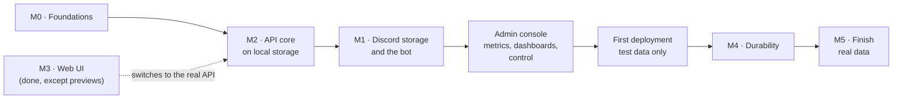
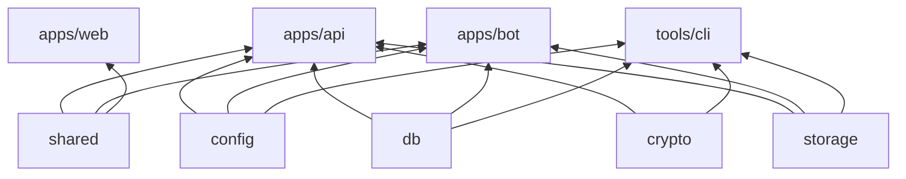

# DFS — Backend Build Plan

### Draft · 2026-10-04

| | |
|---|---|
| **What this is** | The plan for building the API, the bot and the database: order of work, code layout, tasks, and how each milestone is checked. |
| **What it is not** | The spec. Behavior, data model, security and formats are defined in [DESIGN.md](DESIGN.md); this plan links to it instead of restating it. When the two disagree, DESIGN.md wins and this plan is fixed. |
| **Starting point** | The web UI is done against an in-browser mock API (D14). The mock serves the whole §9 contract, so the API's job is to serve the same contract for real. |
| **Lifetime** | Tasks get checked off as they land; once the backend exists, this file is retired and anything lasting moves into DESIGN.md. |

---

## 1. Decisions

Settled for this plan and recorded in [DESIGN.md §19](DESIGN.md#19-decisions-log):

| # | Decision | Effect on the plan |
|---|---|---|
| D19 | **API first, Discord later.** | After M0 comes M2 on local storage, so the UI runs against a real server early. M1 (Discord storage and the bot) follows (§2). |
| D20 | **An upload onto an existing file's name creates a new version** of that file. | New rules in DESIGN §6.1, a small contract change (§4.2), and mock and UI updates (§7). |
| D21 | **Superseded by D27:** there is no dev-only sign-in. | Development signs in with a password like production; `dfs owner` makes the first account. |
| D22 | **Node runs the TypeScript sources directly** (type stripping). | No build step for api, bot and packages; rules and checks in §3.2. |
| D23 | **First deployment once Discord storage works**, test data only until M4. | A deployment step between M1 and M4 (§2). |
| D24 | **Old versions count toward the quota** until purged. | Quota reservation and pruning rules in DESIGN §5.1 and §6.1. |
| D25 | **One Discord server and bot for development and production.** Development uses its own `DFS Dev` channels and no gateway connection. | Config for the category and the gateway (§6); `dfs setup` in the CLI arrives with M1, since development can't use slash commands; load tests stay off Discord. |
| D26 | **Private GitHub repository, no CI.** | `pnpm check` in M0; the VPS pulls with a deploy key (§4.5). |
| D27 | **Username and password accounts, made by an admin** with a temporary password; no Discord accounts. Users choose their own password at first sign-in. | Password sign-in, the limited first session, and creating users and resetting passwords on the admin side (§4.2, §7). |
| D28 | **Admins are set in DFS;** the owner, made on the server with `dfs owner`, is always an admin. | The `dfs owner` command and the owner protections in the admin routes (§4.2). |

The Discord server and application already exist and serve both environments; §6 lists what to configure. The VPS is available: Fedora 43, 6 cores, 11 GB of memory and a 100 GB disk (§4.5).

---

## 2. Order of work

The design's milestone numbers stay; only their order changes (D19).



| Step | Ends with |
|---|---|
| **M0 · Foundations** | Workspace packages, config, Postgres in Docker, schema and migrations, health endpoints; TypeScript runs directly in Node. |
| **M2 · API core on local storage** | The UI works end to end against the real API (`VITE_API_MOCKS=off`): sign-in, browsing, uploads with versions, downloads, shares, admin, live events. Files are encrypted frames in a local blob store. |
| **M1 · Discord storage and the bot** | Blobs go to Discord, small files are packed, CDN URLs are refreshed, deletions in Discord are noticed. |
| **Admin console** | Everything about the running system can be seen and done from the admin pages: graphs of what it does, its health, and the actions that needed the command line. |
| **First deployment** | DFS runs on the Fedora VPS behind Caddy, privately, with test data. |
| **M4 · Durability** | GC, compaction, scrubber, metadata journal, nightly backups, and a recovery drill that passes. Real data is allowed from here. |
| **M5 · Finish** | Previews and version history in the UI (the rest of M3), admin search, slash commands, hardening. |

---

## 3. Code layout and conventions

### 3.1 Packages

The layout of [DESIGN §14](DESIGN.md#14-repository-layout), with responsibilities:

| Package | Holds | Used by |
|---|---|---|
| `packages/shared` | Wire schemas (Zod) and name rules. Exists. | web, api, bot |
| `packages/config` | Env parsing with Zod, derived sizes (`BLOB_MAX_BYTES`, `CHUNK_SIZE`), startup checks (DESIGN §15). | api, bot, cli |
| `packages/db` | Drizzle schema, SQL migrations, the connection pool, query helpers for recursive CTEs and keyset pages, the journal outbox writer. | api, bot, cli |
| `packages/crypto` | DFS1 frames, envelope encryption, DEK wrapping, AAD contexts (DESIGN §7.3). | api, cli |
| `packages/storage` | `BlobStore` interface, `LocalBlobStore`, `DiscordBlobStore`, `ChaosBlobStore`. | api (reads), bot (writes), cli |
| `apps/api` | Fastify app: routes of DESIGN §9, sessions, uploads, downloads, live events. | — |
| `apps/bot` | pg-boss workers, packer, Discord gateway, internal RPC. Runs without Discord when `BLOB_STORE=local`. | — |
| `tools/cli` | `dfs` admin CLI (setup, recover, rotate-key, verify). Later phases. | — |



`crypto` never reaches the bot: it only moves ciphertext (DESIGN §3.1).

### 3.2 Running TypeScript in Node (D22)

Node 24 strips types, so `node src/main.ts` runs the sources as they are. The base config already enforces the syntax this needs (`erasableSyntaxOnly`, `verbatimModuleSyntax`). The remaining rules:

- **Imports name their files:** `import { x } from './x.ts'`. Workspace packages export `.ts` entry points, as `@dfs/shared` does.
- **No path aliases at runtime.** Use relative imports, or package.json [subpath imports](https://nodejs.org/api/packages.html#subpath-imports) (`"imports": { "#*": "./src/*" }`), which Node resolves natively.
- **JSON imports** need `with { type: 'json' }`.
- **Typecheck with Node's rules:** packages that Node runs get a `tsconfig` with `module`/`moduleResolution: "NodeNext"`, since the base config's `Bundler` resolution accepts imports Node would reject.
- **Development** uses `node --watch src/main.ts`; production images copy the sources and run the same command (`pnpm deploy --prod` produces the runtime tree).

M0 proves this with a smoke test before anything else is built on it (§4.1), because Node refuses to strip types under `node_modules` and workspace packages are reached through pnpm's symlinks.

### 3.3 API conventions

- **Fastify 5 plugins, in order:** request ID and pino logger; config; database; trusted-proxy client IP; session (cookie → user, and the limited session that can only choose a password, DESIGN §7.1); CSRF check on state-changing routes, except `POST /auth/login` and the public share routes, which check `Origin` instead (DESIGN §7.1, §7.5); rate limits; error handler.
- **One error shape:** `{ error: { code, message } }` (the shared `apiErrorSchema`), with the codes the mock already uses (`name_conflict`, `invalid_move`, `quota_exceeded`, `share_locked`, …). Unknown errors become `500 internal_error` with the request ID in the log, never a stack trace in the response.
- **Validation from the shared schemas:** routes declare their bodies, queries and replies with the Zod schemas of `@dfs/shared` through the Zod type provider, so the API and the UI can't drift.
- **Routes are thin:** a route parses, authorizes and calls a service function (`nodes`, `uploads`, `content`, `shares`, `admin`, `events`) that takes a transaction.
- **Changes that matter for recovery** write their journal records in the same transaction (DESIGN §8). The helper exists from M2, so the journal fills from the first real upload even though flushing it to Discord comes in M4.
- **Streaming:** content and archive routes stream; nothing reads a whole file into memory.

---

## 4. Milestones

Each step lists its tasks and how to check it is done. "Done" means the command or test named there passes.

### 4.1 M0 · Foundations

Done on 2026-10-04.

**Tasks**

- [x] **Node runs TypeScript (do first):** `node src/main.ts` and `node --watch` run the sources through pnpm's workspace links, which resolve to real paths outside `node_modules`, so no flag or link-mode change is needed. Node-run packages extend `tsconfig.node.json` (NodeNext), and `@dfs/shared` does too.
- [x] `packages/config`: Zod env schema for DESIGN §15, derived sizes, startup checks, `DISCORD_*` optional when `BLOB_STORE=local`. Development and tests get defaults that match the dev compose file (DESIGN §15); production has none for the database and the secrets. Each service is checked only for what it already uses; the Discord settings become required in M1.
- [x] `docker/docker-compose.dev.yml`: Postgres 18, port 5432 on localhost only, a named volume at `/var/lib/postgresql` (where the PostgreSQL 18 image keeps its versioned data directory).
- [x] `packages/db`: Drizzle schema for every table of DESIGN §5, with the indexes of §5.1 (partial and trigram ones generated by drizzle-kit), `pg_trgm` in a first custom migration, migrations committed as SQL, and `pnpm db:migrate`, which holds an advisory lock while it runs. `backups` and the journal's batch bookkeeping come with M4.
- [x] `apps/api` skeleton: logger with request IDs, config, database, trusted proxies, the Zod type provider, one error shape (`invalid_request`, `not_found`, `internal_error` without a stack trace), `/api/health` (503 while Postgres is unreachable), graceful shutdown. Sessions, CSRF and rate limits arrive with sign-in in M2.
- [x] `apps/bot` skeleton: the advisory-lock leader election on a dedicated connection (DESIGN §11), pg-boss started by the leader, `/internal/health` behind `INTERNAL_RPC_SECRET`. It retries while Postgres is down, and exits if the connection holding the lock fails, so two leaders never overlap.
- [x] Turborepo tasks for the new packages (`dev`, `typecheck`, `lint`, `test`), with transit nodes so a change in a dependency invalidates cached results; `.env.example`; a README section on running the backend.
- [x] `pnpm check` at the root: format check, typecheck, lint and tests in one command, to run before every push (D26).
- [x] The private GitHub repository, with this repo pushed to it.
- [x] Integration test harness: Vitest global setup starts PostgreSQL 18 with Testcontainers (or uses `TEST_DATABASE_URL`), migrates a template database once, and each test file copies it.

**Done when**

- [x] `pnpm dev` starts web, api and bot; `curl localhost:3000/api/health` answers `ok` with the DB reachable.
- [x] `pnpm typecheck`, `pnpm lint` and `pnpm test` pass, with integration tests against a real Postgres (schema rules, health, leader hand-over).
- [x] Migrations apply to an empty database and again as a no-op.

### 4.2 M2 · API core on local storage

Files are encrypted from the start: the API writes DFS1 frames to staging (DESIGN §6.1, §7.3), and the bot, running without Discord, moves them into `LocalBlobStore`. Every frame becomes its own local blob for now; packing arrives with M1. Data written in M2 stays valid afterwards, because the frame format is final.

**Contract change for versions (D20)**

- [x] `uploadSessionSchema` gains `versionId` and `isNewVersion`.
- [x] `GET /uploads/:id` keeps answering until the session expires, also after completion: `uploadStatusSchema` gains `state: 'receiving' | 'completed'`.
- [x] Retried parts and completions are accepted (DESIGN §6.1), so the upload engine no longer guesses from the node's sync state whether a lost upload landed; a `404` means the session expired. The mock does the same, and new versions don't replay the "new" animation.

**Tasks**

- [x] **Auth** (DESIGN §7.1, D27): `POST /auth/login` with argon2id, the dummy-hash check for unknown usernames, per-IP and per-account rate limits, and the `Origin` check; temporary passwords that expire; the limited session that can only choose a password (`403 password_change_required` everywhere else, enforced in the session plugin, not per route); activation on the first own password; `POST /auth/password`, which needs the current password otherwise and ends the other sessions; the common-password list; sessions in Postgres with a new ID on sign-in and password change, CSRF tokens, `GET /auth/me`, logout. Sign-ins, failures, changes and resets are audited.
- [x] **`dfs owner`** (D28): a command in `apps/api` that creates the owner with a temporary password, or gives the existing owner a new one and ends their sessions. Development uses it for its first account too.
- [x] **Browse and change the tree:** children with keyset pagination, path, node, folders, `folders/ensure`, rename, move with the cycle check, trash and restore, search with `pg_trgm`, folder stats.
- [x] **Uploads:** sessions with quota reservation, batches with per-upload results, part PUTs with SHA-256 checks and encryption, auto-complete for single parts, completion, cancel, resume status, `503` with `Retry-After` when staging is full, the 24 h janitor. Same-name uploads become versions; pruning past `VERSION_RETENTION` (D20, D24).
- [x] **Bot in local mode:** the `blob.upload` worker writes staged frames to `LocalBlobStore`, marks blobs and versions `stored`, and sends `nodes.synced` through `pg_notify`.
- [x] **Content:** streamed downloads with `Range` (from staging while syncing, from the blob store once stored), ZIP archives for folders and selections, archive tickets.
- [x] **Shares:** create, list, edit, revoke; the public routes with argon2id passwords, unlock cookies, subtree checks and download counting (DESIGN §7.5, D18).
- [x] **Admin:** creating users (username, display name, temporary password, quota, role, with their root folder), resetting passwords, display names, quotas, roles and disabling, never for the owner or for yourself; usage, the read-only metadata browser, moderation, health, channels, audit log (DESIGN §9, D4). Every admin view and action is audited.
- [x] **Live events:** one `LISTEN` connection per API instance, SSE with typed payloads and pings (DESIGN §6.1).
- [x] **Web and mock (D20):** the mock turns same-name uploads into versions; the engine uses the new session state; a row that gets a new version doesn't replay its "new" animation.
- [x] **Switch-over:** the Vite proxy to the API, real downloads by navigation.

**Done when**

- The contract suite (§5) passes against both the MSW handlers and the real API.
- With `VITE_API_MOCKS=off`, the UI signs in with a password (a first sign-in with a temporary password, too), uploads a folder of 1,000 small files and a 1 GB file, shows them syncing then stored, downloads them back byte for byte, and shares a folder that opens in a private window.
- The upload engine's retry and resume paths pass against the real API with the `ChaosBlobStore` and an injected network failure.

**How it was checked**

- The contract suite runs in `pnpm check` against both targets (42 tests).
- In the browser, against the real API: the first sign-in with a temporary password, choosing a password, uploads that sync to stored live, byte-identical downloads (also ranges across a chunk boundary and ZIPs), a share opened signed out and a password share unlocked, and every page of the drive, shares, trash, settings and admin.
- The 1,000 files and the 1 GB file go through `pnpm --filter @dfs/api check:end-to-end` instead, which makes the web app's requests against the running stack (picking 1,000 files in a browser can't be scripted): 1,000 files in about 12 s from first request to all stored and read back, 1 GB in about 14 s. It also has 12 clients upload versions of the same names at once, which found two bugs: deadlocks between starting and completing uploads, and pruning that failed on finished upload sessions.
- `pnpm --filter @dfs/web check:engine` runs the real upload engine against the stack with `BLOB_STORE=chaos` in the root `.env` (the bot logged its chaos warning): upload requests fail, answers are lost, and an outage fails a file part-way, which gives up its session and is then retried from its start; everything comes back byte for byte and the quota counts each file once.
- The common-password list (2026-10-05) is SecLists' million most common passwords, keeping the ~30,000 of 12 characters or more; the top 10,000 alone would have added only 10 passwords the length rule doesn't already refuse.

### 4.3 M1 · Discord storage and the bot

**Tasks**

- [x] `DiscordBlobStore`: post attachments with `nonce`/`enforce_nonce`, verify size, Range reads from the CDN, URL refresh in batches (`POST /internal/urls/refresh`). Each post keeps a random nonce and its channel for retries, since blob IDs repeat across databases sharing the bot; the API signs a lookup batch's URLs in one call to the bot.
- [x] Workers of DESIGN §11: `blob.upload` per channel concurrency, `pack.seal` with the packer of §6.6, `blob.delete`, `reconcile.orphans`; `blob.compact` and `blob.verify` can wait for M4. Messages carry their database's `i` (DESIGN §4), so the reconciler only ever deletes its own.
- [x] Gateway: `messageDelete` and `messageDeleteBulk` mark blobs `lost` (intents `Guilds` and `GuildMessages` only; users aren't server members, D27).
- [x] `dfs setup` in the CLI: create the category named by `DISCORD_CATEGORY_NAME` with the channels of DESIGN §4, hidden from everyone but the bot, and register them in `storage_channels`. Running it again changes nothing.
- [x] `/dfs setup` in production, with the gateway: the same, as a slash command.
- [x] Environment separation (D25): `DISCORD_GATEWAY=off` skips the gateway (slash commands, tamper watch); the reconciler, scrubber and GC only touch registered channels; Admin → Channels accepts only channels in this environment's category, so development can't register production's channel by its ID.
- [x] Frame cache on the API (DESIGN §6.2), with read-ahead that grows as the reader keeps up, one memory budget for all downloads, and whole packs for ZIPs. Measured against Discord with a 256 MB file. Proposed: run the 2 GB check below at the first deployment, from the VPS, rather than through a home link (about 205 messages and 10 minutes of upload from here).
- [x] Opt-in Discord contract tests against a test channel (DESIGN §17): `pnpm --filter @dfs/storage check:discord`.

**Done when**

- With `BLOB_STORE=discord`, the M2 checks pass again, and 10,000 small files of 100 KB land in about 100 pack messages, not 10,000.
- Deleting a storage message by hand marks its blob `lost`, and the admin overview shows it (production gateway).
- A development instance and a production instance run side by side against the same server, and neither reads, deletes or adopts the other's messages (a test that plants a foreign `dfs1` message in an unregistered channel).
- A 2 GB file streams with seeking from Discord, with the frame cache warm and cold.

### 4.4 Admin console

The admin pages grow from a status page into the place to watch and run DFS, before the first deployment, so that deployment is watched from them. Five steps, each committed on its own.

**Tasks**

- [x] **1 · Metrics** (DESIGN §16, D29): the API and the bot record what they do and add it to the `metrics` table every 5 s (every 10 s at first), in half-minute, minute and hour buckets; the leading bot samples the system's figures every half minute and drops old rows; `GET /admin/metrics` reads series over a range. The overview's cache card shows the real frame cache, and its figures no longer scan pg-boss's job table.
- [x] **2 · Dashboards:** graphs on the overview with a time range, alerts for what needs attention (worked out by the API, with the health), and a Monitoring tab for traffic, Discord, reading back, storage, the database, the processes and people. Graphs are the web app's own SVG, with a crosshair, keyboard reading and a table view. A Database tab watches PostgreSQL: its statistics sampled into the metrics, what runs now (with Cancel and End), the slowest statements (`pg_stat_statements`), tables, unused indexes and settings, and alerts for connections, long transactions, lock waits and deadlocks.
- [x] **3 · Storage control:** an Admin → Storage tab replaces Channels. Tasks go to the leading bot through the `admin.task` queue (one at a time, run once, refused while no bot leads, dropped after 10 minutes waiting): create a channel in the category, check the Discord layout, seal packs, clean up orphans, give uploads that gave up one more try, try failing deletions now, and recover a lost blob from the CDN's cache, which works only for blobs read lately (checked live: a deleted message's attachment is served only through a link that read it before; lost blobs now keep that link). The page lists failing uploads and deletions with their errors, and lost blobs with their files. A partial index on lost blobs (migration 0011) keeps the overview's 5 s refresh cheap.
- [x] **4 · People and access:** an Admin → Access tab: everyone signed in (sessions now keep their address, browser and last use; migration 0012), each signed out at once; every share link, without its token, turned off by an admin; uploads under way, given up by an admin. A user's page has their sessions and Sign out everywhere. The audit log filters by kind of action and by words. Only the owner signs the owner out, and the asking session can't end itself.
- [x] **5 · System:** an Admin → System tab: the settings in effect from a fixed list in `packages/config`, each marked with the service that reads it; the bot's own (`/internal/settings`) for those only it reads, and compared for those both read; secrets as set or not in the service using them; the Discord layout with Check the layout; staging and the frame cache, which can be cleared. The Database tab vacuums a table on demand.
- [x] **Review of the admin console (2026-10-06):**
  - staging counts sealed packs waiting for Discord everywhere, as the upload limit does;
  - one admin task of a kind at a time, checked under a lock, and Create channel asks first;
  - System refreshes after a task, and compares only the settings both services read;
  - only the sessions an admin may end show Sign out, and Sign out everywhere asks first;
  - an upload given up, or a link turned off, is audited only when something changed;
  - lost blobs list each file once, and the alert counts only files whose current version is lost;
  - the overview's pass over `blobs` is shared for 30 s;
  - old metrics are dropped in a loop of their own.

**Done when**

- [ ] With a stack running, the graphs show its traffic, Discord's answers and the storage growing, and agree with the overview's figures. Traffic, storage and the overview's figures were seen on local storage; Discord's answers are recorded (checked in the database) but no graph of them has been looked at yet: on the first run with Discord storage, or at the deployment.
- [x] Every task that needed the command line after setup (except creating the owner) can be done from the admin pages, and each is in the audit log.
- [x] The mock API serves every new route, and the contract suite checks both.

### 4.5 First deployment (from M5, D23)

**Tasks**

- [x] Dockerfiles for api, bot and the web build; `docker-compose.yml` with caddy, api, bot, postgres and the one-shot `migrate`; the Caddyfile with the route allowlist and streaming settings (DESIGN §3.2, §13.2). Postgres starts with `shared_preload_libraries=pg_stat_statements`, as in development, for Admin → Database. Secrets come from files (`*_FILE`), and `dfs master-key` makes the master key. Checked on this PC with local storage (TESTING.md): only Caddy publishes ports, `/internal/*` is a 404, sign-in works over HTTPS, and the end-to-end check passes through Caddy.
- [x] Secrets in `/etc/dfs/secrets`, the master key generated on the development PC (its copy in `D:\Docs\DFS`) and copied to the VPS, `PUBLIC_BASE_URL` (`https://dfs.xlestudio.it`). Then `dfs owner` to make your account, run by the owner.
- [x] `NODE_ENV=production` in the images, so no development default applies (DESIGN §15); a fixed subnet for the internal Compose network, with `TRUSTED_PROXY_CIDRS` set to Caddy's address on it, so sign-in limits and the audit log see real client addresses. To check on the VPS: Docker Desktop shows its own gateway for every client, so only a real host proves it; no AAAA record until IPv6 keeps client addresses too.
- [x] Getting the code: sent from the development PC by `docker/deploy.sh` (the owner's choice, over a deploy key), which replaces `/opt/dfs` whole and starts the stack (DEPLOY.md).
- [x] Sizes for this VPS: its disk turned out to be 100 GB (91 GB free), not more than 150, so `STAGING_MAX_BYTES=30GiB` and `CACHE_MAX_BYTES=15GiB` (the defaults in `docker/.env.example`), leaving room for Postgres, images and the OS. Check them against the DB estimate of DESIGN §12.2 before going live.
- [x] Host setup: Docker Engine and its Compose plugin from Docker's repository. The hardening of DESIGN §13.2 (firewalld, SSH keys only, automatic updates) is left out by the owner's choice (2026-10-06): the VPS serves other uses too. Only Caddy's ports 80 and 443 are DFS's; nothing else of DFS listens.

**Done when**

- [x] The site answers over HTTPS on the VPS domain, `/internal/*` answers 404 from outside, and only Caddy publishes ports. On 2026-10-06: `https://dfs.xlestudio.it` with a Let's Encrypt certificate, `/internal/*` and `/metrics` 404 from outside, ports 80 and 443 only, from Caddy.
- [x] Sign-in works over HTTPS, and the M2 checks pass against the deployed instance, with test data only. The end-to-end check signs in with the owner's password, so the owner ran it on 2026-10-06 against `https://dfs.xlestudio.it`: all checks passed (300 small files, a 64 MB file, through Discord). Both sessions recorded the visitor's public IPv4 address, so the sign-in limits and the audit log see real clients, not Docker.

### 4.6 M4 · Durability

**Tasks**

- [ ] GC (`blob.delete`), compaction (`blob.compact`), scrubber (`blob.verify`), tamper alerts in `#dfs-log`.
- [x] Journal flush to Discord (DESIGN §8): the API seals batches into `journal_batches`, the leading bot posts them to `#dfs-journal`, an alert says when it falls behind, Admin → System shows it. Done 2026-10-07.
- [ ] Keep each file's own modification date, before the rest of M4 (the user's order), since files uploaded without it keep only their upload date. The browser knows it (`File.lastModified`) but the upload doesn't send it, so the drive's "Modified" is when DFS got the file. Send it with each upload (`createUploadSchema`), keep it per version, show it as the file's Modified date, journal it, and write it into ZIP downloads. Fix their time zone while there: ZIP's DOS times have none, and `writeDosTime` (apps/api/src/content/zip.ts) writes the server's clock, UTC in production, so files unzipped in Italy show times 2 hours early (1 in winter). Add the extended timestamp field (UTC, read by 7-Zip, macOS and Info-ZIP) and write the DOS time in the downloader's time zone. A single downloaded file can't keep it: browsers date it to the download (a `Last-Modified` header helps only tools like `curl -R`). Creation dates, permissions and attributes stay out of reach of any website; an archive uploaded as a file keeps them (logged 2026-10-07).
- [ ] Journal the version of an empty file. A zero-byte upload's version is `stored` as soon as it completes, and only the bot's uploader journals `version.stored`, once a version's blobs are on Discord, so an empty file's version is never journaled: recovery would know the file but not its version. Completion should journal it (found 2026-10-07).
- [ ] Nightly snapshots with manifests and backup pointers (DESIGN §8).
- [ ] `dfs recover` and the recovery drill of DESIGN §17. A batch can be in `#dfs-journal` twice: Discord's nonce stops a repeated post only for a few minutes, and a retry after a failure can come later, so recovery skips a batch number it has already read (found 2026-10-07).

**Done when**

- The recovery drill rebuilds an empty database from Discord and the key file alone, and the rebuilt metadata matches the original.
- After that drill passes on the deployed instance, real data is allowed.

### 4.7 M5 · Finish

Previews and version history (the rest of M3), admin search, slash commands, the remaining items of [DESIGN §18.1](DESIGN.md#181-status-and-future-work), and hardening from running it.

---

## 5. Testing

| Level | What | Where |
|---|---|---|
| **Contract** | One HTTP-level suite, grown from today's mock spec (`apps/web/src/mocks/db.test.ts`): every rule of DESIGN §5–§7 the UI relies on (names, cycles, trash, pagination, quotas, uploads, versions, shares, admin). It runs against the MSW handlers in Node (`setupServer`) and against the real API, so the mock and the API can't drift. | A shared test package, run by web and api |
| **Unit** | Crypto round trips and tamper detection, frame parsing, pack math, range → chunk math (DESIGN §17). | `packages/*` |
| **Integration** | API + Testcontainers Postgres + `LocalBlobStore`: full flows, concurrency (renames, moves, quota), SSE across two API instances. | `apps/api` |
| **Fault injection** | `ChaosBlobStore` (429s, 5xx, timeouts, lost responses) under the upload and download paths. | `apps/api`, `apps/bot` |
| **Discord contract** | Opt-in, real token, test channel. | `packages/storage` |
| **E2E** | Playwright against the real API, from M2 on: the checks of §4.2, plus drag-to-move and the motion flows that unit tests can't see. | `apps/web` |

---

## 6. Local development and Discord setup

**Running it**

```bash
docker compose -f docker/docker-compose.dev.yml up -d   # Postgres 18
pnpm --filter @dfs/db migrate
pnpm dev                                                # web :5173, api :3000, bot :3001
```

- `.env` from `.env.example`; with `BLOB_STORE=local`, nothing needs Discord.
- `pnpm --filter @dfs/api dfs owner` makes your first local account and prints its temporary password.
- `VITE_API_MOCKS=off` points the UI at the API; without it, the UI keeps using the mock.

**Discord: what to configure** (the server and application exist)

- **Application → OAuth2:** nothing to set up. DFS doesn't use Discord sign-in (D27), so the client secret isn't used anywhere.
- **Application → Bot:** no privileged intents are needed (D27). The bot is already in the server; it needs *View Channels*, *Send Messages*, *Attach Files*, *Read Message History* and *Manage Messages*, plus *Manage Channels* and *Manage Roles* for `dfs setup` (they can be removed once both categories exist; DESIGN §4).
- **Server:** private to you; users never join it, and no roles are needed (D27). Your existing text channel becomes production's first storage channel: keep it visible only to you and the bot, and register it on the Admin → Channels page at the first deployment. The private categories and their channels (`#storage-00` to `#storage-03`, `#dfs-journal`, `#dfs-backups`, `#dfs-log`) don't need creating by hand: `dfs setup` makes the `DFS Dev` set for development, and `/dfs setup` the `DFS` set in production (M1).
- **Into `.env`:** `DISCORD_BOT_TOKEN` and `DISCORD_GUILD_ID`.
- **Development `.env`:** the same token and IDs as production, plus `DISCORD_CATEGORY_NAME=DFS Dev` and `DISCORD_GATEWAY=off`. Never point development at the `DFS` category.

---

## 7. Changes to the web app

| When | Change |
|---|---|
| Done | Password sign-in, choosing a password after a temporary one, password change in Settings, and creating users and resetting passwords on the Users page, in the UI and the mock (D27, D28). |
| Done | Same-name uploads become versions in the mock; the contract suite covers it (D20). |
| Done | The upload engine checks the session's `state` on a retry, and stops checking the node's sync state. |
| Done | Rows that get a new version don't replay their "new" animation. |
| Done | Downloads use plain navigation with the real API (already built; first exercised here). |
| Done | The mock's demo channels use the names of DESIGN §4 (`storage-00` …) instead of `dfs-data-N`. |
| M5 | Preview and version history screens; the share page shows previews. |

---

## 8. Risks to check early

| Risk | Check | When |
|---|---|---|
| Type stripping and pnpm's symlinked workspace packages | The M0 smoke test: works as is | Done (M0) |
| The Zod type provider supporting Zod 4 | `fastify-type-provider-zod` 7 (Zod 4.2+), used by `/api/health` | Done (M0) |
| Drizzle with PG 18 features (`uuidv7()` defaults, partial and trigram indexes) | The first migration and the schema tests | Done (M0) |
| argon2's native build on Windows and in the Alpine/Debian image | None needed: the API uses Node's built-in `crypto.argon2` | Done (M2) |
| Discord rate limits with many small files | The 10,000-file check with packing | M1 |
| Development and production sharing one bot (D25) | The side-by-side check of M1; load tests stay on `LocalBlobStore` | M1 onwards |
| CDN URL expiry during long streams | A slow download across a refresh | M1 |
| A check's client stopping or failing for no known reason (§8.1) | Run the stack checks through pnpm, and if it happens again, record what §8.1 asks for | Whenever the stack checks run |

### 8.1 Unexplained failures to watch for

Neither of these could be reproduced or explained. Neither touched the data: the API kept serving, and its quota totals stayed exact.

**The end-to-end client stopped without a message (2026-10-05).**

- **What happened:** one `check:end-to-end` run, against a freshly started API and bot on their own database, stopped about 0.3 s into "12 clients uploading versions of the same names at once" and printed nothing more. It left 24 upload sessions without parts (three batches of 8, created within 28 ms); the janitor releases them after 24 hours.
- **Known:** the same API process served the next runs and logged nothing; no Windows event log has an entry at that time; the client had been started from Git Bash through `timeout … | grep | tail`, which loses a crashed process's exit code, so there is none.
- **Ruled out:** an error in the script or the contract client (every failure path prints); an `await` that never settles (Node warns and exits with 13); the output pipe breaking on its own (the step writes nothing until it ends); the server.
- **Not reproduced in:** 63 full runs afterwards (piped, to files, with the servers restarted before each, each one's exit traced from inside the process); 864,000 concurrent WebCrypto digests of one buffer; about 520,000 requests in the step's pattern against a trivial server; 60 rounds of a 1 GiB download followed at once by the burst.
- **Left:** a native crash of the client's `node.exe` (Node 24.14.1 on Windows), or the process being ended from outside. Both leave no message and no Windows event: Node turns off Windows crash reporting.
- **If it happens again:** note the exit code pnpm reports (`ELIFECYCLE … exit code 3221225477` is 0xC0000005, an access violation; see `docs/TESTING.md`), the step it stopped in, the Node version, and whether the API logged anything at that moment. A Windows exception code points at Node itself (then try a newer Node 24 release); any other code, at whatever ended the process.

**The end-to-end client's connection was reset (2026-10-04).**

- **What happened:** once, against the `pnpm dev` stack, right after three stress runs, the client failed with `read ECONNRESET` (errno -4077): the connection it was reading was reset.
- **Known:** the server's log had already scrolled out of view; Postgres logged no error; five runs right after passed.
- **Since:** it hasn't recurred in about 75 runs, on code that has changed a lot since (among others, fixes for a late duplicate part racing completion and for an unhandled error when a download's client disconnects).
- **If it happens again:** the check now names the request that failed. Look in the API's log at that moment for an aborted response or an error while reading content.

---

## 9. Open questions

1. **Uploads larger than staging (found 2026-10-07, held by the user as a design change).** An upload's frames stay in staging until it completes, because only completion hands them to the bot. A file larger than `STAGING_MAX_BYTES` (30 GiB in production) fills staging with its own frames and can never finish; meanwhile every upload, anyone's, waits on `503 staging_full`, and since a failed upload's page keeps its session alive, staging stays full until that page closes and the lease gives it up. Two large uploads at once can block each other the same way. Two ways out: refuse a file larger than staging and reserve staging space per upload as it starts (files capped near 30 GiB), or let the bot post a receiving upload's large frames as they arrive, so staging only holds what is in transit (no cap; abandoned uploads then leave posted blobs for the GC).
2. **The domain.** There is none yet; it is decided before the first deployment, which needs it for TLS, share links and the sign-in `Origin` check. Nothing before that depends on it.
