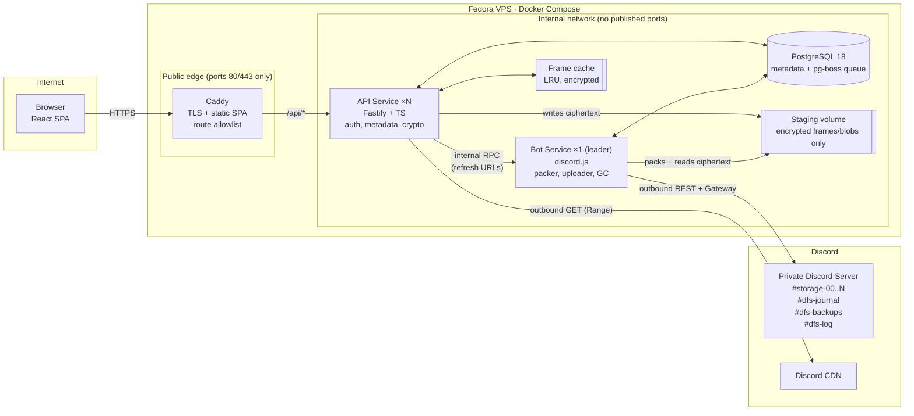
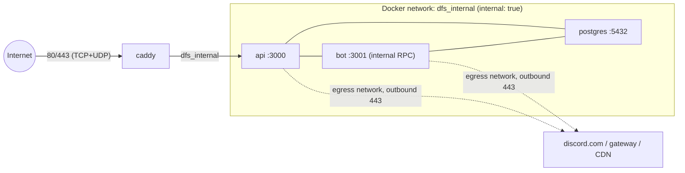
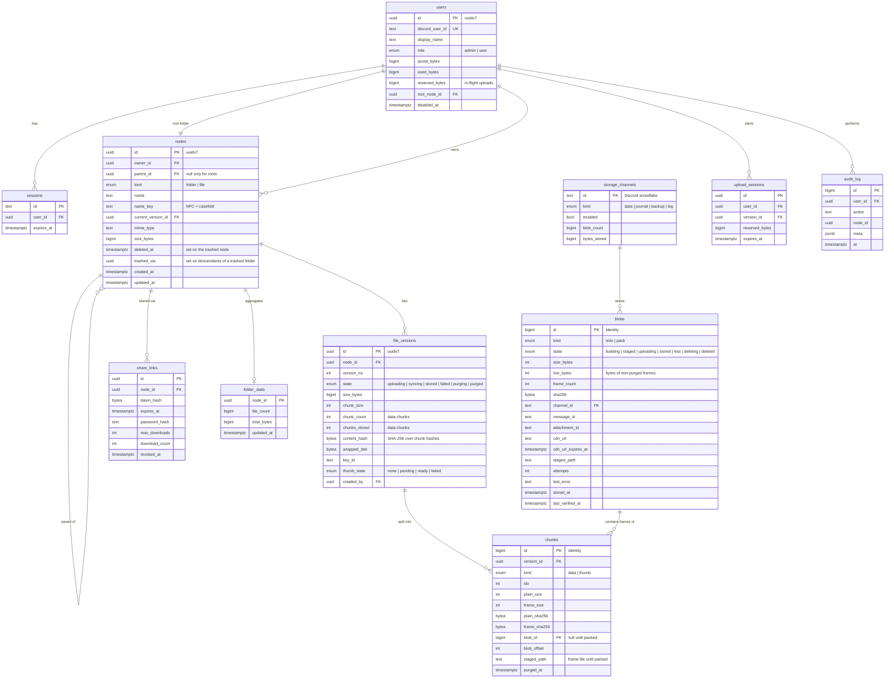
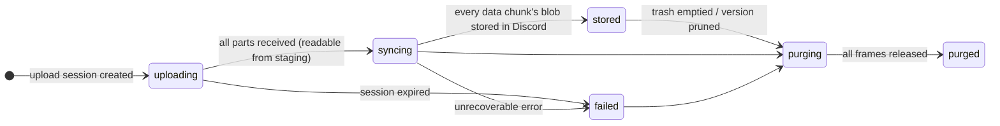
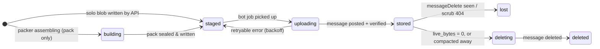
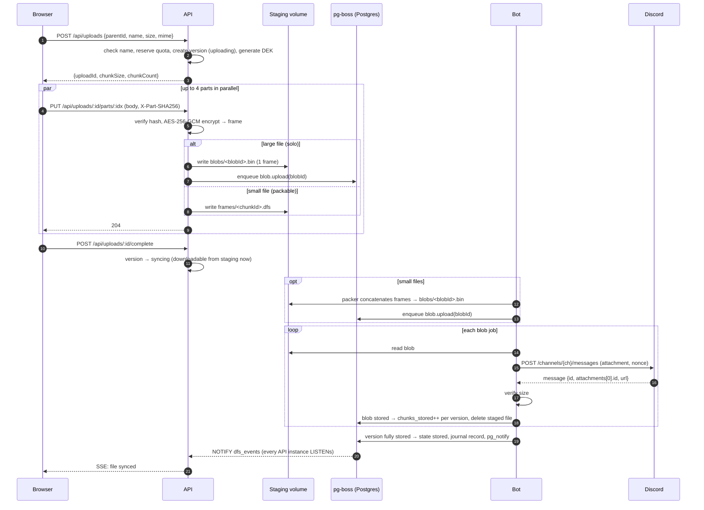
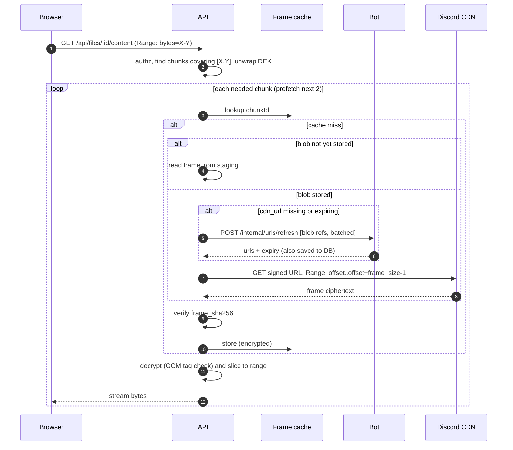
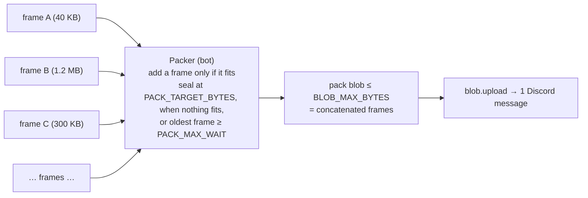
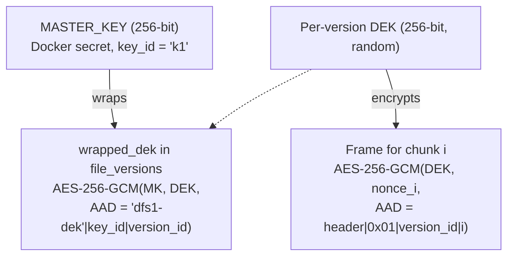
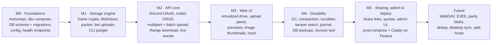

# DFS — Discord File System
### Design Document · v0.4 (Draft)

| | |
|---|---|
| **Status** | Draft, for review. All questions from v0.1/v0.2 resolved, and v0.3 review findings fixed as D8–D13 (see §19) |
| **Date** | 2026-10-03 |
| **Stack** | TypeScript everywhere: React + Fastify + discord.js + PostgreSQL 18 |
| **Deployment** | Docker Compose on **one Fedora Linux VPS**. Only the web UI (Caddy edge) is public; API, bot, and DB sit on an internal Docker network (§3.2, §13) |
| **Development** | Locally on Windows: Node 24 + pnpm, with Postgres in Docker Desktop (§13.1) |
| **Chunk size** | `CHUNK_SIZE` = 10 MiB − 128 KiB, under the 10 MiB Discord attachment limit (unboosted server, §2, D10) |
| **Scale target** | Few users, **many files** (millions of nodes, multiple TB). Designed to scale horizontally where it matters (§12) |

---

## 1. Overview

DFS turns a private Discord server into the **blob storage layer** of a personal cloud drive. Files are split into chunks, encrypted, and posted as message attachments in dedicated storage channels. Small files are **packed together** so that one Discord message can hold hundreds of them. A PostgreSQL database holds the real file system: the folder tree, file names, versions, and a map of which byte range of which Discord attachment holds which piece of which file. A React web app gives a small group of trusted users a familiar "Google Drive"-style interface.

The core idea is that **Discord stores opaque encrypted bytes, and Postgres stores meaning.** Renaming, moving, and organizing files only touch metadata. Discord is involved only when bytes are written, read, or garbage-collected.

### 1.1 Goals

- **G1:** Store files of any size by chunking them below Discord's attachment limit.
- **G2:** Give a hierarchical file system (folders, rename, move, trash, versions) through a web UI.
- **G3:** Support multiple users (friends/family) with separate private drives, quotas, and an admin role.
- **G4:** Encrypt everything at rest in Discord (AES-256-GCM). Discord only ever sees random-looking `.bin` blobs.
- **G5:** Make uploads resumable and parallel, and support streaming downloads with HTTP `Range` (so video can be scrubbed and big downloads can resume).
- **G6:** Keep data durable: verify integrity, detect missing or tampered data, and be able to **rebuild the database from Discord** if it is lost.
- **G7:** **Scale to millions of files** without making the number of Discord messages, the database, or the UI the bottleneck (§12).
- **G8:** Make it easy to self-host with one `docker compose up` on Fedora, and easy to develop locally on Windows.

### 1.2 Non-Goals (v1)

- End-to-end / zero-knowledge encryption. The server holds the keys in v1 (see §7.4 for the future path).
- Mounting as a native drive (FUSE / WebDAV / SMB). Planned for later.
- Real-time collaborative editing, office-document previews.
- Content deduplication across users.
- Public sign-up / multi-tenant SaaS.
- Server-side **copy** of files or folders (D3). Users download and re-upload instead.
- **Mirroring** to a second blob store (D5). Discord is the only blob store, and the risk is accepted (§2).

---

## 2. Constraints & Risks

> [!WARNING]
> **Discord Terms of Service.** Using Discord as a general-purpose file store is outside its intended use and may break the Developer Policy or ToS. Discord could delete messages, disable the bot, or ban the account or server **without warning**. DFS must be treated as a *secondary* storage tier, never as the only copy of irreplaceable data. The design includes mitigations (journal, DB backups, integrity scrubbing), but none of them can protect against Discord deleting the server.

| Constraint | Impact on design |
|---|---|
| **Attachment size limit: 10 MiB** (unboosted server, D1) | Every blob (one attachment) is at most **`BLOB_MAX_BYTES` = 10 MiB − 64 KiB**, leaving headroom for multipart overhead. This is a hard cap, checked before every upload. Large files are split into chunks of **`CHUNK_SIZE` = 10 MiB − 128 KiB**, so a chunk plus its 38-byte frame header always fits (§7.3, D10). Each file version records its own chunk size, so old files keep working if the server is boosted later and the limit is raised. A 1 GiB file is 104 messages. |
| **Lots of small files** (D7) | One message per small file would make Discord rate limits the bottleneck. Small files are **packed** into shared blobs of about 10 MiB (§6.6). For example, 100k files of 100 KB become about 1,000 messages instead of 100,000. |
| **Up to 10 attachments per message** | v1 uses **1 blob per message** for simple addressing, retries, and deletion. Packing (above) already gives the message-count savings. |
| **Rate limits** (per-route buckets plus a global per-bot limit, learned from response headers) | Uploads are spread across a **pool of storage channels**, run through a job queue, and use backoff on `429`. |
| **CDN URLs expire** (signed `ex`/`is`/`hm` query params, roughly 24 h) | We store **`channel_id` + `message_id` + `attachment_id`**, never just the URL. URLs are refreshed on demand and cached until they expire. |
| **Bulk delete only works on messages < 14 days old** | Garbage collection deletes messages one at a time, slowly and rate-limited, in the background. |
| **Anyone with Manage Messages can delete blobs** | Storage channels are locked to the bot. The bot listens for `messageDelete` and marks affected blobs `lost`. |
| **Throughput** | Bounded by rate limits and bandwidth, not CPU. Expect "backup drive" speeds, not "SSD" speeds. Files are **readable from staging as soon as the upload finishes**, before they reach Discord (§6.1), so the user doesn't have to wait for the background sync. |

---

## 3. High-Level Architecture



### 3.1 Services

| Service | Tier | Replicas | Responsibility | Holds secrets |
|---|---|---|---|---|
| **edge (Caddy)** | Public | 1 | TLS termination, serves the static React build (including client-side routes such as the share page `/s/:token`), and reverse-proxies **only `/api/*`** to the API. It is the **only** container that publishes ports. | TLS certs |
| **api** | Internal | 1…N (stateless) | HTTP API, authentication, sessions, the file-system metadata (tree operations), upload sessions, **encryption/decryption**, download streaming, share links, live events (SSE fed by Postgres `LISTEN/NOTIFY`). Enqueues jobs, and runs the background jobs that need keys: `journal.flush`, `backup.snapshot`, `thumb.generate`, and DEK re-wrapping. | `MASTER_KEY`, OAuth client secret |
| **bot** | Internal | 1 active (+ optional standby) | The only process with the Discord token. **Packs** small-file frames into blobs, uploads and deletes blobs, compacts packs, refreshes CDN URLs, watches the gateway for tampering, and offers admin slash commands. **Outbound-only** network access to Discord. It never sees keys or plaintext. | `DISCORD_BOT_TOKEN` |
| **postgres** | Internal | 1 | Metadata, sessions, audit log, journal outbox, and the job queue (**pg-boss**, so no Redis is needed). | — |

**Why the bot and API are split:** the two most sensitive secrets live in different processes. The bot never sees plaintext or keys; it only moves and concatenates ciphertext. The API never talks to Discord's API directly, so all rate-limit state lives in one place. Both import shared packages that define the frame format and the job contracts.

### 3.2 Network topology & exposure

The deployment is a **single Fedora VPS** (D6). The browser still has to reach the API, so "internal" means the API is **never directly addressable from the internet**: every request goes through Caddy, which forwards it over the internal Docker network.



- Two Docker networks: `dfs_internal` (`internal: true`, no internet) for service-to-service traffic, and `dfs_egress` for outbound Discord access. Only `api` and `bot` join `dfs_egress`, and only `caddy` publishes ports. Postgres has no route to the internet at all.
- **Route allowlist at the edge:** only `/api/*` is proxied to the API. Every other path is answered from the static SPA build, and unknown paths fall back to `index.html` so client-side routes such as `/s/:token` (public share pages) work. `/internal/*` and metrics paths get an explicit `404`. Nothing else reaches a backend service.
- **Streaming:** request and response buffering is disabled for `/api/uploads/*/parts/*`, the content and archive routes (`/api/files/*/content`, `/api/s/*/files/*/content`, `*/archive`), and `/api/events` (SSE). The body size limit is **12 MiB** (one part plus headroom). Download and SSE routes have long timeouts.
- **Client IP:** the API trusts `X-Forwarded-For` **only** from the Caddy container's address (`TRUSTED_PROXY_CIDRS`), for rate limiting and audit logs.
- The **Discord OAuth redirect URI** and **share links** use the public URL (`PUBLIC_BASE_URL`).
- *Later, optional:* the same images can be split across two hosts (edge on the VPS, core elsewhere over WireGuard/Tailscale) with `docker-compose.edge.yml` / `docker-compose.core.yml`. This is not built in v1.

---

## 4. Discord Server Layout

```
📁 DFS (category, private: only the bot and admins can view)
 ├─ #storage-00   ┐
 ├─ #storage-01   │ data channels: blobs are spread across the least-loaded channel
 ├─ #storage-02   │ (default 4; more can be added at runtime)
 ├─ #storage-03   ┘
 ├─ #dfs-journal     encrypted metadata journal batches (for disaster recovery, §8)
 ├─ #dfs-backups     snapshot pointers, each with an encrypted manifest (the dumps are DFS files, §8)
 └─ #dfs-log         human-readable bot events and alerts
```

- **Permissions:** `@everyone` is denied View Channel on the category. The bot role gets View, Send Messages, Attach Files, Read Message History, and Manage Messages. Admin users can view `#dfs-log`.
- **Bootstrap:** `/dfs setup` (or `dfs setup` in the CLI) creates the category and channels if they are missing, then registers them in the `storage_channels` table.
- **Message formats.** They leak no file names, and every attachment is encrypted:
  ```
  #storage-NN   content: dfs1 b=184467 k=pack n=212        attachment: 184467.bin
  #dfs-journal  content: dfs1 j=5521 ids=9120004-9125003   attachment: j5521.bin
  #dfs-backups  content: dfs1 snap=212 hwm=9125003         attachment: snap212.bin
  ```
  - **Data:** `b` is the blob ID, `k` the blob kind (`solo` | `pack`), and `n` the number of frames. This lets a reconciler map orphan messages back to DB rows, and lets recovery rebuild blob locations by scanning channels (§8).
  - **Journal:** `j` is the batch number (contiguous, so a missing batch is detectable) and `ids` the range of journal record IDs inside it.
  - **Backups:** `snap` is the snapshot number and `hwm` its journal high-water mark. The attachment is the encrypted manifest that locates the dump (§8).

---

## 5. Data Model (PostgreSQL 18)

Two layers keep the **logical** file system separate from **physical** storage:

- **Logical:** `nodes` (tree) → `file_versions` → `chunks`. A *chunk* is one encrypted *frame* holding a piece of one file version.
- **Physical:** `blobs`. A *blob* is one Discord attachment. A **solo** blob holds one frame (a chunk of a large file). A **pack** blob holds many frames from many small files. Each chunk points at `(blob_id, offset, length)`.



Supporting tables not drawn above: `journal` (outbox of metadata changes, §8), `backups` (snapshots and their manifests, §8), `folder_stat_deltas` (§12.1), and pg-boss's own schema.

### 5.1 Key rules and indexes

- **IDs:** user-facing entities use **UUIDv7** (time-ordered, generated with PG 18's native `uuidv7()`), which gives good B-tree locality for inserts. High-volume internal tables (`chunks`, `blobs`, `audit_log`, `journal`) use `bigint` identity to keep rows and indexes small.
- **Unique names per folder:** `UNIQUE (parent_id, name_key) WHERE deleted_at IS NULL`. `name_key` is the NFC-normalized, case-folded name, so `Photo.JPG` and `photo.jpg` cannot exist side by side. This keeps behaviour predictable on Windows and macOS.
- **Folder listing:** index `(parent_id, kind, name_key, id) WHERE deleted_at IS NULL`, with **keyset pagination** (folders first, then name). There is no `OFFSET` and no `COUNT(*)` on the hot path.
- **Search:** a GIN `pg_trgm` index on `name_key`, always filtered by `owner_id` and `deleted_at IS NULL AND trashed_via IS NULL`.
- **Chunk addressing:** `UNIQUE (version_id, kind, idx)`. Because chunk size is fixed per version, a byte offset maps to a data chunk with `idx = floor(offset / chunk_size)`. A version has at most one `thumb` chunk (§6.7). Index `chunks (blob_id)` for GC and compaction.
- **Blob queues:** partial indexes `blobs (state) WHERE state IN ('staged','uploading','deleting')` and `chunks (id) WHERE blob_id IS NULL AND purged_at IS NULL` (frames waiting for the packer).
- **Tree queries:** paths and breadcrumbs use recursive CTEs, which are cheap because trees are shallow. A move is one `UPDATE` plus a cycle check (the new parent must not be a descendant).
- **Quota:** `upload_sessions` reserve bytes up front (`users.reserved_bytes`). When the upload completes, the reservation becomes `used_bytes` in one short transaction.
- **Versions:** v1 keeps the **current version plus N previous ones** (`VERSION_RETENTION`, default 3). Older versions move to `purging`.

### 5.2 Lifecycle state machines


*File version.* It is readable in `syncing` (served from staging) and in `stored` (served from Discord).


*Blob.*

---

## 6. Core Flows

### 6.1 Upload (multipart, resumable, parallel)

Uploads work like S3 multipart uploads. The browser slices the file into parts that are **exactly the version's chunk size**. Each part becomes one encrypted frame. **Plaintext never touches disk.**



**Details**

- **Resume:** `GET /api/uploads/:id` returns the part indexes already received. The client only re-sends the missing ones. Upload sessions expire after 24 h; a janitor job cleans up expired sessions and releases their reserved quota.
- **Small files in bulk:** `POST /api/uploads/batch` creates up to 500 sessions in one call. A single-part file is uploaded with one `PUT` and **auto-completes**, so uploading a small file costs 2 requests in total. Folder trees are created first with `POST /api/folders/ensure` (like `mkdir -p` for many paths in one transaction).
- **Idempotency:** Discord's `nonce` + `enforce_nonce` on message create prevents duplicate posts when a job retries within a short window. A reconciler also scans for orphan `dfs1` messages whose blob is not `stored`, and deletes or adopts them.
- **Channel selection:** the least-loaded enabled data channel, which spreads rate-limit buckets across channels. Concurrency per channel is configurable (default 2 in-flight requests).
- **Backpressure:** if staging passes `STAGING_MAX_BYTES`, `PUT part` returns `503 Retry-After` and the client backs off. Staging cannot grow without limit when Discord is slower than the user's upload.
- **Read-your-writes:** a `syncing` version is fully readable. The download path reads frames from staging until their blob is `stored`.
- **Progress:** the UI shows two phases. *Uploading* is browser→API. *Syncing to Discord* is in the background and streamed via SSE from `GET /api/events`.
- **Live events across API replicas:** the bot never talks to browsers, and a user's SSE stream can be on any API instance. Every state change the UI shows (version synced or failed, blob lost, quota changed) calls `pg_notify('dfs_events', …)` in the same transaction, so the event is delivered only if the change commits. Each API instance `LISTEN`s on one dedicated connection and forwards events to its own SSE clients for that user. Payloads stay small (user ID, event type, a few IDs; Postgres caps them at 8 KB). Bulk changes send one coalesced event per transaction (for example, per pack), and the UI refetches what it shows. Events are not durable: after a reconnect, the client refetches. Postgres serializes the commits of transactions that issue `NOTIFY`, but those transactions already pass through the journal's commit-order lock (§8), so this adds little.

### 6.2 Download (streaming, Range-aware)



- Responds `206 Partial Content` with `Accept-Ranges: bytes`, so `<video>` seeking and resumable downloads work.
- **Pack reads** use an HTTP `Range` request against the CDN, so reading a 50 KB file out of a 10 MiB pack moves about 50 KB. If the CDN ignores `Range` (returns `200`), the API reads the whole blob, caches every frame in it, and continues.
- **Folder download:** `GET /api/folders/:id/archive` streams a ZIP built on the fly (ZIP64 for large archives, store-only with no compression). Frames are fetched **grouped by blob**, so a folder of 1,000 small files usually means a handful of pack downloads.
- **The cache** holds *ciphertext* frames on local disk (LRU, `CACHE_MAX_BYTES`, default 5 GiB), so it is safe even if the disk is compromised.

### 6.3 Metadata operations (no Discord traffic)

Rename, move, create folder, and trash/restore are plain SQL transactions.

- **Trash a folder:** set `deleted_at` on the folder, and in the same transaction set `trashed_via = <folder id>` on all its descendants (recursive CTE update). This keeps search and stats queries simple (`trashed_via IS NULL`). For very large subtrees (over `TRASH_SYNC_LIMIT`, default 50k nodes), the descendant update runs as a batched background job; the folder itself is hidden immediately.
- **Restore** clears both fields for the subtree, auto-renaming to `name (1)` if the name has since been taken.

### 6.4 Deletion & garbage collection

1. **Trash:** the item can be restored for `TRASH_RETENTION_DAYS` (default 30).
2. **Purge:** triggered by emptying the trash, the retention expiring, or a version being pruned. The version goes to `purging`, its chunks get `purged_at`, each affected blob's `live_bytes` drops by the frame size, and quota is released right away.
3. **Blob release:** a blob with `live_bytes = 0` moves to `deleting`. The GC worker (bot) deletes messages one at a time at a low priority. Uploads always win the rate-limit budget.
4. **Pack compaction** (§6.6) reclaims packs that are mostly dead.
5. When all of a version's chunks are released, the version becomes `purged`.

### 6.5 Integrity & self-healing

| Mechanism | What it catches |
|---|---|
| Per-part plaintext SHA-256 (client→API) | Corruption in transit during upload |
| `frame_sha256` checked on every read | CDN, cache, or staging corruption |
| `blobs.sha256` checked by the scrubber | Corrupted or truncated blobs |
| AES-GCM authentication tag | Tampering with a frame or its header, wrong key, swapped or reordered chunks (the AAD binds the header, object type, version, and index, §7.3). Needs no DB, so it also protects recovery. |
| `content_hash` = SHA-256 of the ordered chunk hashes | Truncated or missing chunks |
| Gateway `messageDelete` / `messageDeleteBulk` listener | Someone deleting storage messages → blob `lost`, every affected file flagged, alert in `#dfs-log` |
| **Rolling scrubber** | Silent loss. It checks blobs in order of `last_verified_at` within a fixed request budget (`SCRUB_REQUESTS_PER_HOUR`), so a full pass takes *blobs ÷ budget* hours regardless of how many files there are. |

A blob that is `lost` is unrecoverable unless the originals still exist somewhere. The UI flags the affected files, and the admin dashboard lists them. *(Future: optional Reed-Solomon parity blobs would let data survive the loss of k blobs.)*

### 6.6 Small-file packing & compaction



- **Which files are packed:** files with `size < PACK_THRESHOLD_BYTES` (default 4 MiB). Each file still has **its own DEK and frame**. A pack is just a concatenation of self-delimiting frames, so **the packer needs no keys** and runs in the bot. Thumbnails (§6.7) are packed too. Backup snapshots are never packed (§8).
- **Packer loop** (single bot leader): `SELECT … FROM chunks WHERE blob_id IS NULL … ORDER BY id FOR UPDATE SKIP LOCKED` over a window of waiting frames. A frame is added only if `pack_bytes + frame_bytes ≤ BLOB_MAX_BYTES`; a frame that doesn't fit stays queued and goes into the next pack. The pack is sealed when it reaches `PACK_TARGET_BYTES`, when no waiting frame fits in the space left, or when its oldest frame has waited `PACK_MAX_WAIT_MS`. Sealing writes `blobs/<id>.bin`, sets `blob_id`/`blob_offset` on each chunk, and enqueues `blob.upload`, all in one transaction. The frame files are deleted after the blob is written. If the bot crashes in the middle, the transaction rolls back and the frame files are still there.
- **Compaction:** a pack whose `live_bytes / size_bytes < COMPACT_THRESHOLD` (default 0.3) and that is older than 7 days is rewritten. The bot downloads it and writes its live frames (still ciphertext, no keys needed) into a new pack, together with frames from other compaction candidates. The chunks keep pointing at the old pack, which stays readable, until the new pack is `stored` in Discord. Only then does one transaction repoint the chunks that are still live and write a `blob.relocated` journal record, and only after that is the old message deleted. This order means a VPS loss mid-compaction can never leave the journal pointing at a pack that never reached Discord. `blob.relocated` lists data chunks only, because thumbnail chunks are never journaled (§6.7).
- **Trade-off:** a deleted small file keeps taking up space in Discord until its pack is compacted. Its quota is released immediately, though, and Discord space is free, so the only real cost is message count.

### 6.7 Thumbnails

- **Scope (v1):** images only, in the formats `sharp` decodes (JPEG, PNG, WebP, GIF, AVIF, TIFF), up to `THUMB_MAX_SOURCE_BYTES` (default 50 MiB). Other files show a file-type icon. Video and PDF thumbnails are future work.
- **Generation:** when an image version reaches `syncing`, the API enqueues `thumb.generate` (low priority). It runs in an API worker, because only the API holds keys. The worker reads the image through the normal read path (usually still from staging), resizes it to a WebP whose longest side is `THUMB_SIZE_PX` (default 256), and encrypts it with the **version's own DEK** as one extra frame: a chunk with `kind = thumb` (AAD type `0x02`, §7.3). That frame is packed like any small file. `file_versions.thumb_state` goes from `pending` to `ready`, or to `failed`/`none`.
- **Lifecycle:** a thumbnail belongs to its version, so it is compacted and purged with it, with no extra bookkeeping. A version's state follows its **data** chunks only (`chunks_stored` counts `kind = data`), so a thumbnail never holds up `stored`. Until its pack is uploaded, it is served from staging like any other frame.
- **Not journaled:** thumbnails are cheap to regenerate, so recovery (§8) resets `thumb_state` to `pending` instead of restoring them. Their old frames become dead bytes that compaction reclaims.
- **Serving:** the UI requests `GET /api/files/:id/thumbnail?v=<versionId>`, so responses can be cached as `private, immutable`. A thumbnail is content, so the route requires content access: the admin metadata browser shows icons only (D4).
- **Hardening:** decoding untrusted images is attack surface. The worker sets `sharp`'s input pixel limit and a timeout, and a failure only marks `thumb_state = failed`. The threat model doesn't change, because the API already sees plaintext while it encrypts uploads.

---

## 7. Security

### 7.1 Authentication: "Log in with Discord"

- Users sign in with **Discord OAuth2** (scopes `identify` and `guilds.members.read`).
- Login is **gated by membership in the DFS guild plus a `DFS User` role**, so admins manage access by assigning a Discord role. There are no passwords to store.
- An optional `DFS Admin` role maps to the `admin` role in DFS (synced on each login and periodically by the bot).
- Sessions are server-side rows in Postgres, referenced by an `HttpOnly; Secure; SameSite=Lax` cookie with a sliding 30-day expiry. Every state-changing request needs a CSRF token header.

### 7.2 Authorization

- Every node has an `owner_id`. A user can only access nodes in their own tree, plus anything reached through a **share link**. A share grants read access to the shared node and, for a folder, to its non-trashed subtree.
- **Admins** (D4) can manage users and quotas, see system health, and **view any user's metadata**: file names, folder tree, sizes, dates, and usage. This is for moderation. Admin access is **metadata-only**: content, preview, archive, and share routes still require ownership. Admins can move a user's item to trash with a reason (moderation). Every admin metadata view and action is written to the audit log.
- All authorization checks run in the API service layer in one place (`assertCanReadMetadata(node, actor)` / `assertCanReadContent(node, actor)` / `assertCanWrite(node, actor)`), and route handlers never skip them.

### 7.3 Encryption



- **Envelope encryption:** each file version gets a random data key (DEK). Only the wrapped DEK is stored. The wrap uses `AAD = "dfs1-dek" | key_id | version_id`, so a wrapped DEK copied onto another version fails to unwrap.
- **Frame format** (self-delimiting, so packs can be parsed without the DB):
  `magic "DFS1" (4B) | format ver (1B) | flags (1B) | ciphertext length (4B, BE) | nonce (12B) | ciphertext | GCM tag (16B)`.
  Overhead is 38 bytes per frame.
- **Frame AAD** = the first 10 header bytes (magic, format version, flags, length) followed by a typed context. The GCM tag therefore authenticates every header field by itself. That matters during recovery (§8), when there is no `frame_sha256` from the DB to check against. The leading type byte keeps one kind of object from passing as another:

  | Object | AAD context after the header |
  |---|---|
  | File data chunk | `0x01` \| `version_id` (16B) \| chunk index (4B, BE) |
  | Thumbnail (§6.7) | `0x02` \| `version_id` (16B) |
  | Journal batch (§8) | `0x03` \| batch number (8B, BE) |
  | Backup manifest (§8) | `0x04` \| snapshot number (8B, BE) |

- **Objects without a file version** (journal batches, backup manifests) each get their own random DEK, stored in front of the frame as `key_id | wrapped_dek`. That wrap's AAD uses the object's context in place of a version ID.
- **Sizes:** `BLOB_MAX_BYTES = DISCORD_ATTACHMENT_LIMIT − 64 KiB` caps every attachment. `CHUNK_SIZE` is the largest multiple of 64 KiB that still fits one frame under that cap. At the 10 MiB limit, that is 10 MiB − 128 KiB (10,354,688 B), so a solo blob is at most 10,354,726 B.
- **Nonces** are 96 bits and random per frame. A DEK encrypts one frame per chunk (about 100k frames for a 1 TiB file), far below the roughly 2³² frames per key at which random nonces become a concern.
- **Key rotation:** add a new master key with a new `key_id`, then a background job re-wraps the DEKs in the DB. **No data in Discord has to be re-uploaded.** Retired keys must be **kept**, though: journal batches, backup manifests, and the wrapped DEKs inside journal records stay encrypted under the key that was current when they were written.
- **Key loss = data loss.** The setup wizard makes the admin download or print the master key (as a recovery phrase) before the first upload.

### 7.4 Threat model summary

| Adversary | Protected? |
|---|---|
| Discord (or anyone who gets into the guild) reads stored data | ✅ They see only ciphertext and numeric IDs. File names, sizes per file, and folder structure are not in Discord in plaintext. |
| Stolen DB dump without the master key | ✅ The DEKs are wrapped. Metadata (file names, tree) **is** exposed. |
| Stolen staging/cache disk | ✅ Ciphertext only |
| Malicious or compromised DFS server operator | ❌ The server holds the keys. Fixing this needs E2EE (future: per-user keys derived in the browser, client-side encryption, and more complex sharing). |
| DFS admin curious about other users | ⚠️ By design (D4), admins **can see file names, the folder tree, and sizes**, but cannot open or download content through the app. Every admin view is audit-logged. |
| Compromised Caddy container | ⚠️ No keys, DB, or Discord token in it, but it sees traffic passing through (including session cookies). |
| Root on the VPS | ❌ It's a single host, so root can read everything. Harden the VPS (§13.2). |
| Discord deletes data or bans the bot | ❌ Detected, not prevented. See §2. |

### 7.5 Other hardening

- Downloads are served with `Content-Disposition: attachment` by default. Inline previews use a strict CSP and `X-Content-Type-Options: nosniff`, and HTML/SVG are always served as attachments, never inline.
- Share-link tokens are 128-bit random values, and only their SHA-256 is stored. Optional password (argon2id), expiry, and download cap. A correct password (`POST /api/s/:token/unlock`) sets a short-lived cookie scoped to that share. A download counts toward the cap only when the request starts at byte 0, so seeking in a video doesn't use it up.
- Login/OAuth callbacks and share-link access are rate-limited.
- An audit log records logins, uploads, deletions, shares, and admin actions.
- Internal API→bot RPC runs only on `dfs_internal`, needs a shared `INTERNAL_RPC_SECRET`, and is blocked at the edge.
- **Network exposure** (D2): only Caddy publishes ports. `api`, `bot`, and `postgres` publish **no** ports. Postgres is on the internal network only and has no egress.
- Containers run as non-root, with read-only root filesystems where possible, `no-new-privileges`, and dropped capabilities.

---

## 8. Disaster Recovery

The design aims to survive **losing the VPS** (DB plus disks), as long as the Discord guild and the master keys survive. Recovery reads **only Discord**: everything it needs is found through other objects in Discord, never through the lost DB.

1. **Metadata journal (outbox pattern).** Every metadata change that matters for recovery is inserted into a `journal` table **in the same transaction** as the change. Records carry the entity's full state after the change, so replaying a record twice is harmless:
   - `user.upsert`, `node.upsert` (create, rename, move, trash, restore), `node.purge`
   - `blob.stored` (blob ID, kind, size, SHA-256, and its Discord location: `channel_id`, `message_id`, `attachment_id`), `blob.deleted`
   - `version.stored` (version metadata, wrapped DEK and `key_id`, and each data chunk's blob ID, offset, size, and hashes), `version.purged`
   - `blob.relocated` (compaction: the new blob ID and offset of every moved data chunk, written only after the new pack's `blob.stored`, §6.6)

   Derived values (`live_bytes`, `used_bytes`, `folder_stats`, channel counters) and thumbnails (§6.7) are not journaled. Recovery recomputes or regenerates them.
2. **Commit order.** A transaction writes its journal records last, right after taking a transaction-scoped advisory lock (`pg_advisory_xact_lock`), so `journal.id` order is commit order. Without this, a transaction that took a lower ID but committed later could be skipped by both the flusher and a snapshot's high-water mark. The cost is that journaled commits are serialized, at about one fsync each, so they top out near 1 ÷ fsync latency (hundreds to a few thousand per second on an SSD). That is fine at this scale, because bulk work is journaled once per batch or per pack, not once per file.
3. **Journal batches.** A singleton job (`journal.flush`, in the API because it needs the master key) runs every `JOURNAL_FLUSH_INTERVAL_MS` (60 s) or after 5,000 records. It takes the unflushed records in ID order, compresses them, and seals them as one encrypted object (§7.3, AAD type `0x03`). A batch is also cut at about 8 MiB so it always fits in one attachment. A single record too large for that (only a `version.stored` for a multi-terabyte file) is split across consecutive batches. The bot posts each batch to `#dfs-journal` (`journal.upload`, message format in §4). This adds **one message per batch, not one per file**, which matters when there are millions of files.
4. **DB snapshots.** A nightly `backup.snapshot` job runs in the API (it holds the keys, and its image ships `pg_dump` 18):
   - It opens a `REPEATABLE READ` transaction, exports its snapshot, and reads the high-water mark (`max(journal.id)`) inside it. `pg_dump --snapshot=…` then dumps that same snapshot, so the dump holds exactly the changes up to the high-water mark.
   - The dump (custom format) is streamed into a DFS file owned by a system account. Backup files are **always stored as solo blobs**, never packed, so compaction never moves them.
   - Once the dump's version is `stored` in Discord, the API seals a **manifest** (AAD type `0x04`) holding everything needed to fetch the dump without the DB: version ID, size, chunk size, `content_hash`, wrapped DEK and `key_id`, and each chunk's `channel_id`, `message_id`, and `attachment_id`. The bot posts it to `#dfs-backups` with the snapshot number and high-water mark in the message content (§4).
   - The newest `BACKUP_RETENTION` (default 7) snapshots are kept. Older dumps are purged like any file, and their pointer messages are deleted. Journal batches are kept forever, so a full replay stays possible.
5. **Recovery tool:** `dfs recover --guild <id> --key-file <…>`, where the key file holds every `key_id`, current and retired:
   1. Read the newest pointer in `#dfs-backups`, decrypt its manifest, download and verify the dump straight from the listed messages, and `pg_restore` it.
   2. Read `#dfs-journal` and replay, in order, every record above the snapshot's high-water mark. Batch numbers are contiguous, so a missing batch is reported, not silently skipped.
   3. If a batch is missing, the blob locations it held can still be rebuilt by scanning the data channels for `dfs1 b=…` messages (§4). The node and version changes it held are lost.
   4. Recompute derived values, reset `thumb_state` to `pending`, and mark versions that were still `uploading` or `syncing` as `failed` (their bytes were only in staging).
   5. Before accepting writes, advance the identity sequences (`journal`, `blobs`, `chunks`) and the batch and snapshot counters past the highest values seen in Discord, so nothing new reuses an ID. Then run the orphan reconciler.

   With no usable snapshot, the tool replays the whole journal from the first batch (slow, but complete).

**What a VPS loss costs (RPO):** journal records not yet uploaded (up to about one flush interval, plus upload time), and files still in staging that had not reached Discord.

> [!IMPORTANT]
> Back up the **master keys** (including retired ones) and the **`.env`** somewhere outside DFS and outside the VPS. Without them, nothing in Discord can be decrypted.

---

## 9. API Surface (v1)

All routes are under `/api`, use JSON unless noted, and are validated with Zod schemas shared with the frontend. All list endpoints use **cursor (keyset) pagination**.

| Method & Path | Purpose |
|---|---|
| `GET /auth/discord` · `GET /auth/discord/callback` · `POST /auth/logout` · `GET /auth/me` | Auth |
| `GET /nodes/:id` · `GET /nodes/:id/children?sort&cursor&limit` · `GET /nodes/:id/path` | Browse |
| `POST /folders` `{parentId, name}` · `POST /folders/ensure` `{parentId, paths[]}` | Create folder / `mkdir -p` in bulk |
| `PATCH /nodes/:id` `{name?, parentId?}` · `POST /nodes/move` `{ids[], parentId}` | Rename / move (single or bulk) |
| `DELETE /nodes/:id` · `POST /nodes/trash` `{ids[]}` · `POST /nodes/:id/restore` · `GET /trash` · `DELETE /trash` | Trash |
| `POST /uploads` · `POST /uploads/batch` · `GET /uploads/:id` · `PUT /uploads/:id/parts/:idx` (binary) · `POST /uploads/:id/complete` · `DELETE /uploads/:id` | Multipart upload |
| `GET /files/:id/content` (Range) · `GET /files/:id/thumbnail?v=<versionId>` · `GET /files/:id/versions` · `POST /files/:id/versions/:vid/restore` | Content, thumbnails (§6.7), and versions |
| `GET /folders/:id/archive` · `POST /archive` `{ids[]}` | ZIP download |
| `GET /search?q=&type=&cursor` | Name search (`pg_trgm`) |
| `POST /shares` · `GET /shares` · `PATCH /shares/:id` (expiry, password, cap) · `DELETE /shares/:id` | Share links (owner) |
| `GET /s/:token` · `POST /s/:token/unlock` · `GET /s/:token/children?parentId&cursor` · `GET /s/:token/files/:id/content` (Range) · `GET /s/:token/archive` | Public share access, no login. Used by the SPA page at `/s/:token`. `:id` and `parentId` must be the shared node or inside its subtree |
| `GET /events` (SSE) | Upload/sync progress, quota changes, lost files (fed by `LISTEN/NOTIFY`, §6.1) |
| `GET /admin/users` · `PATCH /admin/users/:id` (quota, role, disable) | Admin: users |
| `GET /admin/users/:id/usage` · `GET /admin/nodes/:id` · `GET /admin/nodes/:id/children` · `GET /admin/search?q=&userId=` | Admin: **read-only metadata** of any user (no content routes) |
| `DELETE /admin/nodes/:id` `{reason}` | Admin: moderation trash (audited; the owner sees the reason in their trash) |
| `GET /admin/health` · `GET /admin/channels` · `POST /admin/channels` · `GET /admin/audit` | Admin: system |

There is no copy endpoint (D3).

Internal (bot), only reachable on `dfs_internal` and returning `404` at the edge: `POST /internal/urls/refresh` (batched, up to 50 blobs), `GET /internal/health`.

---

## 10. Frontend (React)

**Stack:** React 19 + Vite + TypeScript, TanStack Query (server state, infinite queries), **TanStack Virtual** (virtualized lists for folders with 100k+ entries), React Router, Tailwind CSS + shadcn/ui (Radix primitives), `@dnd-kit` (drag-and-drop moves), Zod (shared schemas), and a Web Worker for hashing parts (`hash-wasm`).

### 10.1 Screens

| Screen | Key features |
|---|---|
| **Login** | "Continue with Discord" button, plus a clear message if the user lacks the role |
| **Drive** (main) | Breadcrumbs, virtualized list/grid (image thumbnails in the grid, §6.7), sort, multi-select (shift/ctrl, select-all across pages), right-click context menu, drag-drop upload (files *and* folders), drag-to-move, inline rename, keyboard shortcuts (F2, Del, Ctrl+A), sync status icon per file (syncing / stored / lost) |
| **Upload panel** | Docked queue showing aggregate progress (files and bytes) for large batches, per-file two-phase progress (upload → Discord sync), pause/resume/cancel, retry failed |
| **Preview** | Image, video/audio (streamed with Range), PDF, text/code (with size cap), plus version history and share actions |
| **Trash** | Restore, delete forever, empty trash |
| **Shared links** | List, copy, revoke, and edit expiry/password |
| **Public share page** | Minimal, unauthenticated SPA route `/s/:token` (data from `/api/s/*`): a password prompt if needed, then file preview/download, or a folder listing with per-file and ZIP download |
| **Settings** | Profile, quota usage bar |
| **Admin** | Users and quotas, **per-user usage and a read-only metadata browser** (names, tree, sizes, dates; no open/download/preview), moderation trash, storage channels (add/disable), queue depth and sync backlog, lost-blob report, scrubber status, backups, audit log viewer |

### 10.2 Client upload engine

- **Folder drops** walk the directory tree (`DataTransferItem.webkitGetAsEntry`) lazily, so dropping 100k files doesn't freeze the tab. The engine creates the folders with `POST /folders/ensure`, then creates sessions in batches of 500 (`POST /uploads/batch`).
- **Concurrency:** up to 4 concurrent large-file parts, or up to 8 concurrent small-file `PUT`s (configurable). It retries with exponential backoff and honours `Retry-After`.
- Each part: `file.slice()` → SHA-256 in a worker → `PUT` with `X-Part-SHA256`.
- Upload IDs are saved to IndexedDB, so after a page reload the user can re-select the same files and resume (matched by relative path + size + lastModified).

---

## 11. Bot Service

- **discord.js v14**, intents: `Guilds`, `GuildMessages`, `GuildMembers` (for role sync). Message Content intent is **not** needed, because the bot reads its own messages.
- **Leader election:** the bot takes a Postgres advisory lock at startup. A second instance waits as a hot standby, so only one gateway connection and one packer exist at a time.
- **Job workers (pg-boss queues):**
  | Queue | Priority | Notes |
  |---|---|---|
  | `blob.upload` | high | concurrency per channel; retries with backoff; dead-letter after N attempts → affected versions `failed` |
  | `pack.seal` | high | packer loop (§6.6); also triggered by timer |
  | `journal.upload` | high | uploads encrypted journal batches staged by the API, and posts backup pointers with their manifests to `#dfs-backups` (§8) |
  | `blob.delete` | low | GC |
  | `blob.compact` | low | rewrites mostly-dead packs |
  | `blob.verify` | lowest | rolling scrubber, request-budgeted |
  | `reconcile.orphans` | cron, daily | scans channel history since the last checkpoint for untracked `dfs1` messages |
- **Slash commands** (admin-only): `/dfs setup`, `/dfs status` (usage, queue depth, sync backlog, throughput), `/dfs health` (lost blobs, last scrub), `/dfs channel add`.
- **Gateway events:** `messageDelete`/`messageDeleteBulk` in storage channels → mark blobs `lost` and alert. `guildMemberUpdate` → role sync (revoke sessions when the `DFS User` role is removed).
- **Rate limiting:** relies on `@discordjs/rest`'s bucket handling, plus our own per-channel concurrency limiter. Rate-limit metrics are exported to `/internal/health`.

---

## 12. Scalability

Expected profile (D7): **few users (≤ ~20), many files.** The design targets **10M nodes and 10+ TB** without changing the architecture.

### 12.1 Where the bottlenecks are, and how each is handled

| Pressure point | Mitigation |
|---|---|
| **Discord message count** (rate limits) | Small-file packing (§6.6), batched journal (§8), batched URL refresh (50 blobs/call), more storage channels as needed. |
| **Discord upload throughput** | Parallel uploads across channels. Measure real per-channel throughput in M1 and size `UPLOAD_CHANNEL_CONCURRENCY` and the channel count from that. |
| **Postgres row counts** | Compact bigint keys on the high-volume tables. Every hot query is index-only or keyset-paginated, with no `OFFSET` or `COUNT(*)`. With 10M nodes, about 15M chunks, and a few million blobs, the DB stays in the tens of GB, comfortable on a single PG instance. `chunks` can be hash-partitioned by `version_id` later if needed (the schema allows it without app changes). |
| **Hot rows** (folder sizes, quota) | **Folder sizes are eventually consistent**: writes append to `folder_stat_deltas`, and a periodic job folds them up the ancestor chain in batches, so bulk uploads don't contend on the root folder's row. Quota uses short per-user transactions; with few users this is fine. The journal's commit-order lock (§8) is the one deliberate serialization point. It is held only for the journal insert and commit. |
| **Huge folders** | Keyset pagination plus virtualized rendering. No "load all children" code paths. |
| **Bulk operations** (trash or move 100k items) | Moves are O(1) (only the parent changes). Trash and restore of very large subtrees run as batched background jobs (§6.3). |
| **API CPU/IO** (encryption, streaming) | The API is **stateless**: sessions live in PG, staging is a shared volume, the cache is per instance, and live events fan out through Postgres `LISTEN/NOTIFY` (§6.1), so any instance can serve any user's SSE stream. Scale with `docker compose up --scale api=N`; Caddy load-balances. |
| **Job queue volume** | Jobs are per **blob**, not per file. Rows are inserted in batches. pg-boss archive retention is tuned (completed jobs are kept for 1 day). |
| **Postgres connections** | Each service has a small pool, plus one `LISTEN` connection per API instance. Add PgBouncer (transaction mode) if the API is scaled past a few replicas. The `LISTEN` connections and the bot's leader advisory lock need session-level connections, so they bypass PgBouncer. |
| **Scrubbing millions of objects** | Scrubbing works per blob (not per file) and is request-budgeted (§6.5). |

### 12.2 Capacity estimate (worked example)

| Input | Value |
|---|---|
| Files | 2,000,000 (90% small, average 200 KB; 10% large, average 25 MB) |
| Data | ≈ 360 GB small + ≈ 5 TB large |
| Small-file packs | 360 GB ÷ ~10 MiB per pack ≈ **35k messages** (vs. 1.8M unpacked) |
| Large-file blobs | 5 TB ÷ `CHUNK_SIZE` ≈ 483k, plus about half a chunk per file for the partial last chunk ≈ **580k messages** |
| `chunks` rows | ≈ 2.4M (plus one per image thumbnail) · `blobs` rows ≈ 615k · `nodes` rows ≈ 2.1M |
| DB size (incl. indexes) | roughly 3–5 GB |

---

## 13. Development & Deployment

### 13.1 Local development (Windows)

| Piece | How it runs locally |
|---|---|
| Node.js 24 LTS + **pnpm** (via Corepack) | Native on Windows |
| PostgreSQL 18 | `docker compose -f docker/docker-compose.dev.yml up -d` (Docker Desktop). Port `5432` is published to **localhost only** |
| api (`:3000`), bot (`:3001`), web (`:5173`) | `pnpm dev` (Turborepo runs all three in watch mode with `tsx` / Vite) |
| Web → API | The Vite dev server proxies `/api` to `localhost:3000`, so the browser sees one origin, as it will in production |
| Discord | A **separate dev guild and dev bot application**, so dev never touches production data |
| No-Discord mode | `BLOB_STORE=local` swaps in `LocalBlobStore` (files under `./.data/blobs`). Most work, including all of M0–M3 UI work, can happen offline |

- The repository uses `.gitattributes` with `* text=auto eol=lf`, so shell scripts and config files work unchanged on Fedora.
- Paths are always built with `node:path`, never hard-coded separators.

### 13.2 Production (single Fedora VPS)

- **Container runtime:** Docker Engine + Compose plugin from Docker's official Fedora repository (recommended for Compose parity with dev). The Compose files also avoid features that break under Podman (`podman compose`), so Podman stays possible.
- **SELinux** (enforcing by default on Fedora): data lives in **named volumes**, and configs (Caddyfile, built SPA) are **baked into images**, so no SELinux relabeling (`:Z`) is needed. Any bind mount that is added later must use `:Z`.
- **firewalld:** allow only `ssh`, `http`, `https` (plus `443/udp` for HTTP/3). Docker writes its own iptables/nftables rules for published ports. That is fine here because only Caddy publishes ports.
- **Secrets:** `/etc/dfs/secrets/*` (mode `0600`, root-owned) are mounted as Compose `secrets:`. Nothing sensitive goes into images or environment files committed to git.
- **Lifecycle:** `restart: unless-stopped` and Docker enabled via systemd (`systemctl enable --now docker`). Updates: `git pull && docker compose build && docker compose up -d`. Migrations run automatically in a one-shot `migrate` service before `api`/`bot` start.
- **Host hardening:** `dnf-automatic` security updates, SSH key-only login, fail2ban (optional), and a non-root deploy user in the `docker` group.
- **Disk:** staging (`STAGING_MAX_BYTES`) and cache (`CACHE_MAX_BYTES`) must fit on the VPS disk alongside Postgres. Size the VPS disk from those plus the DB estimate (§12.2).

---

## 14. Repository Layout

pnpm workspaces + Turborepo.

```
dfs/
├─ apps/
│  ├─ web/            React SPA (Vite)
│  ├─ api/            Fastify HTTP API
│  └─ bot/            discord.js worker + packer + internal RPC
├─ packages/
│  ├─ shared/         Zod schemas, DTO types, constants
│  ├─ config/         env parsing (Zod) shared by api/bot
│  ├─ db/             Drizzle ORM schema, migrations, query helpers
│  ├─ crypto/         envelope encryption, frame format (DFS1), hashing
│  └─ storage/        BlobStore interface + DiscordBlobStore + LocalBlobStore
├─ tools/
│  └─ cli/            `dfs` admin CLI (setup, recover, rotate-key, verify)
├─ docker/
│  ├─ docker-compose.dev.yml    local dev: Postgres only
│  ├─ docker-compose.yml        production: caddy, api, bot, postgres, migrate
│  ├─ Caddyfile                 TLS, SPA, route allowlist, streaming settings
│  └─ *.Dockerfile              multi-stage builds per app
└─ docs/
   └─ DESIGN.md
```

The **`BlobStore` interface** (`put(blob) → ref`, `get(ref, range?) → stream`, `delete(ref)`) keeps the file-system logic independent of Discord. It exists so tests and offline development can use `LocalBlobStore` and `ChaosBlobStore`. Production only ever uses `DiscordBlobStore` (no mirroring, D5).

### 14.1 Technology choices

| Concern | Choice | Rationale |
|---|---|---|
| Runtime | Node.js 24 LTS | Current LTS; native `fetch`, web streams |
| Package manager | pnpm 10 + Turborepo | Fast workspaces, cached task graph |
| HTTP | Fastify 5 | Fast, good streaming, schema validation via Zod type provider |
| Database | PostgreSQL 18 | Native `uuidv7()`, async I/O, mature |
| ORM / migrations | Drizzle ORM + drizzle-kit | SQL-first, typed, light; easy to drop to raw SQL for recursive CTEs and partial indexes |
| Job queue | pg-boss | Postgres-backed: one less service, transactional enqueue with metadata writes |
| Discord | discord.js v14 / @discordjs/rest | De-facto standard, built-in rate-limit handling |
| Crypto | Node `crypto` (AES-256-GCM, HKDF), argon2 for share passwords | No exotic dependencies |
| Logging | pino | Structured JSON, fast |
| Testing | Vitest, Testcontainers (Postgres), Playwright (E2E) | |
| Lint/format | ESLint + Prettier | |

---

## 15. Configuration

| Variable | Default | Notes |
|---|---|---|
| `NODE_ENV` | `development` | |
| `DATABASE_URL` | — | |
| `BLOB_STORE` | `discord` | `local` for offline development and tests |
| `LOCAL_BLOB_DIR` | `./.data/blobs` | when `BLOB_STORE=local` |
| `DISCORD_BOT_TOKEN` | — | bot only |
| `DISCORD_CLIENT_ID` / `DISCORD_CLIENT_SECRET` | — | OAuth (api) |
| `DISCORD_GUILD_ID` | — | |
| `DFS_USER_ROLE_ID` / `DFS_ADMIN_ROLE_ID` | — | access gating |
| `DISCORD_ATTACHMENT_LIMIT` | `10485760` | 10 MiB (unboosted server). Only raise it if the server is boosted. |
| `BLOB_MAX_BYTES` / `CHUNK_SIZE` | derived | Not set directly. Attachment limit − 64 KiB (hard cap on every attachment) / the largest multiple of 64 KiB that fits one frame under that cap (§7.3) |
| `PACK_THRESHOLD_BYTES` | `4194304` | files smaller than this are packed |
| `PACK_TARGET_BYTES` | `BLOB_MAX_BYTES` − 256 KiB | soft target: seal a pack once it reaches this size. Packs never exceed `BLOB_MAX_BYTES` |
| `PACK_MAX_WAIT_MS` | `5000` | seal a partial pack after this long |
| `COMPACT_THRESHOLD` | `0.3` | live/size ratio below which packs are compacted |
| `MASTER_KEY_FILE` | `/run/secrets/dfs_master_key` | api only. Holds the current key and every retired key, each with its `key_id` (§7.3) |
| `STAGING_DIR` / `STAGING_MAX_BYTES` | `/data/staging` / `20 GiB` | shared volume |
| `CACHE_DIR` / `CACHE_MAX_BYTES` | `/data/cache` / `5 GiB` | per api instance |
| `UPLOAD_CHANNEL_CONCURRENCY` | `2` | in-flight uploads per channel |
| `SCRUB_REQUESTS_PER_HOUR` | `600` | scrubber budget |
| `JOURNAL_FLUSH_INTERVAL_MS` | `60000` | |
| `BACKUP_RETENTION` | `7` | nightly snapshots to keep (§8) |
| `THUMB_MAX_SOURCE_BYTES` / `THUMB_SIZE_PX` | `50 MiB` / `256` | image thumbnails (§6.7) |
| `TRASH_RETENTION_DAYS` / `VERSION_RETENTION` / `TRASH_SYNC_LIMIT` | `30` / `3` / `50000` | |
| `DEFAULT_QUOTA_BYTES` | `100 GiB` | per user |
| `INTERNAL_RPC_SECRET` | — | api ↔ bot |
| `BOT_INTERNAL_URL` | `http://bot:3001` | used by the api |
| `PUBLIC_BASE_URL` | — | public URL (VPS domain), used for the OAuth redirect and share links |
| `API_PORT` / `BOT_PORT` | `3000` / `3001` | |
| `TRUSTED_PROXY_CIDRS` | Docker network CIDR | addresses allowed to set `X-Forwarded-*` |
| `LOG_LEVEL` | `info` | |

At startup, config parsing rejects size settings that can't work: it requires `PACK_THRESHOLD_BYTES + 38 ≤ BLOB_MAX_BYTES` (otherwise some small-file frames could never be packed) and `PACK_TARGET_BYTES ≤ BLOB_MAX_BYTES`.

---

## 16. Observability

- Structured JSON logs (pino) with request and job correlation IDs.
- `/api/health` (liveness + DB check) and `/internal/health` for container health checks.
- An admin dashboard backed by metrics queries: bytes stored, blobs by state, **sync backlog** (bytes/frames in staging), packer fill level, queue depth, upload throughput (MiB/s over the last hour), 429 counts, lost blobs, and scrub progress.
- Important events (failed versions, lost blobs, backup success/failure, rate-limit storms, staging near full) are mirrored to `#dfs-log`.

---

## 17. Testing Strategy

| Level | Scope |
|---|---|
| Unit | Crypto round-trips and tamper detection (including flipped header bytes and frames moved between object types or versions), frame parsing, pack assembly/offsets (property test: a pack never exceeds `BLOB_MAX_BYTES`), chunk math (range → chunks), name normalization, tree cycle detection |
| Integration | API + Postgres (Testcontainers) + `LocalBlobStore`: full upload/download/trash/purge flows, packing and compaction, quota accounting, concurrent renames, SSE events across two API instances, and a **recovery drill**: rebuild an empty DB from the blob store alone (snapshot + journal) and diff it against the source DB |
| Scale | Seed 1M nodes and check that listing, search, and move latencies stay within budget (p95 < 100 ms for list and search) |
| Discord contract | `DiscordBlobStore` against a **dedicated test guild** (opt-in, real token): upload, Range read on the CDN, URL refresh, delete |
| Fault injection | A `ChaosBlobStore` wrapper: random 429s, 5xx, timeouts, dropped responses after a successful post (to test idempotency and the reconciler) |
| E2E | Playwright: log in (mocked OAuth), upload a folder of 1,000 files, preview a video with seeking, share link, restore from trash |

---

## 18. Milestones



**MVP = M0 through M3.** Users can log in, upload a large file or a folder with thousands of small files, see them sync to Discord, browse, and stream content back.

---

## 19. Decisions Log

| # | Question | Decision | Where reflected |
|---|---|---|---|
| D1 | Chunk size / boost level | **10 MiB** attachment limit (unboosted). Blobs are at most 10 MiB − 64 KiB. | §2, §7.3, §15 |
| D2 | Exposure | **Only the web UI is public.** API, bot, and DB are internal with no published ports, and the edge proxies an allowlist of routes. | §3, §7.5 |
| D3 | Server-side copy | **Not supported.** | §1.2, §9 |
| D4 | Admin visibility | **Admins can see other users' file names, folder trees, sizes, and usage** (read-only metadata) for moderation. Content stays off-limits through the UI and API. | §7.2, §7.4, §9, §10 |
| D5 | Mirroring to a second store | **No.** Discord is the only blob store. | §1.2, §14 |
| D6 | Topology | **Everything on the same VPS**, running **Fedora Linux**. Development happens locally on Windows for now. | §3.2, §13 |
| D7 | Scale | **Few users, many files.** Built for scalability: small-file packing, batched journal, keyset pagination, eventually consistent folder stats, stateless API. | §2, §6.6, §8, §12 |
| D8 | How does recovery find the snapshot without the DB? | Each backup pointer carries an **encrypted manifest** (chunk locations, wrapped DEK). The journal records blob locations, its IDs follow commit order, and the high-water mark is read inside the dump's own snapshot. Backups are always solo blobs, compaction journals a move only after the new pack is stored, and retired master keys are kept. | §4, §6.6, §7.3, §8, §15 |
| D9 | What does the frame's GCM tag authenticate? | The AAD covers the **frame header plus a typed context** (data chunk, thumbnail, journal batch, manifest). Wrapped DEKs are bound to their version. | §6.5, §7.3 |
| D10 | Blob size invariant | `BLOB_MAX_BYTES` (10 MiB − 64 KiB) is a hard cap. `CHUNK_SIZE` is 10 MiB − 128 KiB, so a frame always fits, and the packer adds a frame only if it fits. | §2, §6.6, §7.3, §12.2, §15 |
| D11 | Live events with several API replicas | Postgres **`LISTEN/NOTIFY`**, sent in the same transaction as the change, with one listener connection per API instance. | §6.1, §9, §12.1 |
| D12 | Share link routing | `/s/:token` is an **SPA route**, and its data comes from `/api/s/*`. The edge proxies only `/api/*`. | §3, §7.2, §7.5, §9, §10.1 |
| D13 | Thumbnails | **Image thumbnails in v1**, generated by the API and stored as an extra encrypted frame of the version. Video and PDF thumbnails are future work. | §5, §6.7, §9, §10.1, §18 |

No open questions at this time.
