# DFS — Discord File System
### Design Document · v0.7 (Draft)

| | |
|---|---|
| **Status** | Draft, for review. All questions from v0.1/v0.2 resolved, v0.3 review findings fixed as D8–D13, and the UI-first build and its API details settled as D14–D18, and the backend plan as D19–D28 (see §19). The web UI is done against a mock API; the backend is next ([BACKEND.md](BACKEND.md)) |
| **Date** | 2026-10-04 |
| **Stack** | TypeScript everywhere: React + Fastify + discord.js + PostgreSQL 18 |
| **Deployment** | Docker Compose on **one Fedora Linux VPS**. Only the web UI (Caddy edge) is public; API, bot, and DB sit on an internal Docker network (§3.2, §13) |
| **Development** | Locally on Windows: Node 24 + pnpm, with Postgres in Docker Desktop (§13.1) |
| **Chunk size** | `CHUNK_SIZE` = 20 MiB − 128 KiB, under the 20 MiB Discord attachment limit (unboosted server, §2, D1, D10) |
| **Scale target** | Few users, **many files** (millions of nodes, multiple TB). Designed to scale horizontally where it matters (§12) |

---

## 1. Overview

DFS turns a private Discord server into the **blob storage layer** of a personal cloud drive. Files are split into chunks, encrypted, and posted as message attachments in dedicated storage channels. Small files are **packed together** so that one Discord message can hold hundreds of them. A PostgreSQL database holds the real file system: the folder tree, file names, versions, and a map of which byte range of which Discord attachment holds which piece of which file. A React web app gives a small group of trusted users a familiar "Google Drive"-style interface.

The core idea is that **Discord stores opaque encrypted bytes, and Postgres stores meaning.** Renaming, moving, and organizing files only touch metadata. Discord is involved only when bytes are written, read, or garbage-collected.

### 1.1 Goals

- **G1:** Store files of any size by chunking them below Discord's attachment limit.
- **G2:** Give a hierarchical file system (folders, rename, move, trash, versions) through a web UI.
- **G3:** Support multiple users (friends/family) with separate private drives, quotas, and an admin role.
- **G4:** Encrypt everything at rest in Discord (AES-256-GCM). Discord only ever sees random-looking `.bin` blobs.
- **G5:** Make uploads resumable and parallel, and support streaming downloads with HTTP `Range` (so video can be scrubbed and big downloads can resume).
- **G6:** Keep data durable: check every frame read back for damage or tampering, and be able to **rebuild the database from Discord** if it is lost.
- **G7:** **Scale to millions of files** without making the number of Discord messages, the database, or the UI the bottleneck (§12).
- **G8:** Make it easy to self-host with one `docker compose up` on Fedora, and easy to develop locally on Windows.

### 1.2 Non-Goals (v1)

- End-to-end / zero-knowledge encryption. The server holds the keys in v1 (see §7.4 for the future path).
- Mounting as a native drive (FUSE / WebDAV / SMB). Planned for later.
- Real-time collaborative editing, office-document previews.
- **Version history** (D33). A file's earlier versions are internal copies, kept only while a share link serves one (§7.5) and deleted once it stops working; there is nothing to browse or restore.
- Content deduplication across users.
- Public sign-up / multi-tenant SaaS.
- Server-side **copy** of files or folders (D3). Users download and re-upload instead.
- **Mirroring** to a second blob store (D5). Discord is the only blob store, and the risk is accepted (§2).
- **Thumbnails** (D13). The grid shows file-type icons in v1. The planned design: the API generates a small WebP for each image version and stores it as one extra encrypted frame of that version, packed like a small file and not journaled (it can be regenerated). AAD type `0x02` is reserved for it (§7.3), so adding thumbnails later needs no frame-format change.

---

## 2. Constraints & Risks

> [!WARNING]
> **Discord Terms of Service.** Using Discord as a general-purpose file store is outside its intended use and may break the Developer Policy or ToS. Discord could delete messages, disable the bot, or ban the account or server **without warning**. DFS must be treated as a *secondary* storage tier, never as the only copy of irreplaceable data. The design includes mitigations (journal, DB backups, integrity scrubbing), but none of them can protect against Discord deleting the server.

| Constraint | Impact on design |
|---|---|
| **Attachment size limit: 20 MiB** (unboosted server, D1) | Every blob (one attachment) is at most **`BLOB_MAX_BYTES` = 20 MiB − 64 KiB**, leaving headroom for multipart overhead. This is a hard cap, checked before every upload. Large files are split into chunks of **`CHUNK_SIZE` = 20 MiB − 128 KiB**, so a chunk in its frame (about 2.2 KB more, §7.3) always fits (D10). Each file version records its own chunk size, so files stored under the earlier 10 MiB limit keep working, as would any if the limit changes again. A 1 GiB file is 52 messages. |
| **Lots of small files** (D7) | One message per small file would make Discord rate limits the bottleneck. Small files are **packed** into shared blobs of about 20 MiB (§6.6). For example, 100k files of 100 KB become about 500 messages instead of 100,000. |
| **Up to 10 attachments per message** | v1 uses **1 blob per message** for simple addressing, retries, and deletion. Packing (above) already gives the message-count savings. |
| **Rate limits** (per-route buckets plus a global per-bot limit, learned from response headers) | Uploads are spread across a **pool of storage channels**, run through a job queue, and use backoff on `429`. |
| **CDN URLs expire** (signed `ex`/`is`/`hm` query params, roughly 24 h) | We store **`channel_id` + `message_id` + `attachment_id`**, never just the URL. URLs are refreshed on demand (`POST /attachments/refresh-urls`, 50 per request) and cached until they expire. |
| **Bulk delete only works on messages < 14 days old** | Garbage collection deletes messages one at a time, slowly and rate-limited, in the background. |
| **Anyone with Manage Messages can delete blobs** | Only the bot reaches DFS's channels (D31): the category is private to it, and no one else is given access. So no message is deleted but by DFS itself, and DFS doesn't watch for deletions. |
| **Throughput** | Bounded by rate limits and bandwidth, not CPU. Expect "backup drive" speeds, not "SSD" speeds. Files are **readable from staging as soon as the upload finishes**, before they reach Discord (§6.1), so the user doesn't have to wait for the background sync. |

---

## 3. High-Level Architecture

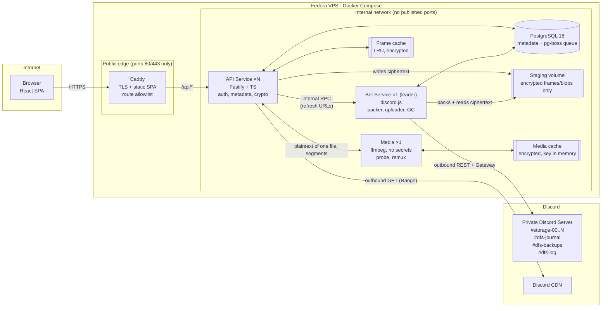

### 3.1 Services

| Service | Tier | Replicas | Responsibility | Holds secrets |
|---|---|---|---|---|
| **edge (Caddy)** | Public | 1 | TLS termination, serves the static React build (including client-side routes such as the share page `/s/:token`), and reverse-proxies **only `/api/*`** to the API. It is the **only** container that publishes ports. | TLS certs |
| **api** | Internal | 1…N (stateless) | HTTP API, authentication, sessions, the file-system metadata (tree operations), upload sessions, **encryption/decryption**, download streaming, share links, live events (SSE fed by Postgres `LISTEN/NOTIFY`). Enqueues jobs, and runs the background jobs that need keys: `journal.flush`, `backup.snapshot`, and DEK re-wrapping. | `MASTER_KEY` |
| **bot** | Internal | 1 active (+ optional standby) | The only process with the Discord token. **Packs** small-file frames into blobs, uploads and deletes blobs, compacts packs, refreshes CDN URLs, and offers admin slash commands. **Outbound-only** network access to Discord. It never sees keys or plaintext. | `DISCORD_BOT_TOKEN` |
| **postgres** | Internal | 1 | Metadata, sessions, audit log, journal outbox, and the job queue (**pg-boss**, so no Redis is needed). | — |
| **media** | Internal | 1 | Examines audio and video files, and remuxes them to HLS while they play; extracts subtitles and cover art (ffmpeg, §6.7). Reaches nothing but the API, its only client. | — (a token per file, from the API) |

**Why the bot and API are split:** the two most sensitive secrets live in different processes. The bot never sees plaintext or keys; it only moves and concatenates ciphertext. The API never talks to Discord's API directly, so all rate-limit state lives in one place. Both import shared packages that define the frame format and the job contracts. The media service is split off for the same reason: ffmpeg parses files anyone with an account uploads, so it runs where a flaw in it reaches no secret (§6.7).

### 3.2 Network topology & exposure

The deployment is a **single Fedora VPS** (D6). The browser still has to reach the API, so "internal" means the API is **never directly addressable from the internet**: every request goes through Caddy, which forwards it over the internal Docker network.

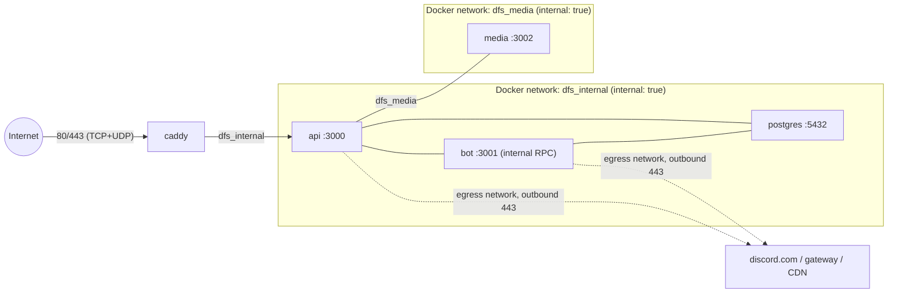

- Four Docker networks: `internal` (`internal: true`, no internet, the fixed subnet `10.73.0.0/24`) for service-to-service traffic, `egress` for outbound Discord access (and the API's check of the internet, §16), `edge` for Caddy, which publishes ports there and reaches Let's Encrypt (a container on an internal network alone can publish no port), and `media` (`internal: true`) for the API and the media service alone. Only `api` and `bot` join `egress`, and only `caddy` publishes ports. `media` joins its own network alone, so ffmpeg, which parses uploads, reaches the API and nothing else: not Postgres, the bot or Caddy (§6.7). Postgres has no route to the internet at all.
- **Route allowlist at the edge:** only `/api/*` is proxied to the API. Every other path is answered from the static SPA build, and unknown paths fall back to `index.html` so client-side routes such as `/s/:token` (public share pages) work. `/internal/*` and metrics paths get an explicit `404`. Nothing else reaches a backend service.
- **Streaming:** request and response buffering is disabled for uploads (`/api/uploads/*/content`, a whole file in one request, and `/api/uploads/*/parts/*`), the content and archive routes (`/api/files/*/content`, `/api/s/*/files/*/content`, `*/archive`), and `/api/events` (SSE). The body size limit is **22 MiB** (one part plus headroom; a test checks it against the chunk size), except for a file streamed whole, whose length the API checks against its upload. Download and SSE routes have long timeouts; an upload may stall for a minute (Caddy's `read_body_idle`) before Caddy cuts it.
- **Client IP:** the API trusts `X-Forwarded-For` **only** from the Caddy container's address, fixed at `10.73.0.10` on the internal network (`TRUSTED_PROXY_CIDRS=10.73.0.10/32`), for rate limiting and audit logs.
- **Share links** use the public URL (`PUBLIC_BASE_URL`), and the sign-in route checks `Origin` against it (§7.1).
- *Later, optional:* the same images can be split across two hosts (edge on the VPS, core elsewhere over WireGuard/Tailscale) with `docker-compose.edge.yml` / `docker-compose.core.yml`. This is not built in v1.

---

## 4. Discord Server Layout

```
📁 DFS (category, private: only the bot and admins can view)
 ├─ #storage-00   ┐
 ├─ #storage-01   │ data channels: blobs are spread across the least-loaded channel
 ├─ #storage-02   │ (default 4; more can be added at runtime)
 ├─ #storage-03   ┘
 ├─ #dfs-journal     encrypted metadata journal batches (for disaster recovery, §8)
 ├─ #dfs-backups     snapshot pointers, each with an encrypted manifest (the dumps are DFS files, §8)
 └─ #dfs-log         human-readable bot events and alerts (nothing posts there yet)
```

- **Permissions:** `@everyone` is denied View Channel on the category. The bot role gets View, Send Messages, Attach Files, Read Message History, and Manage Messages, plus Manage Channels and Manage Roles while `dfs setup` creates the category and sets its permissions (they can be removed afterwards). No one else is given access to the category (D31).
- **Bootstrap:** `/dfs setup` (or `dfs setup` in the CLI) creates the category and channels if they are missing, then registers them in the `storage_channels` table.
- **Environments (D25):** development shares the server and the bot with production. Production uses the `DFS` category, development a `DFS Dev` category (`DISCORD_CATEGORY_NAME`). Each environment registers only its own channels in its own `storage_channels`, and everything that reads or deletes messages (reconciler, scrubber, GC, recovery) works only in registered channels, so neither can take the other's messages for orphans. Three more guards back that up: a channel registered by hand on Admin → Channels must be a text channel inside this environment's category (the bot checks, and makes it private); the bot posts new blobs, and the reconciler reads history, only in registered channels that are inside that category in Discord at the time, so a channel registered by mistake or moved out keeps its blobs readable but gets no more; and every data message carries its database's `i`, so even a channel both register can't mix them up. Production's first storage channel is an existing channel outside any category, so the guard refuses it as it is. Proposed (not yet agreed): move it into `DFS` once `/dfs setup` has made the category, then register it. Development runs without a gateway connection (`DISCORD_GATEWAY=off`): slash commands belong to production, and development sets up its channels with the CLI (`dfs setup`). The two share Discord's rate limits, so load tests use `LocalBlobStore` or `ChaosBlobStore`, never Discord.
- **Message formats.** They leak no file names, and every attachment is encrypted:
  ```
  #storage-NN   content: dfs1 b=184467 k=pack n=212 i=3fa9c1d2e0b4   attachment: 184467.bin
  #dfs-journal  content: dfs1 j=5521 ids=9120004-9125003 i=3fa9c1d2e0b4   attachment: j5521.bin
  #dfs-backups  content: dfs1 snap=212 hwm=9125003         attachment: snap212.bin
  ```
  - **Data:** `b` is the blob ID, `k` the blob kind (`solo` | `pack`), `n` the number of frames, and `i` the ID of the database that posted it (12 hex digits, made once by its migration in the `instance` table). This lets a reconciler map orphan messages back to DB rows, and lets recovery rebuild blob locations by scanning channels (§8). Blob IDs restart in every database, so `i` is what tells a database its own messages apart: no environment, test stack or restored copy can take another's messages for orphans, even in a channel both registered. Recovery keeps the `i` of the database it rebuilds.
  - **Journal:** `j` is the batch number (contiguous, so a missing batch is detectable), `ids` the range of journal record IDs inside it (a range: IDs can have gaps), and `i` the database that posted it, as for data. The sealed batch names its database too, which recovery checks, since development stacks share a master key and a category.
  - **Backups:** `snap` is the snapshot number and `hwm` its journal high-water mark. The attachment is the encrypted manifest that locates the dump (§8).

---

## 5. Data Model (PostgreSQL 18)

Two layers keep the **logical** file system separate from **physical** storage:

- **Logical:** `nodes` (tree) → `file_versions` → `chunks`. A *chunk* is one encrypted *frame* holding a piece of one file version.
- **Physical:** `blobs`. A *blob* is one Discord attachment. A **solo** blob holds one frame (a chunk of a large file). A **pack** blob holds many frames from many small files. Each chunk points at `(blob_id, offset, length)`.

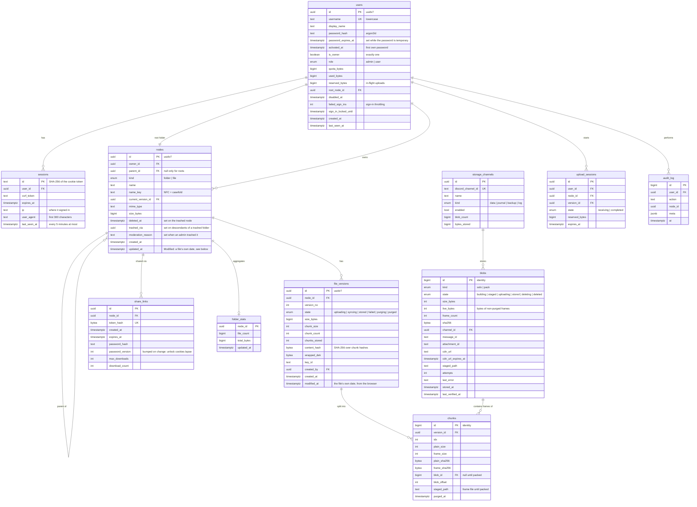

**Modified.** `nodes.updated_at` is what the drive shows and sorts as "Modified". A file's is its own modification date, as the browser that uploaded it read it (`File.lastModified`, kept per version in `file_versions.modified_at`), or the time of the upload when the browser didn't know; renaming or moving a file leaves it, as a file system does. A folder's is when it was made, renamed or moved. ZIP downloads carry the same dates (§6.2). A single downloaded file can't: browsers date it to the download. Creation dates, permissions and attributes are out of any website's reach; an archive uploaded as a file keeps them.

Supporting tables not drawn above: `journal` (outbox of metadata changes, §8), `journal_batches` (the sealed batches, staged until the bot posts them, §8), `backups` (snapshots and their manifests, §8, added with M4), `folder_stats_dirty` (§12.1), `archive_tickets` (single-use ZIP links, §9), `metrics` (the admin's graphs, §16), `media_info` (what an audio or video version holds, derived, §6.7), `playback_positions` (where each user stopped, §10.4), and pg-boss's own schema. The Drizzle schema in `packages/db` is the exact definition; this diagram shows its shape. A received upload part is its chunk row, so upload sessions don't list parts separately. Storage channels have their own ID, so a Discord channel ID appears once, in `storage_channels`.

### 5.1 Key rules and indexes

- **IDs:** user-facing entities use **UUIDv7** (time-ordered, generated with PG 18's native `uuidv7()`), which gives good B-tree locality for inserts. High-volume internal tables (`chunks`, `blobs`, `audit_log`, `journal`) use `bigint` identity to keep rows and indexes small.
- **Unique names per folder:** `UNIQUE (parent_id, name_key) WHERE deleted_at IS NULL`. `name_key` is the NFC-normalized, case-folded name, so `Photo.JPG` and `photo.jpg` cannot exist side by side. This keeps behaviour predictable on Windows and macOS.
- **Folder listing:** index `(parent_id, kind, name_key, id) WHERE deleted_at IS NULL`, with **keyset pagination** (folders first, then name). There is no `OFFSET` and no `COUNT(*)` on the hot path.
- **Search:** a GIN `pg_trgm` index on `name_key`, always filtered by `owner_id` and `deleted_at IS NULL AND trashed_via IS NULL`.
- **Chunk addressing:** `UNIQUE (version_id, idx)`. Because chunk size is fixed per version, a byte offset maps to a chunk with `idx = floor(offset / chunk_size)`. Index `chunks (blob_id)` for GC and compaction.
- **Blob queues:** partial indexes `blobs (state) WHERE state IN ('staged','uploading','deleting')` and `chunks (id) WHERE blob_id IS NULL AND purged_at IS NULL` (frames waiting for the packer).
- **Tree queries:** paths and breadcrumbs use recursive CTEs, which are cheap because trees are shallow. A move is one `UPDATE` plus a cycle check (the new parent must not be a descendant).
- **Quota:** `upload_sessions` reserve bytes up front (`users.reserved_bytes`). When the upload completes, the reservation becomes `used_bytes` in one short transaction.
- **Users:** `username` is stored lowercase with a unique index, so `Sam` and `sam` are the same account. A partial unique index `(is_owner) WHERE is_owner` allows only one owner (D28).
- **Versions:** a file keeps its **current version, and an earlier one only while a share link serves it** (§7.5). A file link serves the version current when it was made; when the file is replaced, versions no working link serves are purged as the upload completes, and the rest by the leading bot's janitor once their last link stops working (expired, used up, or turned off, which deletes it). Earlier versions count toward the owner's quota until they are purged, like the trash (D24). There is no version history to browse.

### 5.2 Lifecycle state machines

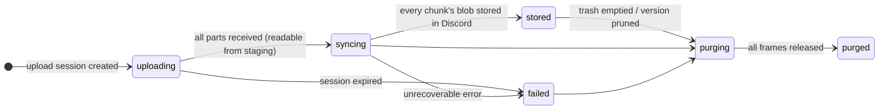
*File version.* It is readable in `syncing` (served from staging) and in `stored` (served from Discord).

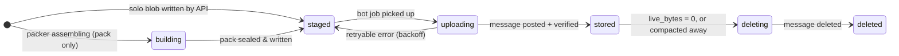
*Blob.*

---

## 6. Core Flows

### 6.1 Upload (streamed, resumable)

A file is stored in parts of **exactly the version's chunk size**, each one encrypted frame, as in an S3 multipart upload. A small file goes in a single `PUT` of its one part. A larger one **streams in one request** (`PUT /api/uploads/:id/content`), which the API cuts into parts as the bytes arrive: the browser sends the file straight from disk, and its progress counts the bytes as they go (D30). **Plaintext never touches disk.**

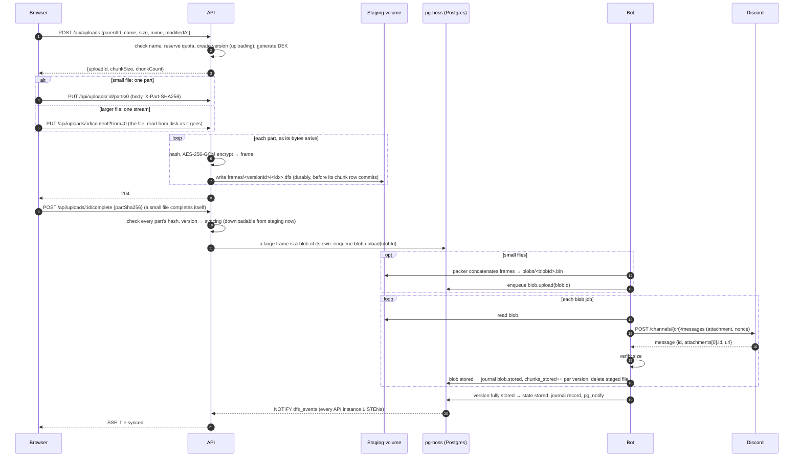

**Details**

- **Resume:** `GET /api/uploads/:id` returns the session with `receivedParts`, the part indexes already received. A broken or paused stream starts again at the first part missing (`?from=`): the API keeps every part that arrived whole, and drops the one cut short. A session expires 24 h after its last sign of life (its creation, a stored part, or its page saying it is open), so an upload under way never expires however long the file takes; a janitor job cleans up expired sessions and releases their reserved quota.
- **Uploads live in their page**, as on any website: closing or reloading it cancels them (the browser asks first while any are under way). As it goes, the page cancels its sessions not yet complete in requests that outlive it (`fetch` with `keepalive`), so no half file stays in its folder. A page can't always say goodbye (a crash, a phone closing the tab, a lost network), so a session is also a lease: while the page holds it, it says every minute that it is still open (`POST /uploads/alive`), and every stored part renews it too; the leading bot gives up sessions quiet for 10 minutes, and their open folders refresh. A computer asleep for longer comes back to an upload to retry from the start. An upload that fails gives up its session at once, with what had arrived, so Retry starts it afresh; one paused for 5 hours is canceled, and the panel says when beforehand. Files already uploaded reach Discord without the page.
- **A stream's integrity:** the stream carries no hashes. While it uploads, the browser reads the file a second time, one part at a time, and hashes each part; `POST /complete` sends them all (`partSha256`), and the API compares them with the parts it received. Parts that differ are dropped before the `400 hash_mismatch`, and the client streams again from the first one.
- **Small files in bulk:** `POST /api/uploads/batch` creates up to 500 sessions in one call. It answers per upload, in request order (`{results: [{ok: true, session} | {ok: false, error}]}`), because a batch can partly fail: an invalid name, or the quota running out halfway (`507 quota_exceeded`). A single-part file is uploaded with one `PUT` and **auto-completes**, so uploading a small file costs 2 requests in total. Folder trees are created first with `POST /api/folders/ensure` (like `mkdir -p` for many paths in one transaction).
- **Same name, new version (D20):** an upload whose name matches a non-trashed **file** in the target folder (by `name_key`, so ignoring case) creates a new version of that file instead of a new node. The node keeps its ID and its stored name, so links, shares and paths keep working. A matching **folder** is a `409 name_conflict`. Renames and moves still answer `409` on any clash; only uploads make versions.
  - **The web app asks first.** Its uploads send `ifExists: 'ask'`: a name a file already has (in the folder, or earlier in the same batch) then starts nothing and answers `409 file_exists` with that file (`existing: {nodeId, versions, links}`). The upload waits in the panel, and a dialog asks, one file at a time: **Replace** (sent again with `ifExists: 'replace'`, a new version), **Keep both** (under another name, `name (N).ext` by default, N the file's version count, editable), or **Skip**. Closing the dialog skips. A choice can be made for every file of the drop that already exists; copies are then numbered, counting on past numbers already taken. The dialog says how many working share links the file has: replacing it leaves them sharing it as it is now (§7.5). Without `ifExists`, as from scripts, an upload replaces.
  - The new version reserves its full size; old versions still count (D24), so there must be room for both.
  - `current_version_id` moves to the new version only when the upload completes, in the same transaction that turns the reservation into used bytes. Until then, readers and shares get the previous version.
  - Completing it purges the earlier versions no working share link serves, which frees their quota; those a link serves stay until it stops working (§7.5). A download of a purged version under way is cut short; one resumed later gets the whole current version (`If-Range`, §6.2).
  - The upload session says which version it creates (`versionId`) and whether it is a new version of an existing file (`isNewVersion`, so the UI doesn't animate the row in as new). `GET /uploads/:id` answers until the session expires, also after completion (`state: 'receiving' | 'completed'`).
- **Retries are harmless:** sending a part again, alone or in a stream, is accepted, also after the upload completed, as long as its SHA-256 matches the part received (otherwise `409 upload_completed`); completing a completed upload is a no-op, and cancelling one leaves the file. A client whose response was lost simply retries, and a `404` means the session expired.
- **Idempotency:** Discord's `nonce` + `enforce_nonce` on message create prevents duplicate posts when a job retries within a short window: a retry reuses the blob's channel and its random nonce (random, since blob IDs repeat across databases sharing the bot). A reconciler reads its environment's registered channels (§4) every hour from where it last stopped, and deletes the bot's data messages carrying this database's `i` that no blob records (one posted again after the nonce window, say). It leaves messages younger than an hour alone, since an upload may still be recording them, and never adopts one: posting again is cheaper than checking a stray copy. Each channel is reconciled on its own, so one that is gone or out of reach doesn't keep the others from being cleaned.
- **Channel selection:** the least busy enabled data channel, which spreads rate-limit buckets across channels. Each channel takes `UPLOAD_CHANNEL_CONCURRENCY` posts at a time (default 2), so a channel Discord slows down gets fewer blobs while the others keep going. The bot holds about 32 blobs at once to keep the channels busy, but reads a blob from staging only when its post starts, so waiting blobs take no memory.
- **Backpressure:** if staging passes `STAGING_MAX_BYTES`, `PUT part` returns `503` with `Retry-After` (seconds or an HTTP date) and the client backs off. A stream instead stops reading while staging is full, which pauses the browser's sending with it, and answers `503` only after 45 s, less than the minute Caddy lets an upload stall. Staging cannot grow without limit when Discord is slower than the user's upload. What staging holds is counted one way everywhere (`stagedBytesSql` in `packages/db`): frames on their own, plus sealed packs waiting to be stored. The upload limit, the overview's staging alert and graph, and Admin → System all read it.
- **Read-your-writes:** a `syncing` version is fully readable. The download path reads frames from staging until their blob is `stored`.
- **Progress:** the UI shows two phases. *Uploading* is browser→API. *Syncing to Discord* is in the background and streamed via SSE from `GET /api/events` (`nodes.synced`).
- **Live events across API replicas:** the bot never talks to browsers, and a user's SSE stream can be on any API instance. Every state change the UI shows (version synced or failed, quota changed) calls `pg_notify('dfs_events', …)` in the same transaction, so the event is delivered only if the change commits. Each API instance `LISTEN`s on one dedicated connection and forwards events to its own SSE clients for that user. Payloads stay small (user ID, event type, a few IDs; Postgres caps them at 8 KB). Bulk changes send one coalesced event per transaction (for example, per pack). Events are not durable: after a reconnect, the client refetches. Postgres serializes the commits of transactions that issue `NOTIFY`, so only transactions that are already infrequent send one: per pack, per batch, or rare events. Per-file transactions, such as completing a small-file upload, don't notify. The uploading browser already knows about those, and it refetches the quota when a batch finishes.
- **Event payloads** (shared Zod schemas, `liveEventSchemas`): the SSE `event` field is the type and `data` is JSON. They say what changed, so the UI updates in place instead of refetching whole folders (a 6,000-file folder is 30 pages):

  | Event | Payload | The UI |
  |---|---|---|
  | `nodes.synced` | `{nodes: [{id, parentId, syncState}]}`, at most 500 nodes | patches the rows in the cache; the upload panel ticks off phase two (or shows the failure) |
  | `nodes.changed` | `{parentIds}` | refetches only those folders' listings (background changes, e.g. moderation) |
  | `quota.changed` | `{usedBytes}` | sets the quota meter directly |
  | `ping` | `{}` | every 25 s. Proxies keep the stream open, and a client that hears nothing for 60 s reconnects |

  The `NOTIFY` itself carries only IDs (a pack or a few versions), well under the 8 KB cap; the API instance that receives it expands them into the SSE payload. A pack of more than 500 files becomes `nodes.changed` for their folders instead. An event the client can't parse makes it refetch everything, and after a reconnect the upload panel re-checks the files it still shows as syncing, so a newer server or a missed event never leaves a stale screen.

### 6.2 Download (streaming, Range-aware)

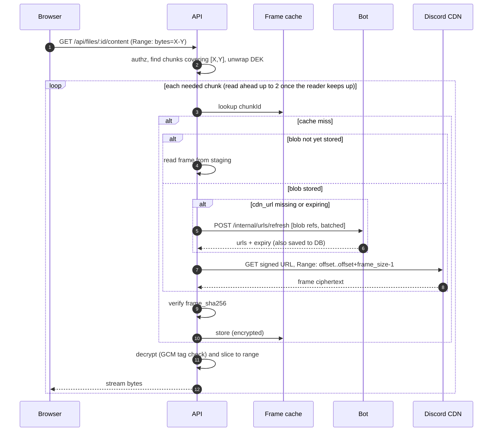

- Responds `206 Partial Content` with `Accept-Ranges: bytes`, so `<video>` seeking and resumable downloads work.
- **Revalidation:** the ETag is the version's ID and the answer is `private, no-cache`, so a browser asks again each time; one that names the version it has (`If-None-Match`) gets `304 Not Modified` and no bytes, so going back and forth between previews (§10.3) moves nothing again. A resumed download names its version with `If-Range` instead, and one of another version gets the whole file.
- **Pack reads** use an HTTP `Range` request against the CDN (the contract test checks it answers `206`), so reading a 50 KB file out of a 20 MiB pack moves about 50 KB. If the CDN ever ignores `Range` (returns `200`), the API cuts the frame out of the whole blob.
- **Folder download:** `GET /api/folders/:id/archive` streams a ZIP built on the fly (ZIP64 for large archives, store-only with no compression). Each entry carries its "Modified" (§5) twice: as an MS-DOS time, which has no time zone and is read as local time, so the server writes it in the downloader's zone (`?tz=`, which the web app sends from `Intl`; UTC without it), and as Info-ZIP's extended timestamp in UTC (1901 to 2038), which 7-Zip, macOS and unzip prefer. Before streaming, it signs the URLs of the packs it needs in one call, and fetches a pack **whole** when the round trips that saves outweigh the bytes it adds (a round trip of 40 ms against 7 MB/s, measured from the development machine: for files of 100 KB, from about a quarter of a pack on, whatever its size; measure both again from the VPS, whose faster link makes whole packs pay off earlier). Its frames go to the cache, where each file finds them, and the next pack is fetched while this one's files are sent. A folder of 1,000 small files usually means a handful of pack downloads; a second download of it, none.
- **The cache** holds *ciphertext* frames on local disk (LRU, `CACHE_MAX_BYTES`, default 5 GiB), so it is safe even if the disk is compromised. It is keyed by each frame's SHA-256: frames never change, so an entry stays right even after compaction moves its frame. Every hit is checked again (a bad copy is dropped and fetched anew), readers of the same frame share one fetch, writes skip `fsync` (a torn file fails its check), and the index is rebuilt in the background at start. Only frames of stored blobs read from Discord go through it; the local store and staging don't need one. It also keeps single segments of format 2 frames read in part (§7.3), under the same size and the same order: a PDF's pages and ffmpeg's reads come back to the same few, each of which would otherwise be another request to Discord. Their own tags check them when opened, so a bad copy is dropped and fetched again; only segments that passed their tag are kept; and a frame kept whole replaces its segments. Hits and misses count per segment as per frame.
- **A deleted message's attachment** (checked live, 2026-10): Discord still signs new links to it, but its CDN answers them with 404, and an attachment no one had read is gone at once; only a link that read it before the deletion keeps serving it, from the CDN's cache, for a while. So a read that fails looks its frame up again and reads it where it is now, if it moved since: packed or stored while it was read from staging, or compacted into another pack whose old message went (§6.6). A download looks up 64 chunks at a time, and a ZIP plans whole packs at its start, so a frame can move under a long one. The frame cache needs nothing: a move doesn't change a frame's hash.
- **Streaming a chunk** (format 2, §7.3): one that isn't in staging or kept whole in the cache is read segment by segment, each checked by its own tag and sent as soon as it has arrived; the first bytes wait for one 256 KiB segment, not a whole 20 MiB frame. Each segment comes from the cache if kept there, from another reader's fetch if one is under way (shared, as checked plaintext in memory), or else from Discord by `Range`, consecutive ones in one request. A small range that ends before its chunk does also reads the next segments, up to 1 MiB in all, into the cache, so the reads that follow it find them (**read-around**); a range to the end of its chunk, as a player asks, gets none, so a seek cancelled at once still fetches only what it asked for. A chunk read whole is fetched whole, checked against its SHA-256 and kept as one frame. Bytes are counted: a range Discord cuts short fails, never taken for a whole one, and if a frame moves mid-stream (§6.6) the rest is read where it is now, from the next segment. Staged, cached and format 1 frames are read whole, and only the segments wanted are opened.
- **Discord's CDN asking to slow down.** Discord publishes no limits for its CDN, which counts by address, and everything DFS reads comes from the VPS's one. When it answers 429, every read of the process waits as long as it asked (`Retry-After`, at most a minute) or, when it didn't say, a pause that doubles with each 429 in a row, then the refused request is sent again, three times at most (`CdnGate`). A read cancelled while waiting leaves at once, and a request's minute runs from when it is sent. The API counts them (`cdn.429`) on the graph beside failed CDN reads, and five in an hour raise a warning.
- **Many streams at once.** Nothing caps how many requests the API makes of the CDN: what many viewers share is bandwidth, which a cap would only divide into queues. From the VPS, three 20 MiB frames at once came no faster than about 34 MB/s together, so some 30 cold 1080p streams (about 1 MB/s each) would fill that link (an estimate from one measurement; the VPS's own upload to viewers isn't measured). Under load, read-ahead drops out first (its 256 MiB budget), a file several watch is fetched once (the cache, shared fetches), and the whole API backs off together if Discord asks. The graphs show CDN reads under way against downloads to browsers, and the CDN's time to first byte (§16), so contention shows before anyone feels it; giving reads someone waits for priority over read-ahead comes only if it does.
- **Read-ahead** starts at nothing and grows by one chunk per chunk the client takes (not per segment of one), up to 2, never past the requested range, so a whole file keeps up to 3 requests overlapping. A response asks the reader for its next piece only once its socket has taken the last (`paced`, in `send.ts`); Node's `Readable.from` alone asks again as soon as it hands a piece on. So a stalled client stalls its download, and holds one chunk outside the budget, in the socket's write buffer. But a socket takes a piece before the client has it, as far as the connection's buffers go: behind Caddy, with the VPS's buffer limits (a receive buffer may grow to 32 MiB), they take a whole 20 MiB piece at once, so reading ahead starts anyway. So a response that closes before it has finished, as a seek closes one (and Chrome's player on opening a video), **aborts what is being read for it** (`cancellation`, in `send.ts`): its CDN requests stop at once, and nothing given up on is cached. A frame another download waits for too is fetched on: the frame cache stops a shared fetch only once every reader has left it. Measured on Discord (2026-10-08), behind Caddy with the VPS's buffer limits, a client reading at 7 MB/s: a seek cancelled within its first 1 to 10 MB took 3 whole frames from Discord before (about 62 MB), and 1.1 to 1.7 frames' worth after, the first frame and what of the next had arrived by the cancel; full reads were as fast, and so were cold ZIPs (60 files of 150 KB from one pack fetched whole, 1.4–1.7 s; 28 of 200 KB read by range from three sparse packs, 2.1 s). A `HEAD` request, which Fastify answers by draining the stream it was given, read the file from Discord for nobody (3 frames within 10 s, and on) and a folder's whole pack for a ZIP; it now gets an empty stream, with the length, and reads nothing. Frames read ahead come from one budget of 256 MiB for the whole API (whole packs for archives too); a download that finds no room reads a chunk at a time. Whole packs fetched for a ZIP (below) finish into the cache, even for a ZIP cancelled meanwhile.
- **Measured with segments** (format 2, 2026-10-09), on Discord, 125 MB files of each format and the frame cache cleared each time. Discord's CDN itself: a range of an attachment never read takes 0.2 s to its first byte (0.5–0.9 s with a new TLS connection), and 256 KiB more arrive within 20–50 ms; once read, 0.05–0.15 s. Through the API on the development machine, a cold seek's first byte: format 1, 2.7–3.0 s; format 2, 0.40–0.52 s with Discord cold and 0.08–0.09 s once it has the file, as fast as passing bytes on unchecked would be. Behind Caddy with the VPS's buffer limits, a seek cancelled after 1 MB of a client reading at 7 MB/s: first byte 0.14–0.19 s against 2.8–3.3 s, and about 1.5 MB from Discord against 24 MB (after 10 MB, 12 MB against 34). Full reads and cold ZIPs took as long as before, and examining a 30 MB MP4 cold took 0.54–1.0 s against 4.3–6.3 s. Sealing in segments kept uploads as fast (`scripts/performance.ts`: whole parts the same within noise, 1 MiB parts faster, sealed in parallel). With the segment cache and read-around (2026-10-09), behind Caddy with the VPS's buffer limits: a PDF read as pdf.js reads one (140 ranges of 64 KiB, 14 in a row in each of 10 places) took 16 requests to Discord and 3.1 s, against 140 and 11.3 s, and opened again, none and 1.3 s, against 140 and 11.1 s; cancelled seeks cost as before (first byte 0.14–0.20 s, about 1.5 MB from Discord after 1 MB).
- **Measured** before segments, from the development machine (a link of about 55 Mbit/s, which caps every cold figure). With 20 MiB chunks (2026-10-08) and a 125 MB file: a cold first byte, a seek's too, takes 2.9–4 s (a whole frame has to arrive before its tag can be checked; with 10 MiB chunks it took 1.5–2 s, so the chunk size is the lever, at the cost of more messages), a cold full read 6.2–7 MB/s, the same before and after pacing, with no stall for a client reading at 7 MB/s. From the VPS, Discord's CDN gives a 20 MiB frame in 0.6–0.95 s (22–34 MB/s), so a cold seek in production waits about a second; three frames at once come no faster (34 MB/s together), so there read-ahead overlaps waiting, not bandwidth. With 10 MiB chunks, a 256 MB file and 300 files of 100 KB: a warm read 345 MB/s with first bytes in 31 ms; the ZIP of the 300 files 6 s cold with whole packs against 15 s reading each file's range, and 0.75 s warm. Read-ahead depths of 0 to 2 were within noise on the development machine's link.

### 6.3 Metadata operations (no Discord traffic)

Rename, move, create folder, and trash/restore are plain SQL transactions.

- **Trash a folder:** set `deleted_at` on the folder, and in the same transaction set `trashed_via = <folder id>` on all its descendants (recursive CTE update). This keeps search and stats queries simple (`trashed_via IS NULL`). For very large subtrees (over `TRASH_SYNC_LIMIT`, default 50k nodes), the descendant update runs as a batched background job; the folder itself is hidden immediately.
- **Restore** clears both fields for the subtree, auto-renaming to `name (1)` if the name has since been taken.

### 6.4 Deletion & garbage collection

1. **Trash:** the item can be restored for `TRASH_RETENTION_DAYS` (default 30). After that, the leading bot's janitor purges it, every 10 minutes, the oldest 500 items at a time and one drive per transaction under its tree lock, as emptying the trash would; each is logged as deleted for good by the system.
2. **Purge:** triggered by emptying the trash, the retention expiring, or a version being pruned. The version goes to `purging`, its chunks get `purged_at`, each affected blob's `live_bytes` drops by the frame size, and quota is released right away.
3. **Blob release:** a blob with `live_bytes = 0` moves to `deleting` (also when it was purged while being uploaded). The GC (bot leader) deletes messages one at a time: one every 2 s while blobs wait to be uploaded, up to 20 every 2 s otherwise. Uploads get most of the rate-limit budget, and deleting never stops altogether. A message goes only once every journal record written by its release is in `#dfs-journal` (`blobs.released_at`, against the oldest record not posted yet): with the VPS lost first, the database rebuilt from Discord would point at a message gone, and once compaction moves frames (§6.6), lose files still in use. So messages go a minute or two after their files, and wait while the journal can't be posted. A failed deletion is counted on the blob (`attempts`, `last_error`), and blobs are taken fewest failures first, so one that keeps failing never holds up the rest. It works the same on the local store.
4. **Pack compaction** (§6.6) reclaims packs that are mostly dead.
5. When all of a version's chunks are released, the version becomes `purged`.

### 6.5 Integrity & self-healing

| Mechanism | What it catches |
|---|---|
| Per-part plaintext SHA-256 (client→API: with each part's `PUT`, or with a stream's completion) | Corruption in transit during upload, and a stream cut into parts in the wrong place |
| `frame_sha256` checked on every read | CDN, cache, or staging corruption |
| `blobs.sha256` checked by the scrubber | Corrupted or truncated blobs |
| AES-GCM authentication tag | Tampering with a frame or its header, wrong key, swapped or reordered chunks (the AAD binds the header, object type, version, and index, §7.3). Needs no DB, so it also protects recovery. |
| `content_hash` = SHA-256 of the ordered chunk hashes | Truncated or missing chunks |
| **Rolling scrubber** *(not built)* | Silent loss or damage on Discord's side, the only kind left now that no one but DFS deletes its messages (D31); whether it is worth building is open (BACKEND §4.6). It would check blobs in order of `last_verified_at` within a fixed request budget (`SCRUB_REQUESTS_PER_HOUR`), so a full pass takes *blobs ÷ budget* hours regardless of how many files there are, and check each blob's **message**, not just its URL, since a link can serve a deleted attachment for a while (§6.2). |

### 6.6 Small-file packing & compaction

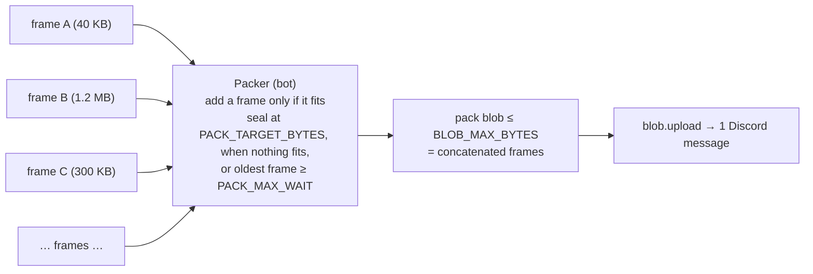

- **Which frames are packed:** every frame of less than `PACK_THRESHOLD_BYTES` (default 4 MiB) of plaintext: small files, and the last chunk of a large file, so nearly every message is close to full. Each file still has **its own DEK and frame**. A pack is just a concatenation of self-delimiting frames, so **the packer needs no keys** and runs in the bot. Backup snapshots are never packed (§8).
- **Packer loop** (single bot leader): `SELECT … FROM chunks WHERE blob_id IS NULL … ORDER BY id FOR UPDATE SKIP LOCKED` over a window of waiting frames. A frame is added only if `pack_bytes + frame_bytes ≤ BLOB_MAX_BYTES`; a frame that doesn't fit stays queued and goes into the next pack. The pack is sealed when it reaches `PACK_TARGET_BYTES`, when no waiting frame fits in the space left, or when its oldest frame has waited `PACK_MAX_WAIT_MS`. Sealing writes `packs/<uuid>.bin` in staging, sets `blob_id`/`blob_offset` on each chunk, and enqueues `blob.upload`, all in one transaction. The frame files are deleted after it commits, and until the pack is stored, reads cut frames out of the staged pack. If the bot crashes in the middle, the transaction rolls back and the frame files are still there. The packer runs every second and seals every pack that is due; frames are taken in upload order, so files uploaded together share packs, which keeps folder downloads to a few messages.
- **Compaction**: the leading bot merges packs that hold little into fewer (`apps/bot/src/compactor.ts`, D32).
  - *Which packs:* a stored pack whose live bytes are under `COMPACT_THRESHOLD` (0.3) of a full pack (`PACK_TARGET_BYTES`), whatever its own size, stored at least `COMPACT_MIN_AGE_DAYS` (7) ago, so files deleted soon after their upload go first. That takes mostly dead packs and the small ones a lone upload sealed after `PACK_MAX_WAIT_MS` alike. Candidates are grouped in pack ID order, so files uploaded together stay together, as many whole packs to a group as fit in `PACK_TARGET_BYTES`, and a group of one is left: rewriting one pack saves no message. A merged pack still under the threshold may be merged again `COMPACT_MIN_AGE_DAYS` later, saving messages each time. The rule is one function (`packages/db/src/compaction.ts`), by which the bot merges and Admin → Storage counts what it would, so that deleted files' bytes leaving Discord within some days (not now) would only change it.
  - *When:* one group per run, a minute after the last run ends, and only while no blob waits to be stored, as deletions yield to uploads (§6.4), and no file was downloaded in the last minute (`downloads.bytes`, which the API saves every 5 s): a run reads whole packs from Discord over the link downloads use too, and measured on a home link, downloads of packed files took up to half again as long while one ran. A run that sees a download start stops before its next pack read, having reserved nothing. Admin → Storage's Compact packs now runs every group there is, without the days' wait and without waiting for downloads. One run at a time, shared by the loop and the task.
  - *A group:* each pack is downloaded whole and checked (its size and SHA-256, then each live frame's), one at a time, keeping only its live frames, so a group of many sparse packs never holds them all in memory. One that fails is left out with a warning and `compaction.failures`, and skipped until the bot restarts; its files would fail to download as well, and nothing else shows it (D31). A read the store may answer later (a rate limit, a timeout) ends the run instead, to be tried again a minute on. The live frames, still ciphertext, go into a new pack in chunk ID order. Its row is reserved as `building`, for the blob ID its message names, and the pack is posted from memory, never staged.
  - *Then one transaction* takes the frames' versions, then the old packs and the new one by ID (`locks.ts`); gives up if the new row isn't `building` any more, or was reserved over half an hour ago, well inside the hour after which the janitor and the reconciler clean up after it; moves each chunk still where it was read (the same `blob_id` and `blob_offset`: a frame purged meanwhile stays behind, as dead space in the new pack); sets `live_bytes` on both sides from what moved, the new pack `stored` and an old one left with nothing `deleting`; and journals `blob.stored` for the new pack, then `blob.relocated`. The old messages go only once that is in `#dfs-journal` (§6.4), so a VPS lost at any point leaves the journal pointing at packs that are there.
  - *A failure midway* leaves nothing pointing at the new pack. When the move fails or gives up, its row goes `deleted` and what was posted is deleted at once. After a crash, the janitor turns a `building` row older than an hour `deleted`, removing its file from the local store, and the reconciler deletes its message if it was posted (§6.1).
  - *Reads* that looked a frame up before it moved read it from its new pack once the old one fails (§6.2); the frame cache, keyed by frames' hashes, needs nothing.
- **Trade-off:** a deleted small file keeps taking up space in Discord until its pack is compacted, which may be never while the pack stays mostly live. Its quota is released immediately, though, and Discord space is free, so the only real cost is message count. Its bytes stay readable to whoever holds the master key; making them leave Discord within some days was considered and left for later (2026-10-07).

### 6.7 Audio and video streaming

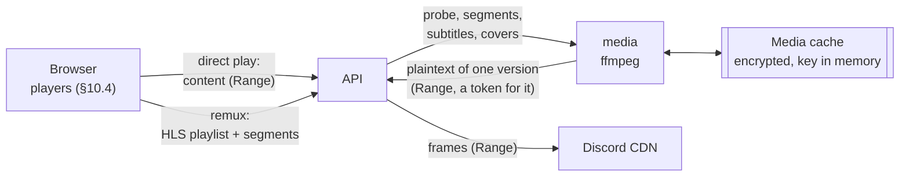

Audio and video play in the browser as they are whenever it can decode them, and otherwise, when only the container or the sound stands in the way, through the media service, which remuxes them while they play (D34). Nothing is transcoded: the VPS (6 cores, no video hardware, and other work of the user's) can't convert a video while it plays, so a video whose codec the browser can't decode says so, with Download (the user's decision, 2026-10-08). The players are §10.4; both come after previews of images, PDFs and text (§10.3).

- **Media info.** Each audio and video version is examined once with ffprobe: right after its upload completes, at the API's request and best effort, or else when first played. `media_info` keeps, per version: its kind, duration and container; each stream's codec with its RFC 6381 string (`avc1.640028`, `hvc1.2.4.L153.B0`, `mp4a.40.2`, `opus`, `ec-3`), profile, resolution, frame rate, HDR transfer and rotation, channels and sample rate, language, title, and default and forced flags; chapters; tags (title, artist, album, album artist, track and disc numbers, year, genre); whether it has a cover; and the times of its video keyframes, read from the file's index (an MP4's sample tables, an MKV's cues) without reading the video itself. It is derived, so it is not journaled: after a recovery, files are examined again as they are played.
- **Two ways to play, or a reason not to.** The player chooses from what the browser says it decodes, given the exact codecs (`MediaSource.isTypeSupported`, `canPlayType`), never from a list of formats, since that differs by browser, system and hardware:
  1. **Direct play:** the original, from the content route with Range (§6.2), as a download. Nothing runs on the server. Most phone videos and music play this way.
  2. **Remux:** when only the container is the problem, or only the sound (AC-3, E-AC-3, DTS and TrueHD, which few browsers decode): HLS of fragmented-MP4 segments, the video copied as it is, and the sound copied or converted to AAC, up to 5.1 channels (a few percent of a core). Segments are cut at keyframes from the index, a few seconds each, so the playlist is known before any segment is made. A file without an index (an MPEG-TS recording, an MKV without cues) isn't remuxed: it plays directly if the browser can, and otherwise says why.
  3. **Otherwise it doesn't play:** a video codec the browser can't decode (HEVC without a decoder, AV1 on older devices, MPEG-2, MPEG-4 Part 2, VC-1, WMV) would need a transcode, which DFS doesn't do. The player names the codec that stands in the way, with Download.
- **HDR** plays as the browser plays it: in HDR on an HDR screen, and on an SDR one as the browser or the system tone-maps it. DFS converts nothing; a browser that can't play it fails like any other, with the error and Download (the user's decision, 2026-10-08). Details shows HDR from the media info.
- **Sessions.** A playlist names its version (`…/media/<versionId>/remux/…`), so a segment's bytes never change and are cached as such. The first segment asked for starts ffmpeg at its time, which then makes the next ones, staying at most a minute ahead of the last one asked for, paused beyond that. A segment more than a minute from what is being made starts ffmpeg again there; seeking back finds made segments in the cache. A session nobody asks anything of for a minute ends. At most `MEDIA_REMUXES` (4) remuxes run at once, across all viewers; past that, `503 media_busy`, and the player says the server is busy and offers the original.
- **Quality** is the original's alone: lower qualities for a slow connection would be transcodes.
- **Tracks.** A remux carries the audio track chosen in the player (the default one, else the first); direct play plays the default (Safari offers the others). Text subtitles inside the file (SRT, ASS and SSA, mov_text, WebVTT) are extracted once to WebVTT, as are subtitle files beside a video with its name (`Film.srt`, `Film.it.srt`, `Film.en.forced.vtt`, `.ass`, `.ssa`); ASS styling is lost. Picture subtitles (PGS, VobSub) would have to be burned into the video, a transcode: they are listed in Details, and not shown.
- **Cover art:** the picture in an audio file's tags, extracted once; else an image named `cover`, `folder` or `front` (JPEG, PNG or WebP) in the same folder.
- **The media service** (`apps/media`, Node 24 with Debian's ffmpeg, its own image) runs ffmpeg and ffprobe, and the API is its only client. ffmpeg parses files anyone with an account uploads, so the service holds no secret: no master key, no database, no Discord token, and no internet (the internal network only, §3.2). It runs without root, on a read-only root filesystem with its cache volume, within Compose limits (1 CPU, 512 MiB: remuxing copies, and converting sound is light), and ffmpeg at a low priority. It reads a version's plaintext from the API (`GET /internal/media/:versionId`, with Range, on the API's port but outside `/api`, so the edge never forwards it) with a token the API signs for that version alone, valid a few hours (HMAC with a key derived from the master key, as share cookies are, §7.5). A flaw in ffmpeg reaches only the files it is asked to play.
- **The media cache** (`MEDIA_CACHE_DIR`, `MEDIA_CACHE_MAX_BYTES`, 10 GiB on the VPS) holds segments, subtitles and covers, the least recently used going first. They are plaintext media, so each is encrypted (AES-GCM) with a key the service makes when it starts and keeps only in memory: a stolen disk holds ciphertext alone (§7.4), and a restart empties the cache.
- **Reads from Discord.** ffmpeg reads through the API's reader, so it shares the frame cache and its read-ahead (§6.2). A seek costs the 256 KiB segment holding that point, and those after it as far as ffmpeg reads (§6.2, §7.3).
- **Shared links** play the same way, within the same limits (the user's decision, 2026-10-08), and playing never counts toward a link's download limit (§7.5).
- **Planned, not yet built:** seek thumbnails (frames above the seek bar, made once in one pass that decodes only a video's keyframes, at a low priority, and kept). The user counts them important (2026-10-08).

---

## 7. Security

### 7.1 Authentication: usernames and passwords

- **No Discord accounts (D27).** People sign in with a username and a password. Discord is only the storage layer: the server is private to the owner, and users never join it.
- **An admin makes every account (D27).** On the Users page, an admin enters a username, a display name, a quota, a role and a **temporary password** (typed or generated), and hands the username and password to the person. There is no sign-up and no email.
- **First sign-in:** a temporary password opens a **limited session** that can only choose a new password. Until then, the API answers every other route with `403 password_change_required`; only `GET /auth/me`, `POST /auth/password` and `POST /auth/logout` work, and the session lasts 15 minutes. Choosing a password **activates** the account (`activated_at`). A temporary password expires after `TEMP_PASSWORD_DAYS` (7); signing in with an expired one answers `403 password_expired`, and an admin sets a new one.
- **Forgotten passwords:** an admin sets a new temporary password on the Users page. That ends all of the user's sessions, and they choose a new password at their next sign-in. The sign-in page's **Forgot your password?** asks for one by username (`POST /auth/password-reset`): there is no email yet, so only an admin can tell it's really that person, and the request goes to the admins. Admin → Users marks the account and the overview raises an alert, until an admin sets a temporary password or the person signs in. The answer is the same whether or not the account exists; an account's request is recorded once in 15 minutes and audited, and one address may ask 5 times in 15 minutes. An email with a link will replace the admin's part.
- **The owner (D28)** is created on the server with `dfs owner`, a command in the api image that prints a temporary password. Run again, it gives the existing owner a new temporary password and ends their sessions. That is how the owner gets back in, since there is no email. The owner is a flag in the database, always an admin, and nobody can demote, disable or reset the owner from the app. Any admin can make other users admins.
- **Passwords:** hashed with argon2id. 12 to 256 characters of any kind, with no rules about character classes. The API refuses the username itself and common passwords: the ones among SecLists' million most common that are long enough to pass the length rule, about 30,000 (MIT licensed, `apps/api/src/auth/common-passwords.LICENSE`). Changing a password needs the current one (except in the limited session above) and ends the user's other sessions.
- **Sign-in protection:** an unknown username and a wrong password get the same `401 invalid_credentials`, and an unknown username is still checked against a dummy argon2 hash, so the response time doesn't tell them apart. `account_disabled` and `password_expired` are only answered after a correct password. Sign-in is rate-limited per IP and per account: after 10 failures in a row, the account must wait before the next try, starting at 1 minute and doubling up to 1 hour (`429` with `Retry-After`); a successful sign-in resets that. Sign-ins, failed sign-ins, password changes and resets go to the audit log.
- **Sessions** are server-side rows in Postgres, referenced by an `HttpOnly; Secure; SameSite=Lax` cookie with a sliding 30-day expiry. Every sign-in and password change gets a new session ID. Disabling a user ends their sessions at once.
- **CSRF:** every state-changing request needs a CSRF token header, except `POST /auth/login` and `POST /auth/password-reset`, which come before there is a session. Those routes accept only requests whose `Origin` is `PUBLIC_BASE_URL`, and are rate-limited as above (like share unlock, §7.5).
- **Development** signs in the same way; `dfs owner` makes the first local account.

### 7.2 Authorization

- Every node has an `owner_id`. A user can only access nodes in their own tree, plus anything reached through a **share link**. A share grants read access to the shared node and, for a folder, to its non-trashed subtree.
- **Admins** (D4) can manage users and quotas, see system health, and **view any user's metadata**: file names, folder tree, sizes, dates, and usage. This is for moderation. Admin access is **metadata-only**: content, preview, archive, and share routes still require ownership. Admins can move a user's item to trash with a reason (moderation). Removing an item also deletes every share link to it or to what's inside it, expired and used-up ones included, so restoring it brings none back; the dialog says how many beforehand (`GET /admin/nodes/:id/links`), and the result, the toast and the audit entry say how many went. Every admin metadata view and action is written to the audit log.
- All authorization checks run in the API service layer in one place (`assertCanReadMetadata(node, actor)` / `assertCanReadContent(node, actor)` / `assertCanWrite(node, actor)`), and route handlers never skip them.

### 7.3 Encryption

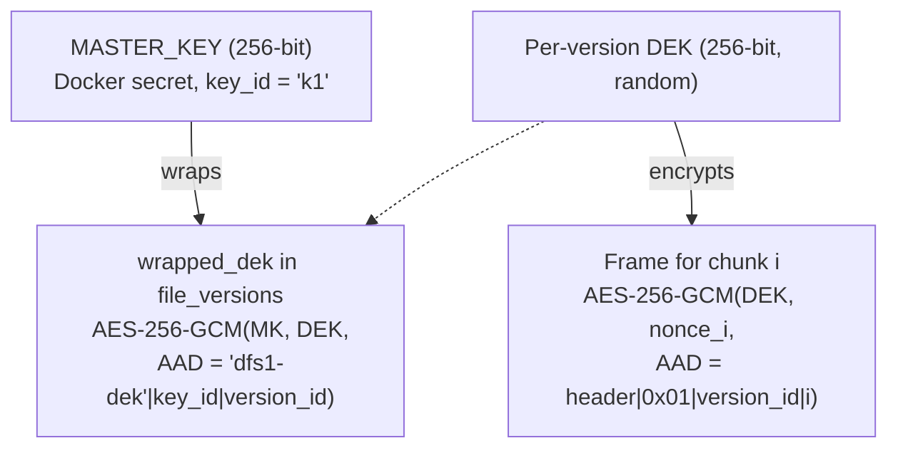

- **Envelope encryption:** each file version gets a random data key (DEK). Only the wrapped DEK is stored. The wrap uses `AAD = "dfs1-dek" | key_id | version_id`, so a wrapped DEK copied onto another version fails to unwrap.
- **Frame format** (self-delimiting, so packs can be parsed without the DB), in two formats under one magic:
  - **Format 2, file chunks (D37):** `magic "DFS1" (4B) | format ver 2 (1B) | flags 0 (1B) | plaintext length (4B, BE) | segment size (4B, BE) | segments`, each segment `nonce (12B) | ciphertext (up to 256 KiB) | GCM tag (16B)`. The plaintext is sealed in segments of 256 KiB, the format's size and no other, so a reader can check part of a chunk before the rest arrives (§6.2). Overhead is 14 bytes plus 28 per segment: 2,254 bytes for a 20 MiB chunk.
  - **Format 1, journal batches and chunks stored before format 2:** `magic "DFS1" (4B) | format ver 1 (1B) | flags (1B) | ciphertext length (4B, BE) | nonce (12B) | ciphertext | GCM tag (16B)`, one seal over the whole plaintext. Overhead is 38 bytes per frame.
  - A chunk's format, and in format 2 where each segment is, follow from its plaintext and frame sizes in the database (format 1 adds exactly 38 bytes, format 2 never does), so a reader asks Discord for the segments it needs without reading the header first.
- **Segment AAD** (format 2) = the 14 header bytes, the segment's index (4B, BE), whether it is the last (1B), then the typed context below: a segment can't be moved, dropped, or passed off as the end, and a changed header fails every segment. A reader rebuilds the header it expects from the database, so it checks a segment without the frame's header.
- **Frame AAD** (format 1) = the first 10 header bytes (magic, format version, flags, length) followed by a typed context. The GCM tag therefore authenticates every header field by itself. That matters during recovery (§8), when there is no `frame_sha256` from the DB to check against. The leading type byte keeps one kind of object from passing as another:

  | Object | AAD context after the header |
  |---|---|
  | File chunk | `0x01` \| `version_id` (16B) \| chunk index (4B, BE) |
  | *Reserved: thumbnails (§1.2)* | `0x02` \| `version_id` (16B) |
  | Journal batch (§8) | `0x03` \| batch number (8B, BE) |
  | Backup manifest (§8) | `0x04` \| snapshot number (8B, BE) |

- **Objects without a file version** (journal batches, backup manifests) each get their own random DEK, stored in front of the frame as `key_id | wrapped_dek`. That wrap's AAD uses the object's context in place of a version ID.
- **Sizes:** `BLOB_MAX_BYTES = DISCORD_ATTACHMENT_LIMIT − 64 KiB` caps every attachment. `CHUNK_SIZE` is the largest multiple of 64 KiB that still fits one frame under that cap. At the 20 MiB limit, that is 20 MiB − 128 KiB (20,840,448 B), so a solo blob is at most 20,842,702 B (format 2).
- **Nonces** are 96 bits and random per frame, and per segment in format 2. A DEK encrypts one version: about 4.2 million segments for a 1 TiB file, far below the roughly 2³² messages per key at which random nonces become a concern.
- **Key rotation:** add a new master key with a new `key_id`, then a background job re-wraps the DEKs in the DB. **No data in Discord has to be re-uploaded.** Retired keys must be **kept**, though: journal batches, backup manifests, and the wrapped DEKs inside journal records stay encrypted under the key that was current when they were written.
- **Key loss = data loss.** The setup wizard makes the admin download or print the master key (as a recovery phrase) before the first upload.

### 7.4 Threat model summary

| Adversary | Protected? |
|---|---|
| Discord (or anyone who gets into the guild) reads stored data | ✅ They see only ciphertext and numeric IDs. File names, sizes per file, and folder structure are not in Discord in plaintext. |
| Stolen DB dump without the master key | ✅ The DEKs are wrapped. Metadata (file names, tree) **is** exposed. |
| Stolen staging/cache disk | ✅ Ciphertext only |
| Malicious or compromised DFS server operator | ❌ The server holds the keys. Fixing this needs E2EE (future: per-user keys derived in the browser, client-side encryption, and more complex sharing). |
| DFS admin curious about other users | ⚠️ By design (D4), admins **can see file names, the folder tree, and sizes**, but cannot open or download content through the app. Every admin view is audit-logged. |
| A crafted audio or video file exploiting ffmpeg | ⚠️ Contained: the media service holds no key, database access or token, and reaches only the API, through which it reads the files it is asked to play (§6.7). |
| Compromised Caddy container | ⚠️ No keys, DB, or Discord token in it, but it sees traffic passing through (including session cookies). |
| Root on the VPS | ❌ It's a single host, so root can read everything. Harden the VPS (§13.2). |
| Discord deletes data or bans the bot | ❌ Detected, not prevented. See §2. |

### 7.5 Other hardening

- Downloads are served with `Content-Disposition: attachment` by default. Inline previews use a strict CSP and `X-Content-Type-Options: nosniff`, and HTML/SVG are always served as attachments, never inline.
- Share-link tokens are 128-bit random values, and only their SHA-256 is stored, so a link is shown once, when it is created. **Turning a link off deletes it**, whether its owner or an admin does: it stops working at once, answers like a link that never existed (`404 share_not_found`), and leaves both link lists; the audit log keeps the entry. **A file link keeps the version current when it was made** (`share_links.version_id`): replacing the file doesn't change what it serves, and its version is kept, counting toward the owner's quota, while the link works. Once it is expired, used up or turned off, the version can be purged (§5.1); then the link answers `410 share_version_deleted` for good, and changing it is refused, so it can never start serving another version. A file can only be shared once its first upload completed. The owner's list says whether a link serves the file's `current` version, an `earlier` one, or one `deleted`. A folder link serves its files as they are. **The web app warns before an action changes what links do:** moving items to the trash asks first when outstanding links (not expired or used up) reach them or anything inside them, which stop working while they are there; deleting forever and emptying the trash say how many links go with them; replacing a file says its links keep the version replaced. It counts them with `POST /shares/count` (`{ids}`, subtrees included, or `{trash: true}`). Optional password (argon2id), expiry, and download cap, all editable later. A password-protected link reveals nothing, not even the item's name, until a correct password (`POST /api/s/:token/unlock`) sets a short-lived cookie scoped to that share, HMAC-signed with a key derived from the master key and bound to the share's password version, so changing the password invalidates those cookies. The share routes have no session, so `POST /api/s/:token/unlock` is exempt from the CSRF token check (§7.1); it is protected instead by rate limiting, an `Origin` check, and a `SameSite=Strict` cookie whose path is `/api/s/:token`. A file download counts toward the cap only when the request starts at byte 0, so seeking in a video doesn't use it up; a ZIP (`GET /api/s/:token/archive`) counts as one download. A preview never counts (`?preview=1`, §10.3): the cap limits downloads, and looking is free, as often as the recipient likes (the user's decision, 2026-10-08). A preview is the whole file all the same, so the cap limits the Download button, not who can keep a copy: anyone with the link could ask for one as a preview. Nor does a browser that has the file count (`304`, §6.2). Once the last download is used, the link is dead, its previews too.
- Sign-in (§7.1) and share-link access are rate-limited.
- An audit log records sign-ins, password changes and resets, completed uploads, moving to the trash, restoring and deleting for good (one entry per item, not per file below it), shares, and admin actions. It keeps a year: the leading bot's janitor drops older entries. Every entry is journaled (§8), so a recovery brings the log back with the data.
- Internal API→bot RPC runs only on `dfs_internal`, needs a shared `INTERNAL_RPC_SECRET`, and is blocked at the edge.
- **Network exposure** (D2): only Caddy publishes ports. `api`, `bot`, and `postgres` publish **no** ports. Postgres is on the internal network only and has no egress.
- Containers run as non-root, with read-only root filesystems where possible, `no-new-privileges`, and dropped capabilities.

---

## 8. Disaster Recovery

The design aims to survive **losing the VPS** (DB plus disks), as long as the Discord guild and the master keys survive. Recovery needs **only Discord and the key file**: everything it reads is found through other objects in Discord, never through the lost DB.

1. **Metadata journal (outbox pattern).** Every metadata change that matters for recovery is inserted into a `journal` table **in the same transaction** as the change. Records carry the entity's full state after the change, so replaying a record twice is harmless:
   - `user.upsert`, `node.upsert` (create, rename, move, trash, restore), `node.purge`
   - `blob.stored` (blob ID, kind, size, SHA-256, and its Discord location: the Discord channel ID, `message_id`, `attachment_id`), `blob.deleted`. Records name channels by their Discord ID, not by the database's own `storage_channels.id`, so they stay meaningful without the database.
   - `version.stored` (version metadata, wrapped DEK and `key_id`, and each chunk's blob ID, offset, size, and hashes), `version.purged`
   - `blob.relocated` (compaction, §6.6): `{id, chunks: [{versionId, idx, offset}]}`, the new pack and where each moved chunk is in it, named by its version and index as `version.stored` names chunks. Written in the transaction of the new pack's `blob.stored`, after it. Recovery moves the chunks of the versions it has; a version not journaled yet names its chunks where they are by then.
   - `share.upsert` (a share link's state, its token's hash in hex, and a file link's version; its download count is a usage counter and is left out, so a rebuilt link counts afresh), `share.deleted` (a link turned off; migration 0019 journaled one for each link revoked before links were deleted, and an older `share.upsert` with a `revokedAt` set means the same). A `node.purge` takes the item's links with it. A file link whose version was purged (`version.purged`) serves nothing, as in the database, where the purge clears its `version_id`.
   - `audit.added` (an audit log entry as written, §7.5), in the transaction of the action it records, so the log survives with the data. Entries written before this record existed were journaled by migration 0016, as were share links.

   Derived values (`live_bytes`, `used_bytes`, `folder_stats`, `nodes.trashed_via`, channel counters) are not journaled. Recovery recomputes them.

   Uploads still under way are not journaled either. An upload lives in its page (§6.1) and can't survive the VPS, so a file joins the journal with its first completed version, and a version once it is stored: starting, renaming or giving up an upload not yet complete writes nothing.
2. **Commit order.** A transaction writes its journal records last, right after taking a transaction-scoped advisory lock (`pg_advisory_xact_lock`), so `journal.id` order is commit order. Without this, a transaction that took a lower ID but committed later could be skipped by both the flusher and a snapshot's high-water mark. The cost is that journaled commits are serialized, at about one fsync each, so they top out near 1 ÷ fsync latency (hundreds to a few thousand per second on an SSD). That is fine at this scale, because bulk work is journaled once per batch or per pack, not once per file.
3. **Journal batches.** A singleton job (`journal.flush`, in the API because it needs the master key) runs every `JOURNAL_FLUSH_INTERVAL_MS` (60 s) or as soon as 5,000 records wait. One API instance flushes at a time (a lock of its own, never the journal's, which every journaled write takes). Each batch is sealed in a transaction of its own, which takes the next number and gives it back if it rolls back, so numbers stay contiguous; the sealed bytes wait in `journal_batches` until the leading bot posts them, in number order, and then only Discord holds them (rows of batches posted a week ago are pruned). The plaintext is `{v, instance, batch, records: [{id, kind, at, record}]}` as JSON, gzip'd (frame flag `0x01`), sealed as an object (§7.3: `key_id length | key_id | wrapped DEK | frame`); a record too large for a batch is cut into pieces, one per batch, `{piece: {id, index, count, data}}`, all sealed in one transaction, and recovery joins their `data`. It takes the unflushed records in ID order, compresses them, and seals them as one encrypted object (§7.3, AAD type `0x03`). A batch is also cut at about 8 MiB so it always fits in one attachment. A single record too large for that (only a `version.stored` for a multi-terabyte file) is split across consecutive batches. The bot posts each batch to `#dfs-journal` (`journal.upload`, message format in §4). This adds **one message per batch, not one per file**, which matters when there are millions of files.
4. **DB snapshots.** A nightly `backup.snapshot` job runs in the API (it holds the keys, and its image ships `pg_dump` 18):
   - It opens a `REPEATABLE READ` transaction, exports its snapshot, and reads the high-water mark (`max(journal.id)`) inside it. `pg_dump --snapshot=…` then dumps that same snapshot, so the dump holds exactly the changes up to the high-water mark.
   - The dump (custom format) is streamed into a DFS file owned by a system account. Backup files are **always stored as solo blobs**, never packed, so compaction never moves them.
   - Once the dump's version is `stored` in Discord, the API seals a **manifest** (AAD type `0x04`) holding everything needed to fetch the dump without the DB: version ID, size, chunk size, `content_hash`, wrapped DEK and `key_id`, and each chunk's `channel_id`, `message_id`, and `attachment_id`. The bot posts it to `#dfs-backups` with the snapshot number and high-water mark in the message content (§4).
   - The newest `BACKUP_RETENTION` (default 7) snapshots are kept. Older dumps are purged like any file, and their pointer messages are deleted. Journal batches are kept forever, so a full replay stays possible.
5. **Recovery tool:** `dfs recover --into <database-url> [--from discord|local] [--instance <id>] [--key-file <…>]`, where the key file holds every `key_id`, current and retired (`apps/api/src/recover/`). It only reads Discord (or the local blob store), and only writes into a new, migrated database that holds no user or item:
   1. *(With snapshots, M4 later:)* read the newest pointer in `#dfs-backups`, decrypt its manifest, download and verify the dump straight from the listed messages, and `pg_restore` it. Until then there is no snapshot, and the tool replays the whole journal from the first batch.
   2. Read `#dfs-journal` in the environment's category and open every batch. Each must say the batch number and record range its message says, and belong to the database being recovered: development stacks share a category and a key, so with batches of several databases the tool asks which (`--instance`). A batch found twice with the same bytes is read once (a retried post can land twice, past Discord's nonce window); twice with different bytes, or a number missing, stops the tool, which names the batches, rather than replay a journal with a hole. Records cut into pieces are joined, and records are replayed in ID order, which is commit order.
   3. Replay into memory: each record carries its entity's full state, and what the database did without a record is done too: purging an item takes everything below it, purging a version unpins the links that served it, and a link journaled with a `revokedAt` (before 0019) was turned off.
   4. Settle: a file whose current version was never journaled as stored (its bytes were only in staging) falls back to the newest earlier version still journaled, or is dropped (the journal has no wrapped key or chunk size to make a `failed` version of); a file recorded with no current version, an upload journaled before uploads in progress were left out, is dropped too. A version with a frame in a blob the journal lacks, or one it says was deleted, is dropped first, as if never journaled, and its file falls back the same way: only DFS deletes its messages (D31), so this means a journal cut short. All of these are listed by the tool.
   5. Write it all in one transaction, under the IDs it had (blob and audit IDs too: blob IDs name the blobs' messages and local files), the database's instance ID (§4) included, and the batches read as posted, so the next one is numbered after them. The channels of the category are registered again from Discord. Derived values are recomputed: usage, trash marks, live bytes (a blob with nothing live left goes to the garbage collector), folder sizes. Identity sequences continue past the highest IDs seen, the blobs' past the highest `b=` this database posted in the data channels, journaled or not. Records written before they carried a field recovery needs are filled in where the code guarantees the value: a version's maker is its file's owner, a first version was made with its file, a solo blob holds one frame. What can't be is known no better: a later version's making is taken as when it was journaled stored, a pack's frame count as the frames still pointing at it.
   6. The orphan reconciler is **not** run: with an incomplete blob table it would delete messages that hold data. The scrubber and reconciler can be started once the result is checked.

   **The drill:** `dfs drill` recovers into a database of its own on the same server, compares it with the one in use column by column (every column of every table, but for a short list of what isn't journaled, each with its reason; a table it doesn't know fails the comparison), prints the differences and drops it. Its integration test (`recover.test.ts`) uses a drive every way the journal records, rebuilds it and reads every file back byte for byte.

**What a VPS loss costs (RPO):** journal records not yet uploaded (up to about one flush interval, plus upload time), and files still in staging that had not reached Discord.

> [!IMPORTANT]
> Back up the **master keys** (including retired ones) and the **`.env`** somewhere outside DFS and outside the VPS. Without them, nothing in Discord can be decrypted.

---

## 9. API Surface (v1)

All routes are under `/api`, use JSON unless noted, and are validated with Zod schemas shared with the frontend (`packages/shared`). All list endpoints use **cursor (keyset) pagination**.

| Method & Path | Purpose |
|---|---|
| `POST /auth/login` `{username, password}` · `POST /auth/password` `{currentPassword?, newPassword}` · `POST /auth/password-reset` `{username}` → `204` · `POST /auth/logout` · `GET /auth/me` | Auth (§7.1). Login, password change and `me` answer `{user, csrfToken, passwordChange}`; `passwordChange` is `'activate'` or `'reset'` while the session can only choose a password, else `null`. A request for a new password answers `204` whether or not the account exists |
| `GET /nodes/:id` · `GET /nodes/:id/children?kind&sort&order&cursor&limit` · `GET /nodes/:id/path` · `POST /nodes/lookup` `{ids[]}` | Browse. `kind=folder` lists subfolders only (folder tree, move dialog). Folder nodes carry `hasChildFolders`, so the tree only shows an expand arrow where there is something to expand. The lookup returns the caller's visible nodes among up to 500 IDs, leaving out the rest: the upload panel re-checks thousands of files' sync states with a few requests |
| `POST /folders` `{parentId, name}` · `POST /folders/ensure` `{parentId, paths[]}` | Create folder / `mkdir -p` in bulk |
| `PATCH /nodes/:id` `{name?, parentId?}` · `POST /nodes/move` `{ids[], parentId}` | Rename / move (single or bulk) |
| `DELETE /nodes/:id` · `POST /nodes/trash` `{ids[]}` · `POST /nodes/:id/restore` · `GET /trash` · `DELETE /trash/:id` · `DELETE /trash` | Trash: move, restore, list, delete one item forever, empty |
| `POST /uploads` · `POST /uploads/batch` (per-upload results) · `POST /uploads/alive` `{ids[]}` (the page holding them is still open, §6.1) · `GET /uploads/:id` (`receivedParts`; also `state` and `versionId`, until the session expires) · `PUT /uploads/:id/parts/:idx` (binary) · `PUT /uploads/:id/content?from=` (the file from part `from` to its end, streamed) · `POST /uploads/:id/complete` (`partSha256` for a streamed file) · `DELETE /uploads/:id` | Uploads (§6.1) |
| `GET /files/:id/content` (Range) | Content: the current version, `304` to a browser that has it (§6.2). Earlier versions are internal, kept only for share links (§1.2), and have no routes |
| `GET /files/:id/media` · `PUT /files/:id/position` `{versionId, positionMs}` · `GET /files/:id/media/:versionId/remux/index.m3u8` · `…/remux/init.mp4` · `…/remux/:n.m4s` · `GET /files/:id/media/:versionId/subtitles/:track.vtt` · `GET /files/:id/media/:versionId/cover` | Audio and video (§6.7, §10.4): the media info of the current version (examined on the first ask if need be), with where this user stopped and the subtitle files beside it; saving where they stopped; HLS for a remux (`?audio=<track>`); subtitles (a track inside the file, or a subtitle file beside it, by its ID) and the cover. The version must be the file's current one; a segment never changes, so it is cached for a year. `503 media_busy` past the limits, `503 media_unavailable` without the media service. The share page uses the same under `/s/:token/files/:id/…`, without positions |
| `GET /folders/:id/archive` · `POST /archive` `{ids[]}` → `{url, fileName, expiresAt}` · `GET /archive/:ticket` | ZIP download. Several items get a short-lived, single-use link (D17), which the browser then downloads with a plain navigation |
| `GET /search?q=&type=&cursor` | Name search (`pg_trgm`) |
| `POST /shares` · `GET /shares` · `PATCH /shares/:id` (expiry, password, cap) · `DELETE /shares/:id` | Share links (owner) |
| `GET /s/:token` · `POST /s/:token/unlock` `{password}` · `GET /s/:token/children?parentId&cursor` · `GET /s/:token/files/:id/content` (Range; `?preview=1` for a preview, which never counts toward the download limit, §7.5) · `GET /s/:token/archive?nodeId` | Public share access, no login. Used by the SPA page at `/s/:token`. `:id`, `parentId` and `nodeId` must be the shared node or inside its subtree. `GET /s/:token` answers `{locked: true}` for a password-protected link that isn't unlocked, otherwise the shared node, who shared it, the expiry and the downloads left. Children come with their `path` inside the share. Dead links answer `410` (`share_expired`, `share_used_up`, `share_version_deleted`); unknown ones, and those turned off, which are deleted, `404`. A locked link or a wrong password is `403`, never `401`, which means "sign in" to the app (D18) |
| `GET /events` (SSE) | Sync progress, background changes, quota, keep-alive pings (fed by `LISTEN/NOTIFY`; payloads in §6.1) |
| `GET /admin/users` · `POST /admin/users` `{username, displayName?, temporaryPassword, quotaBytes?, role?}` · `PATCH /admin/users/:id` (display name, quota, role, disable) · `POST /admin/users/:id/password` `{temporaryPassword}` | Admin: users. The owner can't be demoted, disabled or given a new password here (`409 owner_protected`), and admins can't demote, disable or reset themselves (`409 self_change`) |
| `GET /admin/users/:id/usage` · `GET /admin/nodes/:id` · `GET /admin/nodes/:id/path` · `GET /admin/nodes/:id/children` · `GET /admin/search?q=&userId=` | Admin: **read-only metadata** of any user (no content routes) |
| `GET /admin/nodes/:id/links` → `{links}` · `DELETE /admin/nodes/:id` `{reason}` → `{deletedLinks}` | Admin: moderation trash (audited; the owner sees the reason in their trash), which deletes the item's share links |
| `GET /admin/health` (with its alerts, §16) · `GET /admin/channels` · `POST /admin/channels` · `PATCH /admin/channels/:id` `{enabled}` · `GET /admin/audit?actions&actorId&q` | Admin: system. At least one channel always stays enabled. Admins can't demote or disable themselves. The audit log narrows to prefixes of action names (`auth.`, `share.,node.`), one actor, or words in what an entry is about or its details |
| `GET /admin/sessions?userId` · `DELETE /admin/sessions/:key` · `POST /admin/users/:id/sign-out` → `{ended}` · `GET /admin/shares?active&cursor` · `DELETE /admin/shares/:id` · `GET /admin/uploads` · `DELETE /admin/uploads/:id` | Admin: people and access. A session is named by the first 16 hex digits of its hash, which can't sign in; it lists where it signed in, with what browser, and when it was last used. Only the owner may sign the owner out (`409 owner_protected`), and the session asking can't end itself (`409 self_change`; signing yourself out everywhere keeps it). Share links come without their token or URL (D4), and turning one off is audited with its owner's name. Giving up an upload deletes what arrived and releases its reservation |
| `GET /admin/storage` · `GET /admin/tasks` · `POST /admin/tasks` `{kind}` → `202` · `GET /admin/tasks/:id` | Admin: storage control (§11). The status lists uploads retrying or given up, deletions that keep failing, and what compaction would merge (`compaction`): for packs `COMPACT_MIN_AGE_DAYS` old and for any age, how many packs into how many, their files' bytes, and the bytes that would free in Discord. A task goes to the leading bot through the `admin.task` queue: `503 bot_unavailable` while no bot leads, `409 not_discord` for a Discord task on other storage; its state goes `pending` → `running` → `done` or `failed`, with what it did in a sentence |
| `GET /admin/database` · `POST /admin/database/sessions/:pid/cancel` · `POST /admin/database/sessions/:pid/terminate` | Admin: PostgreSQL now (§16): connections by service, what runs (its SQL as sent: DFS sends values apart, so its own queries show placeholders; SQL typed in psql shows as typed), the slowest statements, the largest tables, unused indexes, settings. Cancelling a query or ending a connection touches only this database's client connections, never the asking one, and is audited; a connection idle in a transaction has no query to cancel (`409 not_running`), only ending it closes the transaction |
| `GET /admin/system` · `POST /admin/system/cache/clear` → `{freedBytes}` · `POST /admin/database/tables/:name/vacuum` | Admin: system (§15). The settings in effect, safe ones only, compared with the bot's; whether each secret is set; the registered Discord channels by kind; staging and this instance's frame cache. Clearing the cache frees its disk (`409 no_cache` with local storage, which has none); frames are read from Discord again as needed. Vacuum takes a table by the name the Database page lists, looked up in the catalog and quoted, and runs `VACUUM (ANALYZE)` on it. Both are audited |
| `GET /admin/metrics?range&series` | Admin: graphs (§16). `range` is `1h`, `6h`, `24h`, `7d`, `30d` or `1y`; `series` lists up to 24 `<metric>:<reading>`, such as `http.ms:p95` or `discord.posted:rate`. Answers the bucket starts and one value per bucket for each series, a few hundred at most, plus each series over the whole range |

There is no copy endpoint (D3).

Internal (bot), only reachable on `dfs_internal` and returning `404` at the edge: `POST /internal/urls/refresh` (batched, up to 50 blobs), `GET /internal/health`.

---

## 10. Frontend (React)

**Stack:** React 19 with the **React Compiler** (automatic memoization, so no hand-written `useMemo`/`useCallback`), Vite 8, TypeScript 6.0, TanStack Query (server state, infinite queries), **TanStack Virtual** (virtualized lists and grids for folders with 100k+ entries), React Router 8 (data router; route loaders gate on the session), Tailwind CSS 4 + shadcn/ui (Radix primitives), zustand (client state: selection, uploads, preferences, drag state), and Zod (schemas shared with the API). Dark mode is the default; light and system themes are available.

**Visual style:** squared-off corners (6 px base radius); a softly cool-tinted neutral palette instead of pure black and white (body text about 13:1, every text pair at least WCAG AA). Motion is cut to a minimum under `prefers-reduced-motion`, View Transitions included.

**Motion:** smooth and a little bouncy, like iOS, without glass effects. Color and hover changes use one short ease-out curve (160 ms). Anything that moves or appears uses **springs**: CSS `linear()` curves sampled from a damped spring, so they run on the compositor like any CSS animation, with no animation library. There are three, each paired with the duration it needs to settle (`motion-*` utilities): *glide* (no overshoot, 350 ms) for opacity, heights and page slides; *spring* (2% overshoot, 430 ms) for menus, dialogs and rows moving; *bounce* (8% overshoot, 580 ms) for small things that pop, such as badges, checkmarks and the switch knob. Overshoot is only ever applied to transforms. Specifically:

- Navigating slides the content pane with a View Transition: into a folder from the right, back out from the left, between sections with a soft zoom. Only the pane is named, the overlay lets clicks through, and nothing animates while dragging or when the page is hidden.
- Rows glide to their new place when items are added, removed or re-sorted (a transform-only transition, keyed so a grid reflow doesn't animate). Removed rows shrink out first; new, restored and uploaded rows pop in.
- Buttons and tiles shrink slightly while pressed and spring back. Tree groups open and close to their natural height; tab underlines slide between tabs.

**Drag-to-move:** a small pointer-driven controller instead of a library (D16). While dragging, a requestAnimationFrame loop moves the floating preview with a transform and finds the folder under the pointer, so React only re-renders the two rows whose highlight changes. Drop targets are folder rows and tiles, tree folders and breadcrumb ancestors; a folder can't be dropped into itself or its subtree. Resting on a folder makes it blink and spring open (tree folders expand instead); lists scroll near their edges; Escape cancels and the preview floats back. Moves update the cache at once, with Undo. Mouse and pen only: touch and keyboard users have the Move dialog. Files dragged in from the desktop onto a folder row upload into that folder.

**Live connection:** SSE (`GET /api/events`) rather than WebSockets (D15). Event payloads patch the cache in place (§6.1), reconnects back off from 1 s to 30 s, a missing ping or the browser coming back online reconnects at once, and a reconnect refetches what is on screen. A dot in the header shows the connection state.

**Data updates:** mutations update the cache optimistically (moved and trashed rows leave at once, renames show at once) and then refetch only the folders they touched, never every cached folder.

**Mock API:** in development, MSW 3 serves the §9 API from the browser with seeded demo data (including a 6,000-file folder, deep nesting and every sync state), so the UI can be built and tested before the API exists (D14). `VITE_API_MOCKS=off` switches the dev server to the real API on `localhost:3000`. No mock code ships in production builds.

### 10.1 Screens

| Screen | Key features |
|---|---|
| **Login** | Username and password; a wrong one shakes the card. Explains a disabled account or an expired temporary password. Forgot your password? asks the admins for one by username (§7.1) |
| **Choose a password** | Right after a sign-in with a temporary password, before anything else: a new password, typed twice. Welcomes a first sign-in; after a reset, says an admin reset it |
| **Drive** (main) | Breadcrumbs, virtualized list/grid (file-type icons; thumbnails come later, §1.2), sort, multi-select (shift/ctrl, select-all across pages), right-click context menu, drag-drop upload (files *and* folders, onto the folder or straight onto a subfolder), drag-to-move, inline rename, keyboard shortcuts (F2, Del, Ctrl+A), sync status icon per file (syncing / stored / failed), download (one file as itself, folders and multiple items as a ZIP) |
| **Upload panel** | Docked queue showing aggregate progress (files and bytes), speed and time left, per-file two-phase progress (upload → Discord sync), pause/resume/cancel per file and for all, retry failed. Closing it keeps files still syncing, and a button in the header brings it back. While uploads are under way it says closing the page cancels them, and the browser asks before leaving |
| **Preview** | Full screen over the drive (§10.3): images, PDFs, text and code first, with Download, Share and Details; then video, in its player (§10.4) |
| **Audio player** | A bar docked at the bottom, playing on while the user browses, with the folder as its queue (§10.4) |
| **Trash** | Restore, delete forever, empty trash |
| **Shared links** | List, delete, and edit expiry, password and download limit. A new link is shown (copy, open) only when it is created |
| **Public share page** | Minimal, unauthenticated SPA route `/s/:token` (data from `/api/s/*`), loaded without the signed-in app: a password prompt if needed (a wrong password shakes the card), then the file with a download button, or a folder to browse (breadcrumbs inside the share, per-file download, ZIP of any folder). Shows who shared it, the expiry and the downloads left, and a clear message for expired and used-up links, and for those gone or never there. Previews come with the Preview screen |
| **Settings** | Profile, password change, quota usage bar |
| **Admin** | Tabs: **Overview** (what needs attention, worst first; service status, sync backlog with speed and time left, job queue, staging and cache use, storage, scrubber progress, backups, refreshed every 5 s; then the history over a chosen range, from an hour to a year: stored bytes, bytes received and sent, requests and response time as figures with their trends, and graphs of throughput, the sync backlog, storage and refused or failed requests), **Monitoring** (every graph of §16 by area: traffic, Discord, reading back, storage, database, processes, people; one request per area), **Users** (add a user with a temporary password, typed or generated, and copy their sign-in details; reset a password; quotas, roles, disable; users who haven't signed in yet are marked; the owner is marked and can't be changed; per-user usage by file type and a **read-only metadata browser**: names, tree, sizes, dates, with no open/download/preview; moderation trash with a reason; their sessions in a side panel, each with Sign out, and Sign out everywhere), **Access** (everyone signed in, with browser, address and last activity, each with Sign out; every share link, working or all, grouped by owner (each group opening on that user's links, newest first, with how many work), found by the item's name, the folders it is in or its owner (`GET /admin/shares/owners`, `GET /admin/shares?ownerId=&q=`), each with the folders it is in, its state and downloads and whether it serves an earlier version, linked to the metadata browser and turned off behind a confirmation, never showing its address; uploads under way with their progress, each given up behind a confirmation), **Storage** (tasks for the leading bot, with their results; the channels: create one in the category, add one by ID, enable or disable; uploads retrying or given up, with their errors; released blobs that fail to delete; the packs compaction would merge, the bytes that would free, and Compact packs now; `/admin/channels` leads here), **Database** (PostgreSQL now: version, uptime, size, connections against the limit, buffer cache hits, deadlocks; what runs longer than a quarter second, waits for a lock or holds a transaction, each with Cancel query and End connection behind a confirmation; its graphs over the chosen range; connections by service, the slowest statements, the largest tables with dead rows and their last vacuum, unused indexes, the settings that matter for tuning; each table can be vacuumed now), **System** (environment, instance ID, Node.js and uptime; the Discord server, category and gateway, every registered channel by kind, and Check the layout; staging and the frame cache with how full they are, and Clear the cache behind a confirmation; the settings in effect by group, default or set, each as the service reading it has it, with the bot's where both read one and it differs; whether each secret is set in the service that uses it), **Audit log** (narrowed to a kind of action: sign-ins, accounts, sharing, content, system; and to words, found as you type). A `requireAdmin` route loader makes the pages a 404 for everyone else |

### 10.2 Client upload engine

- **Folder drops** walk the directory tree (`DataTransferItem.webkitGetAsEntry`) lazily, so dropping 100k files doesn't freeze the tab. The engine creates the folders with `POST /folders/ensure`, 500 paths per call.
- **Sessions ahead of time:** sessions are created in batches (`POST /uploads/batch`, 64 per call, the next batch once fewer than 32 are ready, so few placeholder files exist at once), so the new files show up in their folders at once, marked as uploading, and a small file then costs a single `PUT`. A batch that partly fails fails only those files.
- **Concurrency:** up to 8 requests in flight. A file larger than one part streams in one request, one such file at a time; small files fill the remaining slots, read and hashed a little ahead (2 files, within 100 MiB). All configurable.
- **Retries:** a failed request is retried up to 6 times with exponential backoff (1 s doubling to 30 s, ±20% jitter), or exactly as long as `Retry-After` asks; a stream that stored more parts than the try before counts afresh. Network errors, 408/425/429/5xx and `hash_mismatch` are retried; other 4xx fail the file. When the browser comes back online, waiting retries go at once. A single-part retry that finds its session gone checks the node, because the lost response may have been the one that completed it.
- **Pause, resume, retry:** pausing aborts the file's request but keeps its session; resuming, or retrying a failed file, asks `GET /uploads/:id` which parts arrived and streams from the first one missing. Cancelling, or clearing a failed file from the panel, deletes its session, so no stuck "uploading" file is left behind.
- **Small files:** `file.slice()` → SHA-256 with Web Crypto (`crypto.subtle.digest`, which runs off the main thread) → `PUT` with `X-Part-SHA256`. **Larger files:** `file.slice(from)` as an XMLHttpRequest body, which the browser reads from disk as it sends; the parts' hashes are worked out alongside, one part in memory, and go with `POST /complete`.
- **Progress** counts bytes as the browser sends them (XMLHttpRequest's upload events; `fetch` reports none), so the bar and the speed move steadily. After a failure it goes back to the parts the server kept.
- **A page older than the deploy:** after a deploy, a tab opened before it, or a page the browser restores from its history, would run the old app against the new API. Each deploy has a version, its git revision, built into the web app and the server images with when it was made (`docker/deploy.sh`). Every API answer says the deployed one (`X-DFS-Version`), as does `GET /api/version`, which a page asks at startup, every five minutes, on returning to the tab and on a back/forward-cache restore. A production page that finds another version reloads at once at startup (once per version, so a stale cache can't loop it), and later offers a reload, which asks first while uploads are under way. A page also loads each screen's code the first time it opens one, and an older page asks for files the deploy removed: Caddy answers those `404`, never the app's HTML, and the route's error page, seeing a part of the app fail to load, reloads into the new version at the same address instead of showing an error. Caddy serves the HTML with `no-store`, and only files that exist as `immutable`. Settings shows the version a page runs, and Admin → System the API's and the bot's, warning when they differ.
- **No lag with big batches:** the engine keeps its own state and publishes it to the UI store at most ten times a second; the upload panel is virtualized. Speed is the bytes sent over the last 5 s, or since sending started if that is sooner; the panel says "starting…" before the first byte, and "waiting…" when nothing has gone for 5 s (staging full, or a connection retrying).
- **Later:** upload IDs saved to IndexedDB, so after a page reload the user can re-select the same files and resume (matched by relative path + size + lastModified).

### 10.3 Previews

What a file holds, seen without downloading it (D33). First images, PDFs, text and code; audio and video come after, with players of their own (§10.4) and streaming (§6.7). There is no version history (§1.2), and office documents have no preview (§1.2): they download, as does every file the viewer can't show.

- **The viewer:** full screen over the drive, opened by double-click, Enter or the context menu's Preview, for a file it can show. Its place is in the address (`?preview=<id>` on the folder's or the search's URL), so Back closes it and a reload keeps it open. The arrows, ← and → move through the previewable files of the list it was opened from (at a large folder's end, its next page loads), Esc closes it, and on a phone it fills the screen and swipes. Its header has the name, Download, Share and Details (size, type, modified, sync state), and the next image is loaded ahead. Trashed items have none, and neither have admins' views of other users' files (D4).
- **Which viewer** comes from `fileCategory` (MIME type, then extension), as icons do. A file that turns out unreadable (an image the browser can't decode, text that is binary) says there's no preview, with Download.
- **Images:** an `` of the content route: JPEG, PNG, GIF (animated), WebP, AVIF, BMP, ICO, and SVG, which as an image runs nothing. Fit to the screen or at 1:1 (a photo smaller than the screen stays at 1:1; an SVG grows to fill it); the wheel and a pinch zoom around the pointer, a drag pans, a double-click or double tap switches between the two, and + − 0 zoom from the keyboard. HEIC, HEIF and TIFF show where the browser decodes them (Safari, and every browser on an iPhone or iPad). An SVG uploaded without its MIME type downloads instead: a browser draws one only when told its type, and the server sends no type it wasn't given. The browser applies EXIF orientation.
- **PDF:** pdf.js (`pdfjs-dist`), loaded with the first PDF opened, its worker from `/assets`. Its viewer draws pages as they scroll into view, with zoom, the page count and text that can be selected, and reads the document with Range requests the page makes itself, in pdf.js's 64 KiB chunks, so a large PDF opens at its first pages. The first read is the first 64 KiB, which gives the file's length and version (its ETag); every later one names that version (`If-Range`), so a file replaced while it is open fails, rather than mixing two versions. Given a URL, pdf.js would first ask for the whole file and cancel once it had the headers, which cost the API its first chunk and two read ahead from Discord for nobody (now the first alone, and what of the next arrived before the cancel, §6.2). pdf.js reads every page's dictionary before it shows the first (it checks that the last page exists): a 58 MB PDF that keeps them together opened with 4 requests, 0.6 MB to the browser and two chunks from Discord; one that spreads them between its pages' images read every chunk from Discord the first time (8.8 MB to the browser), and the frame cache keeps them for the next (measured on Discord, 2026-10-08). Its zoom fits the window (and fits it again when the window changes), with buttons, Ctrl and the wheel, and + − 0; the PDF's own keys scroll it, while ← and → still move to the next file. Its character maps, standard fonts and JavaScript image decoders are static files under `/assets/pdfjs-<version>/` (copied from `pdfjs-dist` by a Vite plugin, `apps/web/pdfjs-assets.ts`), kept for a year like the hashed assets since the version names them. pdf.js 6 runs no `eval`, so the CSP keeps `script-src 'self'`; it decodes JPEG 2000 and JBIG2 images with WebAssembly by default, and `useWasm: false` has it use its JavaScript decoders instead, so the CSP needs no `'wasm-unsafe-eval'` either (the cost: slower decoding of those images, and no ICC colour profiles). A PDF with a password says so, with Download; forms show but can't be filled, and links open in a new tab.
- **Text and code:** the first 5 MiB (`Range: bytes=0-…`), read as UTF-8 (or UTF-16 with a byte-order mark); text with NUL bytes, or mostly invalid UTF-8, is binary. A read-only CodeMirror 6 editor shows it: colours for the language of its name (each language loaded when first needed), line numbers, wrap on and off (on for prose, off for code), search (Ctrl+F; Esc closes the search before the viewer), and only the lines on screen drawn, so a large log scrolls smoothly. The editor and its languages load with the first text file opened, not with the drive. A file cut at 5 MiB says so, with Download. **Markdown** is shown formatted (GitHub's flavour, through `react-markdown`, without raw HTML, so nothing in it runs), with a switch to its source; its images aren't loaded but shown as their description, since the CSP stops other sites' and one on this site would be a request made in the reader's name (a share link's download, say). **JSON** is laid out when it parses, with a switch to the file as it is; only the spaces between its tokens change, so a number keeps every digit that `JSON.parse` would round. HTML, SVG and XML are shown as source, never rendered. Which files are text comes from the MIME type, then the name (`main.ts`, `Dockerfile`, `.gitignore`), and the name wins over a type that is neither image nor text: Windows calls TypeScript `video/mp2t`.
- **Safety:** the server sends content as it always has, an attachment with `nosniff` (§7.5): images go through ``, text is rendered as text, and PDFs are drawn by pdf.js. Nothing uploaded runs in the page.
- **Caching:** the content route answers `304` to a browser that has the version (§6.2), so going back and forth between files moves no bytes again.
- **Share page:** a file link's preview fills its page, under a bar with its name, the link's facts and Download; a folder link opens its files in the same viewer as the drive, with Download and Details but no Share. Previews ask with `?preview=1`, which never counts toward the download limit (§7.5); only Download does. A file the viewer can't show keeps the page as it was, with Download.
- **Mock:** the demo's images, PDFs and text files have sample content, so previews work in it too.

### 10.4 Audio and video players

The players of D35, over the streaming of §6.7.

- **Video** plays in the viewer (§10.3), with its own controls rather than the browser's:
  - play and pause, a seek bar showing what is loaded and the time (and chapter) under the pointer, time, volume and mute, speed (0.5–2×), subtitles, audio track, picture-in-picture and full screen;
  - keys: Space or K plays and pauses, J and L skip 10 s, ← and → 5 s, ↑ and ↓ change the volume, M mutes, F goes full screen, C turns subtitles on and off, `<` and `>` change the speed, 0–9 jump to tenths, Home and End to the ends;
  - on a phone, a tap shows the controls, a double-tap on either side skips 10 s, and full screen follows the device's rotation;
  - chapters mark the seek bar and have a menu; at the end, the folder's next video plays after 5 s unless cancelled;
  - Details shows the formats (e.g. HEVC 4K HDR, E-AC-3 5.1) and how it plays: directly or remuxed, or why it can't.
- **Audio** plays in a player bar docked at the bottom of the app, which keeps playing while the user browses (it lives outside the routes):
  - opening an audio file plays it, with the folder's other audio files queued in order: disc and track number from the tags, else the name in natural order; Play and Add to queue on files and folders;
  - previous and next, shuffle, repeat (all or one), seek, volume, speed (0.5–3×, for audiobooks and podcasts), and a queue to open, reorder and clear;
  - title, artist, album and cover from the tags (§6.7), else the file's name;
  - Media Session: the lock screen, notifications and media keys show and control it, so a phone plays on in the background;
  - opening a video pauses it; after a reload, the queue and the position come back, paused (stored in the browser).
- **Resuming.** Where a user stopped a video, or an audio file over 20 minutes, is kept per user and file on the server (`playback_positions`, saved every 10 s while playing and on pause), so it follows them to another device. Playback picks up there, with Start over. Finishing (the last 5%) clears it, as does a new version of the file. It is not journaled.
- **Fallbacks.** A direct play that fails to decode (a browser can say yes to codecs it then can't play) goes on as a remux at the same time when the container or the sound may be what failed. Otherwise, and when the remux fails too, the player says why (the codec, from the media info, and the browser's error), with Download. Without the media service, files play only directly, and the others say why, with Download.
- **Shared links:** the share page plays a video in the viewer and audio in the bar; positions are kept in the browser.
- **HLS** plays through hls.js on Media Source Extensions (Managed Media Source on iOS 17.1 and later), loaded with the first remux; older iOS plays HLS by itself. MSE's source is a `blob:` URL, so the CSP gets `media-src 'self' blob:`.
- **Not planned now:** a music library across the drive (artists and albums), and gapless playback between an album's tracks, which needs a different playback engine (the user's decision, 2026-10-08).

---

## 11. Bot Service

- **`@discordjs/core` and `@discordjs/ws`** (the discord.js v14 family), on the same REST client as everything else, so all calls share one set of rate-limit buckets. Intents: `Guilds` and `GuildMessages`; the deletion events carry the message IDs, so nothing is cached. Users never touch Discord (D27), so `GuildMembers` and its privileged intent aren't needed. Message Content intent is **not** needed, because the bot reads its own messages.
- **Leader election:** the bot takes a Postgres advisory lock at startup. A second instance waits as a hot standby, so only one gateway connection and one packer exist at a time.
- **Job workers (pg-boss queues):**
  | Queue | Priority | Notes |
  |---|---|---|
  | `blob.upload` | high | new jobs `NOTIFY` the leader, which takes them in batches of 8, four batches at a time, fetching again at once while batches come back full; concurrency per channel; retries with backoff; dead-letter after N attempts → affected versions `failed` |
  | `pack.seal` | high | packer loop (§6.6), every second; a loop over waiting frames, not a queue |
  | `journal.upload` | high | posts the journal batches the API sealed to `#dfs-journal`, in number order, every 5 s; a loop over `journal_batches`, not a queue; after a failure it waits longer each time, up to 5 minutes (backup pointers, with M4's snapshots, will go to `#dfs-backups`) (§8) |
  | `blob.delete` | low | GC (§6.4), every 2 s; a loop over `deleting` blobs, not a queue |
  | `blob.compact` | low | merges packs that hold little (§6.6): a group a minute while no blob waits to be stored; a loop, not a queue |
  | `blob.verify` | lowest | rolling scrubber, request-budgeted |
  | `reconcile.orphans` | hourly | scans channel history since the last checkpoint (`storage_channels.reconciled_through`) for this database's untracked `dfs1` messages (§6.1) |
  | `admin.task` | on demand | what an admin asks for on Admin → Storage (§9): create a data channel in the category, check the Discord layout (`dfs setup`), seal packs now, clean up orphans now, give uploads that gave up one more try (pg-boss's retry), try failing deletions now, compact packs now. One at a time, run once; the result is the job's output. The API queues one only while a bot leads with its queue running, and a task left waiting 10 minutes is dropped, so nothing runs long after it was asked for |
- **Slash commands** (admin-only): `/dfs setup`, `/dfs status` (usage, queue depth, sync backlog, throughput), `/dfs health` (alerts, last scrub), `/dfs channel add`.
- **Gateway:** for slash commands only; no message events are watched (D31). Only the leading bot connects, and only with `DISCORD_GATEWAY=on`, in the background: a failed connection is tried again every 30 s, and never holds up storing; on connecting it registers `/dfs` in the server (administrators only, checked again on every use). `/dfs setup` answers privately at once and reports what it changed when done.
- **Rate limiting:** relies on `@discordjs/rest`'s bucket handling, plus our own per-channel concurrency limiter. Rate-limit metrics are exported to `/internal/health`.

---

## 12. Scalability

Expected profile (D7): **few users (≤ ~20), many files.** The design targets **10M nodes and 10+ TB** without changing the architecture.

### 12.1 Where the bottlenecks are, and how each is handled

| Pressure point | Mitigation |
|---|---|
| **Discord message count** (rate limits) | Small-file packing (§6.6), batched journal (§8), batched URL refresh (50 blobs/call), more storage channels as needed. |
| **Discord upload throughput** | Parallel uploads across channels. Measure real per-channel throughput in M1 and size `UPLOAD_CHANNEL_CONCURRENCY` and the channel count from that. |
| **Postgres row counts** | Compact bigint keys on the high-volume tables. Every hot query is index-only or keyset-paginated, with no `OFFSET` or `COUNT(*)`. With 10M nodes, about 15M chunks, and a few million blobs, the DB stays in the tens of GB, comfortable on a single PG instance. `chunks` can be hash-partitioned by `version_id` later if needed (the schema allows it without app changes). |
| **Hot rows** (folder sizes, quota) | **Folder sizes are eventually consistent**: a write marks its folder dirty (`folder_stats_dirty`, one row per folder however many writes), and a loop in the bot recomputes dirty folders and their ancestors from the tree every 2 s, children before parents, a level per statement. Bulk uploads never contend on the root folder's row, and a recompute can't drift the way summed deltas can. Quota is a per-user row: completions take it last, so they hold it only until commit, and every writer takes its locks in one order (`packages/db/src/locks.ts`), so concurrent uploads can't deadlock. There are two deliberate serialization points: the journal's commit-order lock (§8) and Postgres's serialization of commits that `NOTIFY` (§6.1). Bulk work hits both once per batch or pack, not once per file. Single actions, such as one upload or a rename, cost one serialized commit each. |
| **Huge folders** | Keyset pagination plus virtualized rendering. No "load all children" code paths. |
| **Bulk operations** (trash or move 100k items) | Moves are O(1) (only the parent changes). Trash and restore of very large subtrees run as batched background jobs (§6.3). |
| **API CPU/IO** (encryption, streaming) | The API is **stateless**: sessions live in PG, staging is a shared volume, the cache is per instance, and live events fan out through Postgres `LISTEN/NOTIFY` (§6.1), so any instance can serve any user's SSE stream. Scale with `docker compose up --scale api=N`; Caddy load-balances. |
| **Job queue volume** | Jobs are per **blob**, not per file. Rows are inserted in batches. pg-boss archive retention is tuned (completed jobs are kept for 1 day). |
| **Postgres connections** | Each service has a small pool, plus one `LISTEN` connection per API instance. Add PgBouncer (transaction mode) if the API is scaled past a few replicas. The `LISTEN` connections and the bot's leader advisory lock need session-level connections, so they bypass PgBouncer. |
| **Scrubbing millions of objects** | Scrubbing works per blob (not per file) and is request-budgeted (§6.5). |

### 12.2 Capacity estimate (worked example)

| Input | Value |
|---|---|
| Files | 2,000,000 (90% small, average 200 KB; 10% large, average 25 MB) |
| Data | ≈ 360 GB small + ≈ 5 TB large |
| Small-file packs | 360 GB ÷ ~20 MiB per pack ≈ **17k messages** (vs. 1.8M unpacked) |
| Large-file blobs | 5 TB ÷ `CHUNK_SIZE` ≈ 483k, plus about half a chunk per file for the partial last chunk ≈ **580k messages** |
| `chunks` rows | ≈ 2.4M · `blobs` rows ≈ 615k · `nodes` rows ≈ 2.1M |
| DB size (incl. indexes) | roughly 3–5 GB |

---

## 13. Development & Deployment

### 13.1 Local development (Windows)

| Piece | How it runs locally |
|---|---|
| Node.js 24 LTS + **pnpm** (via Corepack) | Native on Windows. `pnpm` itself must be on the PATH (`corepack enable pnpm`), because Turborepo calls it; `corepack pnpm …` alone is not enough |
| PostgreSQL 18 | `pnpm db:up` (Docker Desktop), then `pnpm db:migrate`. Port `5432` is published to **localhost only**. It starts with `pg_stat_statements` loaded, as production will, for Admin → Database (§16) |
| media (`:3002`) | `pnpm db:up` too: its image, with ffmpeg, which the development machine needn't have (§6.7), built the first time (about a minute) and again when it changes. It reads files from the API on the host through Docker Desktop's `host.docker.internal`; port `3002` is published to localhost only. Without it, Admin → System says it isn't answering, and audio and video play only as they are |
| api (`:3000`), bot (`:3001`), web (`:5173`) | `pnpm dev` (pnpm runs all three in parallel, avoiding Windows batch-shell shutdown hangs: `node --watch` on the TypeScript sources, D22, and Vite) |
| First account | `dfs owner` creates the owner and prints a temporary password, as in production (§7.1) |
| Web → API | The Vite dev server proxies `/api` to `localhost:3000`, so the browser sees one origin, as it will in production |
| Discord | The production server and bot, with development's own `DFS Dev` channels and no gateway connection (D25, §4). Development never touches production's channels |
| No-Discord mode | `BLOB_STORE=local` swaps in `LocalBlobStore` (files under `./.data/blobs`). Most work, including all of M0–M3 UI work, can happen offline |
| No-backend mode | `pnpm dev` with no API running: the web app uses its in-browser mock API (§10, D14). Set `VITE_API_MOCKS=off` once the API exists |

- The repository uses `.gitattributes` with `* text=auto eol=lf`, so shell scripts and config files work unchanged on Fedora.
- Paths are always built with `node:path`, never hard-coded separators.

### 13.2 Production (single Fedora VPS)

- **Container runtime:** Docker Engine + Compose plugin from Docker's official Fedora repository (recommended for Compose parity with dev). The Compose files also avoid features that break under Podman (`podman compose`), so Podman stays possible.
- **SELinux** (enforcing by default on Fedora): data lives in **named volumes**, and configs (Caddyfile, built SPA) are **baked into images**, so no SELinux relabeling (`:Z`) is needed. Any bind mount that is added later must use `:Z`.
- **firewalld:** allow only `ssh`, `http`, `https` (plus `443/udp` for HTTP/3). Docker writes its own iptables/nftables rules for published ports. That is fine here because only Caddy publishes ports.
- **Secrets:** one file each in `/etc/dfs/secrets` (`postgres_password`, `database_url`, `internal_rpc_secret`, `discord_bot_token`, `master_key`), mounted read-only as Compose `secrets:` in `/run/secrets`, and read through `DATABASE_URL_FILE`, `INTERNAL_RPC_SECRET_FILE` and `DISCORD_BOT_TOKEN_FILE` (§15) and `MASTER_KEY_FILE`. Each service gets only the ones it uses. Outside Swarm, Compose mounts the files as they are on the host, so each is mode `0400` and owned by the user of the container reading it: uid 1000 for the API and the bot, 70 for Postgres; on SELinux, the directory carries the `container_file_t` label. The master key is made by `dfs master-key` and kept off the server too. Nothing sensitive goes into images (`.dockerignore` leaves out `.env` files and `.data`) or into files committed to git; the settings that aren't secret are in `docker/.env`, from `docker/.env.example`.
- **Images:** `docker/server.Dockerfile` (the API, the bot and the migration: one image, three commands, keeping the workspace's layout, since Node runs the TypeScript sources and won't strip types under `node_modules`) `docker/caddy.Dockerfile` (Caddy with the Caddyfile and the built web app), and `docker/media.Dockerfile` (the media service with Debian's ffmpeg, §6.7). All run without root; logs rotate at 10 MB, five files each. A deploy reuses the base images it has, so security fixes in them arrive with `docker/deploy.sh --refresh`, which fetches the newest and builds anew (monthly, docs/DEPLOY.md).
- **Lifecycle:** `restart: unless-stopped` and Docker enabled via systemd (`systemctl enable --now docker`). Updates: `docker/deploy.sh` on the development PC, which sends the committed code over SSH to `/opt/dfs`, replacing it whole, and runs `docker compose up -d --build` there. Migrations run automatically in a one-shot `migrate` service before `api`/`bot` start. The runbook is [DEPLOY.md](DEPLOY.md).
- **Code (D26):** a private GitHub repository. The VPS has no access to it: it gets the code from the development PC (the owner's choice at the first deployment, over a deploy key). There is no CI: `pnpm check` (format, typecheck, lint, tests) runs locally before committing and deploying.
- **Host hardening:** `dnf-automatic` security updates, SSH key-only login, fail2ban (optional), and a non-root deploy user in the `docker` group. The first VPS goes without it, by the owner's choice: it serves other uses too.
- **Disk:** staging (`STAGING_MAX_BYTES`), the frame cache (`CACHE_MAX_BYTES`) and the media cache (`MEDIA_CACHE_MAX_BYTES`) must fit on the VPS disk alongside Postgres. Size the VPS disk from those plus the DB estimate (§12.2).

---

## 14. Repository Layout

pnpm workspaces + Turborepo.

```
dfs/
├─ apps/
│  ├─ web/            React SPA (Vite), with an MSW mock API in src/mocks
│  ├─ api/            Fastify HTTP API
│  ├─ bot/            discord.js worker + packer + internal RPC
│  └─ media/          ffmpeg: media info, remux to HLS (§6.7)
├─ packages/
│  ├─ shared/         Zod schemas, DTO types, constants
│  ├─ config/         env parsing (Zod) shared by api/bot
│  ├─ db/             Drizzle ORM schema, migrations, query helpers
│  ├─ crypto/         envelope encryption, frame format (DFS1), hashing
│  └─ storage/        BlobStore interface + DiscordBlobStore + LocalBlobStore
├─ tools/
│  └─ cli/            `dfs` admin CLI (setup, recover, rotate-key, verify)
├─ docker/
│  ├─ docker-compose.dev.yml    local dev: Postgres and the media service
│  ├─ docker-compose.yml        production: caddy, api, bot, media, postgres, migrate
│  ├─ Caddyfile                 TLS, SPA, route allowlist, streaming settings
│  └─ *.Dockerfile              multi-stage builds per app
└─ docs/
   ├─ DESIGN.md      the spec
   └─ BACKEND.md     the build plan for api, bot and db
```

The **`BlobStore` interface** (`put(blob) → ref`, `get(ref, range?) → stream`, `delete(ref)`) keeps the file-system logic independent of Discord. It exists so tests and offline development can use `LocalBlobStore` and `ChaosBlobStore`. Production only ever uses `DiscordBlobStore` (no mirroring, D5).

### 14.1 Technology choices

| Concern | Choice | Rationale |
|---|---|---|
| Runtime | Node.js 24 LTS | Current LTS; native `fetch`, web streams. Runs the TypeScript sources directly with type stripping, so api, bot and packages have no build step (D22) |
| Language | TypeScript 6.0 | Strict, with `erasableSyntaxOnly` so shared code also runs under Node's type stripping. Not 7.0 yet: typescript-eslint does not support it |
| Frontend | React 19 + React Compiler, Vite 8, React Router 8, TanStack Query/Virtual, Tailwind 4 + shadcn/ui, zustand | See §10 |
| Package manager | pnpm 10 + Turborepo | Fast workspaces, cached task graph |
| HTTP | Fastify 5 | Fast, good streaming, schema validation via Zod type provider |
| Database | PostgreSQL 18 | Native `uuidv7()`, async I/O, mature |
| ORM / migrations | Drizzle ORM + drizzle-kit | SQL-first, typed, light; easy to drop to raw SQL for recursive CTEs and partial indexes |
| Job queue | pg-boss | Postgres-backed: one less service, transactional enqueue with metadata writes |
| Discord | @discordjs/rest, core and ws (the discord.js v14 family) | De-facto standard, built-in rate-limit handling; the bot needs only REST and a few gateway events, so not discord.js's cache |
| Crypto | Node `crypto` (AES-256-GCM, HKDF), argon2 for share passwords | No exotic dependencies |
| Logging | pino | Structured JSON, fast |
| Testing | Vitest, Testcontainers (Postgres), Playwright (E2E), MSW (mock API) | |
| Lint/format | ESLint + Prettier | |

---

## 15. Configuration

| Variable | Default | Notes |
|---|---|---|
| `NODE_ENV` | `development` | |
| `DATABASE_URL` | — | |
| `BLOB_STORE` | `discord` | `local` for offline development and tests; `chaos` (development only) is `local` with the bot's writes failing now and then, to exercise retries (§17) |
| `LOCAL_BLOB_DIR` | `./.data/blobs` | when `BLOB_STORE=local` |
| `DISCORD_BOT_TOKEN` | — | bot only; not needed when `BLOB_STORE=local` |
| `TEMP_PASSWORD_DAYS` | `7` | how long a temporary password set by an admin or `dfs owner` works (§7.1) |
| `DISCORD_GUILD_ID` | — | the server; the bot needs it, and the token, with `BLOB_STORE=discord` |
| `DISCORD_CATEGORY_NAME` | `DFS` | the channel category this environment uses and creates (§4); `DFS Dev` in development |
| `DISCORD_GATEWAY` | `on` | `off` in development: REST only, no slash commands (D25) |
| `DISCORD_ATTACHMENT_LIMIT` | `20971520` | 20 MiB (unboosted server, since August 2026; D1). Only raise it if the server is boosted. |
| `BLOB_MAX_BYTES` / `CHUNK_SIZE` | derived | Not set directly. Attachment limit − 64 KiB (hard cap on every attachment) / the largest multiple of 64 KiB that fits one frame under that cap (§7.3) |
| `PACK_THRESHOLD_BYTES` | `4194304` | files smaller than this are packed |
| `PACK_TARGET_BYTES` | `BLOB_MAX_BYTES` − 256 KiB | soft target: seal a pack once it reaches this size. Packs never exceed `BLOB_MAX_BYTES` |
| `PACK_MAX_WAIT_MS` | `30000` | seal a partial pack after this long. Staging serves the files meanwhile, so waiting only delays when they are safe in Discord; files that trickle in within half a minute share a message instead of taking one each |
| `COMPACT_THRESHOLD` | `0.3` | share of a full pack (`PACK_TARGET_BYTES`) under which a pack's live bytes make it a candidate for compaction (§6.6) |
| `COMPACT_MIN_AGE_DAYS` | `7` | how long a pack waits before compaction merges it on its own; Compact packs now doesn't wait |
| `MASTER_KEY_FILE` | `/run/secrets/dfs_master_key` | api only. Holds the current key and every retired key, each with its `key_id` (§7.3). `dfs master-key <file>` makes a new one, never over an existing file |
| `STAGING_DIR` / `STAGING_MAX_BYTES` | `/data/staging` / `20 GiB` | shared volume |
| `CACHE_DIR` / `CACHE_MAX_BYTES` | `/data/cache` / `5 GiB` | per api instance |
| `MEDIA_INTERNAL_URL` | `http://media:3002` | api only: the media service (§6.7); unset, audio and video play only as they are. Development: `http://localhost:3002`; tests: none |
| `API_INTERNAL_URL` / `MEDIA_PORT` | `http://api:3000` / `3002` | media only: where it reads files from, with the API's token for each (never a caller's URL), and where it listens. It reads no other setting, and no secret |
| `MEDIA_REMUXES` | `4` | media only: remuxes running at once, across all viewers |
| `MEDIA_CACHE_DIR` / `MEDIA_CACHE_MAX_BYTES` | `/data/media` / `10 GiB` | media only: segments, subtitles and covers, encrypted with a key kept in memory |
| `UPLOAD_CHANNEL_CONCURRENCY` | `2` | in-flight uploads per channel |
| `SCRUB_REQUESTS_PER_HOUR` | `600` | scrubber budget |
| `JOURNAL_FLUSH_INTERVAL_MS` | `60000` | |
| `BACKUP_RETENTION` | `7` | nightly snapshots to keep (§8) |
| `TRASH_RETENTION_DAYS` / `TRASH_SYNC_LIMIT` | `30` / `50000` | |
| `DEFAULT_QUOTA_BYTES` | `100 GiB` | per user |
| `INTERNAL_RPC_SECRET` | — | api ↔ bot |
| `BOT_INTERNAL_URL` | `http://bot:3001` | used by the api |
| `PUBLIC_BASE_URL` | — | public URL (VPS domain), used for share links and the sign-in `Origin` check |
| `API_PORT` / `BOT_PORT` | `3000` / `3001` | |
| `TRUSTED_PROXY_CIDRS` | `127.0.0.1/32,::1/128` | addresses allowed to set `X-Forwarded-*`. Production sets the subnet of the Compose network Caddy is on; otherwise every request seems to come from Caddy |
| `LOG_LEVEL` | `info` | |

**Secrets from files:** `DATABASE_URL`, `INTERNAL_RPC_SECRET` and `DISCORD_BOT_TOKEN` may each come from a file instead, named by `<NAME>_FILE` (as Compose mounts them, §13.2), without its line ending; setting both is an error. Commands and migrations need only the database: the API–bot secret is required of the API and the bot alone.

**Development defaults:** with `NODE_ENV` set to `development` (the default) or `test`, every setting has a default that works with `docker/docker-compose.dev.yml`: `DATABASE_URL` points at it, `INTERNAL_RPC_SECRET` has a fixed development value, `PUBLIC_BASE_URL` is the Vite dev server (`http://localhost:5173`), `MASTER_KEY_FILE` is `./.data/master-key.json` (created on first start if missing, in development only), `BOT_INTERNAL_URL` is `http://localhost:3001`, `MEDIA_INTERNAL_URL` is `http://localhost:3002` (development only), `BLOB_STORE` is `local`, `DISCORD_CATEGORY_NAME` is `DFS Dev`, `DISCORD_GATEWAY` is `off` (D25), and staging and the cache live under `./.data`. Relative directories resolve against the repository root. Production has no defaults for the database and the secrets, and requires `INTERNAL_RPC_SECRET` to be at least 32 characters.

At startup, config parsing rejects size settings that can't work: it requires `PACK_THRESHOLD_BYTES + 38 ≤ BLOB_MAX_BYTES` (otherwise some small-file frames could never be packed) and `PACK_TARGET_BYTES ≤ BLOB_MAX_BYTES`.

**Admin → System** shows the settings in effect from a fixed list in `packages/config` (`describeSettings`): each as its variable, its value as it would be written (`20 GiB`), whether it was set or is the default, and which service reads it (the API, the bot, or both), since each container may be given only its own. The bot answers on `/internal/settings` with the settings it reads, whether its secrets are set, and its Discord server, category and gateway. Settings only the bot reads, and the Discord card, show the bot's; settings both read are marked where the bot's differ, since those must agree (the same staging directory, the same attachment limit). `DATABASE_URL`, `INTERNAL_RPC_SECRET`, `DISCORD_BOT_TOKEN` and `MASTER_KEY_FILE` show only whether they are set, in the service that uses them; no other part of the config leaves the process.

---

## 16. Observability

- Structured JSON logs (pino) with request and job correlation IDs.
- `/api/health` (liveness + DB check) and `/internal/health` for container health checks. `/api/health` is also asked by the API's own check (below), so its requests are logged only when something is wrong.
- **Metrics in Postgres** (D29), for the admin's graphs. Each process records what it does in memory, by half minute, and every 5 s adds it to the `metrics` table in one statement: a row per metric and bucket, of half a minute, a minute and an hour, with the sum, count and peak of what was recorded. Rows from several processes add up, so two API instances count as one. Half minutes are kept 3 hours (the last hour's graphs read them), minutes 2 days and hours 400 days; the leading bot's janitor drops older rows. Figures that couldn't be saved wait for the next flush (up to an hour), and a stopping process saves what it has.
- **What is recorded** (the catalog is `METRICS` in `packages/shared`):
  - *API:* requests, 4xx and 5xx; response times (as percentiles, from fixed buckets, so they add up across processes and time; the buckets are fine below 10 ms, where most answers are, so a percentile there is read to within a millisecond or two), leaving out downloads, uploaded parts and event streams, whose time depends on their size, and taking in health checks, which aren't counted as requests: the API's own check gives every half minute a response time; bytes sent to and received from browsers; frame cache hits, misses and size; CDN reads and failures, its 429s and the reads that waited them out, the time it takes to answer (percentiles), and, as peaks between samples, reads from it under way and downloads to browsers under way, which show many viewers sharing the link to Discord; open event streams; sign-ins and failed sign-ins.
  - *Bot:* every Discord request, 429 and 5xx, and every wait the REST client chose to stay inside a rate limit, all seen in one place, its shared client; blobs posted with their bytes, failed posts, deleted messages, signed URLs, packs sealed, packs compacted with the bytes that freed in Discord and the packs that failed to, orphans deleted.
  - *Media,* recorded by the API, which every request to the media service goes through (the service has no database): plays by way (direct, remux, or not at all, with the reason), segments served and the time each took, refusals for being busy, and from its health answer the remuxes running and the cache's size. An alert says when it doesn't answer: audio and video then play only as they are.
  - *Both:* memory, heap, CPU and event loop delay, every 5 s. The delay is how much later the slowest ticks of a 20 ms timer came than its quickest, not than 20 ms: Windows keeps such a timer at about 31 ms, which would read as a constant 12 ms of delay.
  - *The system,* sampled by the leading bot every half minute, 2 s into it on the clock so each half-minute bucket gets exactly one sample, and counted once: sync backlog, staging, stored and live bytes, blobs by state, queue depth and failures, database size, users, files and sessions. These are the overview's figures too (`systemFigures`): each reads an index or a small table, except one pass over `blobs`.
- **The API's checks** (`apps/api/src/checks.ts`), so response times are measured all the time, not only while people use DFS: every 10 s, once it listens, each API instance asks Discord (`https://discord.com/api/v10/gateway`, which needs no token), the internet (Google's connectivity check, `https://www.gstatic.com/generate_204`) and itself (`/api/health`, over loopback). Each check is one request on a new connection, so it is the same every time: the name lookup, the connection, TLS and the answer, to its last byte. An answer within 5 s, of any status below 500, is timed (`check.discord.ms`, `check.internet.ms`); anything else is a failed check (`check.discord.failures`, `check.internet.failures`). The API times its own answer as it times any request (`http.ms`). Nothing is smoothed over: while the API runs, these graphs have a figure in every half minute, so a gap means it didn't run. The last minute's checks also make the overview's Discord and Internet services: the median answer, degraded after a failed check, down after three in a row, and "Checking…" until the first has ended (tests build the API without starting them).
- `GET /admin/metrics` reads any of them over a range, summed into a few hundred buckets on the server: a counter as a rate (of its amounts or of its events) or its peak, a gauge as its average or peak, a timing as p50, p95, p99, average or peak. The last hour is read in half minutes, longer ranges in minutes or hours. Only buckets that ended 8 s ago or more are read (`metricsUntil`, `until` in the answer): by then every process has added its figures (every 5 s), so the last point never reads low and then grows, and on the last hour a new one comes every half minute. The last point is the bucket those figures end in; if that bucket isn't over (the current hour on a week), its rates count only the time read, and it is read from its minutes rather than its hour, whose row still takes figures. The graphs refetch twice per bucket on the last hour (every 7.5 s), and less often on longer ranges. A count (a rate, or events) is 0 in a bucket only if the process that counts it ran then, as its memory sample, taken every 5 s, shows; otherwise it has no data, as a level does, so a stopped API reads as a gap rather than as no requests.
- **PostgreSQL**, sampled by the leading bot every half minute, with the system's figures, from its own statistics views (`PostgresSampler`): connections, queries running, queries waiting for locks, the longest open transaction and dead rows as levels; commits, rollbacks, deadlocks, blocks found in memory or read from disk, rows read and written, temporary files and WAL as what they grew by since the last sample (a total that went down was reset, and is skipped). The slowest statements come from `pg_stat_statements` (migration 0010 creates it where it may; the server must load it with `shared_preload_libraries`), which keeps statements normalized, without their values.
- **Graphs** are drawn by the web app itself, as SVG: thin lines on hairline gridlines, each point at the middle of the time its bucket covers (so the axis reads true, and the last point stands where the figures end), lines broken where there is no data rather than bridged, a point between gaps (a minute with a single request) as a dot, a dot at each line's latest value, a crosshair that reads every line at a time (also with the arrow keys; "no data" where there was none, "so far" on a bucket under way), a legend with each line's figure for the range (the total of a rate, the latest level, the percentile), and the same values as a table. Series colours come in a fixed order checked for colour-blind readers against the card in both themes; lines that mean trouble wear status colours, always with their names. A new range keeps the old graph, faded, until it loads.
- **Alerts** come with `GET /admin/health`, worked out on the server from the same figures and the last hour of metrics (`apps/api/src/admin/alerts.ts`): critical when the bot doesn't answer, Discord doesn't answer the API's last three checks (a single alert, "the server can't reach the internet", when the internet's don't either), or staging is 95% full; warnings when someone asked for a new password (§7.1), the bot isn't leading, staging passes 80%, uploads gave up, the oldest waits 15 minutes, deletions keep failing, or in the last hour 5 posts failed, 20 requests got 429, 10 CDN reads failed or 5 requests ended in a server error. For PostgreSQL: connections at 80% of `max_connections` (critical at 95%), a transaction open 10 minutes, a query waiting 30 s for a lock, or a deadlock in the last hour.
- `#dfs-log` is kept for events worth a message (backups, rate-limit storms, staging near full); nothing posts there yet, and the alerts are on Admin → Overview.

---

## 17. Testing Strategy

| Level | Scope |
|---|---|
| Unit | Crypto round-trips and tamper detection (including flipped header bytes and frames moved between object types or versions), frame parsing, pack assembly/offsets (property test: a pack never exceeds `BLOB_MAX_BYTES`), chunk math (range → chunks), name normalization, tree cycle detection |
| Integration | API + Postgres (Testcontainers) + `LocalBlobStore`: full upload/download/trash/purge flows, packing and compaction, quota accounting, concurrent renames, SSE events across two API instances, and a **recovery drill**: rebuild an empty DB from the blob store alone (snapshot + journal) and diff it against the source DB |
| Media | The media service against files ffmpeg makes in the test (MP4 with H.264 and AAC, MKV with HEVC and AC-3, AVI with MPEG-4, which no browser plays, MP3 with tags and a cover, FLAC): media info and keyframes, remux segments that ffprobe reads back, a far seek restarting a session, the limit; the media routes in the contract suite, on the mock and the API (with a stand-in media service). ffmpeg runs in the media image (Testcontainers), as in production; what needs no ffmpeg, such as reading ffprobe's answers, is tested on its own |
| Scale | Seed 1M nodes and check that listing, search, and move latencies stay within budget (p95 < 100 ms for list and search) |
| Discord contract | `DiscordBlobStore` against `#storage-03` in the `DFS Dev` category (opt-in, real token; D25; `pnpm --filter @dfs/storage check:discord`): upload, Range read on the CDN, URL refresh, delete, and a repeated `nonce` answered with the first message |
| Fault injection | A `ChaosBlobStore` wrapper: random 429s, 5xx, timeouts, dropped responses after a successful post (to test idempotency and the reconciler). `BLOB_STORE=chaos` (in the root `.env` or the environment of `pnpm dev`) runs the bot on it, and `check:engine` (in `apps/web`) drives the real upload engine against that stack while failing requests, losing answers and cutting the connection mid-file |
| Stack checks | `check:end-to-end` (in `apps/api`), against a running stack: 1,000 small files and a 1 GB file up, synced and back byte for byte, then 12 clients uploading versions of the same names at once |
| E2E | Playwright: a first sign-in with a temporary password, upload a folder of 1,000 files, preview a video with seeking, share link, restore from trash |

---

## 18. Milestones

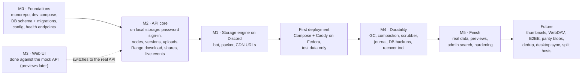

The numbers are the original milestones; the arrows are the order of work (D19): the API comes before Discord storage, so the finished UI runs against a real server early, and the first deployment happens once Discord storage works (D23).

**MVP = M0, M2, M1 and the UI.** Users can log in, upload a large file or a folder with thousands of small files, see them sync to Discord, browse, and stream content back.

### 18.1 Status and future work

**Done (2026-10-04):** the web UI, built first against the mock API (D14). It covers the screens of §10.1 except Preview: drive with drag-to-move and ZIP downloads, upload panel and engine, trash, shared links, the public share page, settings, and the admin area, with live events and the motion described in §10. The mock implements the §9 contract in the browser, and its spec tests (`apps/web/src/mocks/db.test.ts`) encode the rules the real API must follow.

**Done (2026-10-04):** M0 and M2. The API runs the whole §9 contract on local storage, the bot moves encrypted frames into the local blob store, and the web app works end to end against it (`VITE_API_MOCKS=off`). [BACKEND.md](BACKEND.md) §4.2 says how it was checked.

**Done (2026-10-05):** M1. Blobs are stored in Discord, small files packed, CDN links signed by the bot and frames cached on the API's disk. Its watch for messages deleted in Discord went again with D31. [BACKEND.md](BACKEND.md) §4.3.

**Done (2026-10-06):** the admin console. Metrics in Postgres (D29) with the API's own graphs and alerts; tabs for monitoring, access, storage control through tasks for the leading bot, PostgreSQL and the system's settings. [BACKEND.md](BACKEND.md) §4.4.

**Done (2026-10-06):** the first deployment. DFS runs at `https://dfs.xlestudio.it` on the Contabo VPS: Caddy with a Let's Encrypt certificate, the API, the bot with the gateway and the `DFS` channels, and PostgreSQL, in Docker, sent from the development PC by `docker/deploy.sh`. [DEPLOY.md](DEPLOY.md) is the runbook. It holds test data only until M4: there are no backups of the database yet, and without it the files in Discord can't be read.

**Done (2026-10-08):** M4, durability, but for the scrubber and nightly snapshots, both left for later by the user: the GC, the journal on Discord, `dfs recover` and its drill (passed against production's Discord), and compaction.

**Next: previews** (§10.3, D33): images, PDFs, text and code first, then audio and video (§6.7, §10.4, D34, D35). [BACKEND.md](BACKEND.md) is the build plan: packages, conventions, the tasks of each milestone and how each is checked.

**Web UI, still to do:**

- **Preview** (§10.3): images, PDFs, text and code, in the drive and on the public share page; then audio and video: their players (§10.4) and streaming (§6.7), direct or remuxed, and later seek thumbnails.
- **Upload resume after a reload:** upload IDs in IndexedDB (§10.2).
- **Inline rename** in lists (a dialog today), and **select-all across pages** of a large folder (today Ctrl+A selects the loaded rows; needs a server-side "whole folder except" selection for bulk actions).
- **Admin search** across users (`GET /admin/search`).
- **Downloads left on the share page:** it refetches the count right after a download starts, which against the real API can be before the server counted it; decrement it optimistically instead.
- **Thumbnails** in the grid (D13).
- **End-to-end tests** with Playwright (§17) once the API exists, including the motion and drag-and-drop flows that unit tests can't see.

**Later:** the non-goals of §1.2 that are planned: WebDAV/FUSE mount, end-to-end encryption, parity blobs, deduplication, desktop sync, split hosts.

---

## 19. Decisions Log

| # | Question | Decision | Where reflected |
|---|---|---|---|
| D1 | Chunk size / boost level | **20 MiB** attachment limit (unboosted). Blobs are at most 20 MiB − 64 KiB. Discord raised its free limit from 10 to 20 MB in August 2026; on 2026-10-08 the bot posted exactly 20 MiB, and 20 MiB + 1 byte was refused (413, code 40005). Files stored under the 10 MiB limit keep their chunk size. Larger chunks halve the messages per file, but a cold read's first byte, and a cold seek, wait for a whole 20 MiB frame: it arrives in about 3 s through the development machine's link, in 0.6–0.95 s at the VPS (measured 2026-10-08, §6.2). | §2, §6.2, §7.3, §15 |
| D2 | Exposure | **Only the web UI is public.** API, bot, and DB are internal with no published ports, and the edge proxies an allowlist of routes. | §3, §7.5 |
| D3 | Server-side copy | **Not supported.** | §1.2, §9 |
| D4 | Admin visibility | **Admins can see other users' file names, folder trees, sizes, and usage** (read-only metadata) for moderation. Content stays off-limits through the UI and API. | §7.2, §7.4, §9, §10 |
| D5 | Mirroring to a second store | **No.** Discord is the only blob store. | §1.2, §14 |
| D6 | Topology | **Everything on the same VPS**, running **Fedora Linux**. Development happens locally on Windows for now. | §3.2, §13 |
| D7 | Scale | **Few users, many files.** Built for scalability: small-file packing, batched journal, keyset pagination, eventually consistent folder stats, stateless API. | §2, §6.6, §8, §12 |
| D8 | How does recovery find the snapshot without the DB? | Each backup pointer carries an **encrypted manifest** (chunk locations, wrapped DEK). The journal records blob locations, its IDs follow commit order, and the high-water mark is read inside the dump's own snapshot. Backups are always solo blobs, compaction journals a move only after the new pack is stored, and retired master keys are kept. | §4, §6.6, §7.3, §8, §15 |
| D9 | What does the frame's GCM tag authenticate? | The AAD covers the **frame header plus a typed context** (file chunk, journal batch, backup manifest, with one type reserved for thumbnails); a format 2 segment's adds its index and whether it is the last (D37). Wrapped DEKs are bound to their version. | §6.5, §7.3 |
| D10 | Blob size invariant | `BLOB_MAX_BYTES` (20 MiB − 64 KiB) is a hard cap. `CHUNK_SIZE` is 20 MiB − 128 KiB, so a frame always fits, and the packer adds a frame only if it fits. | §2, §6.6, §7.3, §12.2, §15 |
| D11 | Live events with several API replicas | Postgres **`LISTEN/NOTIFY`**, sent in the same transaction as the change, with one listener connection per API instance. | §6.1, §9, §12.1 |
| D12 | Share link routing | `/s/:token` is an **SPA route**, and its data comes from `/api/s/*`. The edge proxies only `/api/*`. | §3, §7.2, §7.5, §9, §10.1 |
| D13 | Thumbnails | **Deferred to after v1.** The grid shows file-type icons. The planned design (an extra encrypted frame per image version) has AAD type `0x02` reserved, so adding it needs no format change. | §1.2, §7.3, §10.1, §18 |
| D14 | Build order | **UI first, against a mock API.** MSW serves the §9 contract in the browser during development, so the web app is built and tested before the API and bot exist. | §10, §13.1, §14 |
| D15 | Live connection: SSE or WebSockets? | **SSE**, with typed payloads. Traffic is one-way (the browser talks back over plain HTTP), SSE shares the API's HTTP/2 connection through Caddy, and it fits the `LISTEN/NOTIFY` fan-out (D11). A 25 s ping catches dead connections. | §6.1, §9, §10 |
| D16 | Drag-to-move | **A small pointer-event controller** instead of `@dnd-kit`. Folders spring open mid-drag and remount the list, so the drag must outlive the list it started in; one animation-frame loop with direct DOM writes keeps it fast without a dependency. | §10 |
| D17 | Downloading several items | `POST /archive {ids}` returns a **short-lived, single-use link** that streams the ZIP. The browser downloads it natively (progress, no memory buffering), and state-changing requests stay JSON with a CSRF header. | §6.2, §9 |
| D18 | Public share access | `GET /s/:token` answers `{locked: true}` until a password-protected link is unlocked, so a link reveals nothing without its password. Locked and wrong-password answers are `403`, dead links `410` with a reason, and `401` stays reserved for "sign in to the app". | §7.5, §9, §10.1 |
| D19 | Backend build order | **API first, Discord later:** M0, then M2 on `LocalBlobStore` (files already encrypted as DFS1 frames, the bot running as a worker without Discord), then M1. The finished UI runs against a real server one milestone sooner; the Discord work is unchanged, only later. | §18, BACKEND.md |
| D20 | Uploading onto an existing name | **A new version** of that file (matched by `name_key`), switching over only when the upload completes; a matching folder is a `409`. Renames and moves still refuse clashes. The web app asks first: replace, keep both (renamed) or skip. | §5.1, §6.1, §9 |
| D21 | Signing in during development | **Superseded by D27.** Was a development-only sign-in (`DEV_LOGIN=1`) to avoid needing Discord. Password sign-in doesn't use Discord, so development signs in like production, and `dfs owner` makes its first account. | §7.1, §13.1 |
| D22 | Running the backend's TypeScript | **Node runs the sources directly** (type stripping): no build step for api, bot and packages. Imports name their `.ts` files, there are no path aliases at runtime, and those packages are typechecked with Node's module rules. | §13, §14.1, BACKEND.md |
| D23 | First deployment | **Once Discord storage works** (after M1), as a private instance with test data only, until the M4 recovery drill passes. | §18 |
| D24 | Old versions and the quota | **They count** until purged, like the trash, so the quota measures everything a user keeps. Only versions a share link serves are kept (§7.5). | §5.1, §6.1 |
| D25 | Discord for development | **The production server and bot**, with development in its own `DFS Dev` category, REST only (no gateway). Each environment works only in the channels registered in its own database. Rate limits are shared, so load tests never use Discord. | §4, §6.1, §13.1, §15, §17 |
| D26 | Code hosting and checks | **A private GitHub repository, no CI.** `pnpm check` runs locally before pushing; the VPS pulls with a read-only deploy key. | §13.2, BACKEND.md |
| D27 | Who may sign in | **People an admin made an account for**, with a username and a temporary password. They choose their own password at their first sign-in, which activates the account. No one needs a Discord account: Discord is only storage, and the server is private to the owner. Replaces Discord sign-in (OAuth) from earlier drafts. | §5, §7.1, §9, §10.1, §15 |
| D28 | Admins and the owner | **Set in DFS** on the Users page. The owner is created on the server with `dfs owner`, is always an admin, and can't be demoted, disabled or reset from the app; the same command recovers the owner's password. | §5.1, §7.1, §9 |
| D29 | Where metrics live | **In Postgres**, in a table of half-minute, minute and hour buckets that every process adds to, read by the admin's own graphs. Not Prometheus and Grafana: two more services to run, secure and back up on one VPS, and a second sign-in, for a few dozen series that Postgres keeps in a few hundred thousand rows. | §5, §9, §16 |
| D30 | Sending a file | **One request per file**, streamed from disk, which the API cuts into parts as it arrives; progress from XMLHttpRequest's upload events. Parts sent four at a time showed progress only as each part finished, so the bar jumped and the speed fell to nothing between them; one stream keeps the connection busy and its progress true. Resuming starts at the first part missing, and the parts' hashes are checked at completion. Small files keep their single `PUT`. | §3.2, §6.1, §6.5, §10.2 |
| D31 | Messages deleted outside DFS | **They don't happen** (the user's decision, 2026-10-07): only the bot reaches DFS's channels, so no one else can delete a storage message. There is no watch for deletions, no `lost` state for blobs or versions, no tamper alert and no recovery of a lost blob from the CDN's cache. Discord itself losing data is left to the scrubber, if built. | §2, §5.2, §6.5, §8, §11 |
| D32 | Which packs compaction merges | **Those that hold little:** live bytes under `COMPACT_THRESHOLD` of a full pack, whatever their own size, a week old, two or more into one (the user's decision, 2026-10-07). A live/size ratio would leave the small packs a lone upload seals, each a whole message, and rewriting one pack alone saves none. Deleted files' bytes leave Discord only when their pack is merged. | §6.6 |
| D33 | Previews | **Images, PDFs, text and code first**; audio and video after, as their own part, with a dedicated player and streaming (the user's decision, 2026-10-08). PDFs through pdf.js, the same on every browser, Android's included, without loosening the rules against framing; text through a read-only CodeMirror, Markdown formatted and JSON pretty-printed. Viewing a shared file never counts toward its download limit; only Download does. No version history: earlier versions are internal, kept only while a share link serves them. Office documents stay out. | §1.2, §6.2, §7.5, §9, §10.3 |
| D34 | Audio and video streaming | **Direct play when the browser decodes the file; otherwise a remux (the container or the sound), made while it plays as HLS segments; nothing is transcoded** (the user's decisions, 2026-10-08: first direct play, remux and transcode; then, the VPS having 6 cores, no video hardware and other work, no transcoding). A video the browser can't decode says so, with Download; HDR plays as the browser plays it, tone-mapped by it on an SDR screen, and DFS makes no SDR copy. ffmpeg runs in a media service that holds no secret and reads only the files it is asked to play. At most 4 remuxes at once, and shared links play the same way. Media info is examined once per version and not journaled; cached segments are encrypted with a key kept in memory. Seek thumbnails come later, as important. | §3.1, §6.7, §7.4, §9, §15 |
| D35 | Audio and video players | **A video player in the viewer, and an audio player bar** that plays on while the user browses, with the folder as its queue (the user's decision, 2026-10-08): own controls and keys, Media Session, subtitles inside or beside the file, chapters, the next video, and where each user stopped kept on the server. A music library and gapless playback are not planned now. | §10.4 |
| D36 | Starting storage over | When the chunk size went to 20 MiB, the user chose to delete every file stored in 10 MiB chunks rather than keep both, keeping the accounts (2026-10-08). `dfs reset-storage` deletes files, blobs, the storage channels and the journal, keeps accounts, folders, links to folders and the audit log, and journals those again from batch 1, so recovery stays complete; a test recovers from that journal and compares the databases. Only the operator runs it, with the API and the bot stopped (docs/DEPLOY.md). | §8, §15 |
| D37 | Reading part of a chunk | **Chunks are sealed in segments of 256 KiB, each with its own tag (frame format 2)**, so the API streams from Discord by `Range` only the segments a request covers, checking each before sending it on (the user's decision, 2026-10-09, given it is as fast as sending bytes unchecked, which it is). Sending unchecked bytes was the other way, faster to build, but a range that stops before the end of a chunk would never be checked, so DFS's own bugs (a read at the wrong offset, a frame mapped wrong after compaction), disk errors and a CDN serving wrong bytes would go out silently. A cold seek's first byte went from 2.7–3.0 s to 0.4–0.5 s through the development machine's link (0.14–0.19 s behind Caddy, from cache-warm Discord). Format 1 stays for journal batches and is still read; code from before format 2 can't read files stored after it, so deploys can't roll back past it. Production had no files when it came (D36). | §6.2, §7.3 |

No open questions at this time.
